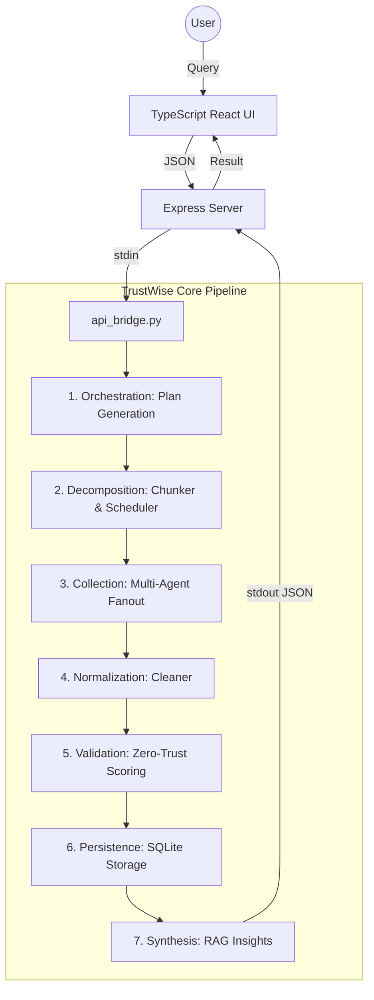

# TrustWise: Trust-First AI Intelligence Pipeline

TrustWise is a professional-grade research engine that converts natural language queries into verifiable technology intelligence. Unlike standard LLM chat interfaces, TrustWise enforces a **Zero-Trust** validation layer, ensuring every insight is backed by academic-grade or reputable web sources.

---

## 🚀 Key Features

- **Strategic Planning**: Decomposes complex queries into multi-step research missions.
- **Academic Fanout**: Concurrent retrieval from 10+ sources (OpenAlex, Semantic Scholar, arXiv, etc.).
- **Zero-Trust Validation**: Proprietary scoring based on domain authority, relevance, and content integrity.
- **RAG Synthesis**: Insight generation with inline citations and "Consensus Discovery" across providers.
- **Privacy-First**: Local SQLite persistence and query caching; no third-party data tracking.
- **Docker-First**: One-command deployment via Docker Compose.

---

## 🏗️ System Architecture & Process Flow

TrustWise operates as a 7-stage linear pipeline, coordinated by a Python backend and a TypeScript/Express gateway.



### The 7-Stage Lifecycle

1.  **Orchestration**: The `orchestrator` invokes the LLM (Gemini/Ollama) to produce a structured JSON execution plan.
2.  **Decomposition**: The `chunker` breaks the plan into actionable tasks, and the `scheduler` routes them to specialized agents.
3.  **Collection**: 
    - **Research Agent**: Queries academic APIs (OpenAlex, Semantic Scholar, Crossref).
    - **Web Agent**: Uses `Crawl4AI` (headless browser) and `DuckDuckGo` for high-signal web scraping.
4.  **Normalization**: The `cleaner` maps diverse source schemas into a unified TrustWise record format.
5.  **Validation**: Every record is scored (0.0 to 1.0). Items below the threshold are dropped.
6.  **Persistence**: Validated items are hashed (for deduplication) and stored in local SQLite.
7.  **Synthesis**: The `insights` generator performs RAG, identifying consensus points across multiple sources.

---

## 📦 Module Reference

### Core Packages

| Module | Core Function | Responsibility |
| :--- | :--- | :--- |
| **`orchestrator`** | `generate_plan()` | Strategic decomposition of user intent into JSON. |
| **`agents`** | `run()` | The execution layer. Handles API fanout and web crawling. |
| **`trust`** | `validate_structured_data()` | The Zero-Trust scoring engine. Filters by domain & proximity. |
| **`insights`** | `generate_insights()` | LLM-driven synthesis with inline citation mapping. |
| **`storage`** | `save_trusted_items()` | SQLite persistence and content-hash deduplication. |
| **`cleaner`** | `normalize_results()` | Transforms raw JSON/Markdown into the unified internal schema. |
| **`utils`** | `Config` / `Logger` | Global environment management and structured audit logging. |

### Entry Points

- **`main.py`**: The CLI entry point for direct pipeline execution.
- **`api_bridge.py`**: The secure JSON-over-stdin interface used by the Express server.

---

## 🛠️ Technology Stack

### Backend (Python 3.11+)
- **LLM**: `google-generativeai` (Gemini Pro), `Ollama` (Llama 3.2).
- **Collection**: `crawl4ai` (Headless Chromium), `duckduckgo_search`, `feedparser`.
- **Infrastructure**: `SQLAlchemy` (SQLite), `python-dotenv`, `requests`.

### Frontend (Node.js 20+)
- **Gateway**: `Express.js` (TypeScript).
- **Runtime**: `Node.js` (Child Process management for the Python bridge).
- **UI**: Vanilla TypeScript/HTML5 with a focused CSS design system.

---

## 🚦 Operational Guide

### Quick Start (Recommended: Docker)
```bash
# Setup environment
copy .env.example .env
# Set LLM_PROVIDER=ollama or gemini

# Launch
docker-compose up --build
```
Access the dashboard at `http://localhost:5000`.

### Local Verification
```bash
# Run basic connectivity tests
python test_basic.py

# Run full implementation audit
python scripts/run_implementation_tests.py --ci
```

---

## 📄 Documentation Index

Explore the detailed sub-documentation for deep dives:
- 🗺️ [Architecture Diagrams](docs/ARCHITECTURE.md)
- 📋 [Product Requirements (PRD)](docs/PRD.md)
- 💼 [Business Requirements (BRD)](docs/BRD.md)
- 🌐 [API Specifications](FRONTEND.md)
- 🛠️ [Implementation Status](IMPLEMENTATION.md)

---

## ⚖️ License
Distributed under the MIT License. See `LICENSE` for more information.
