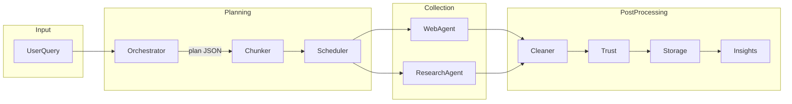
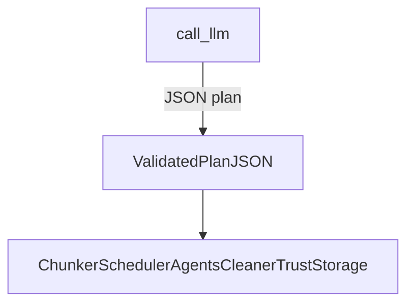
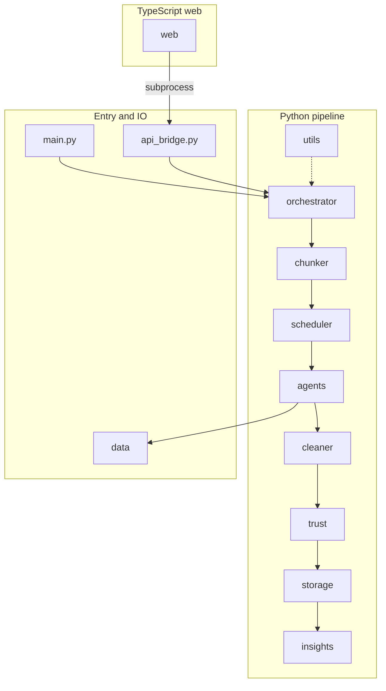
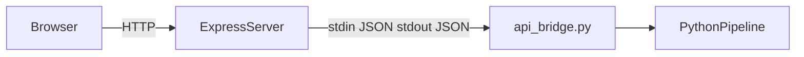
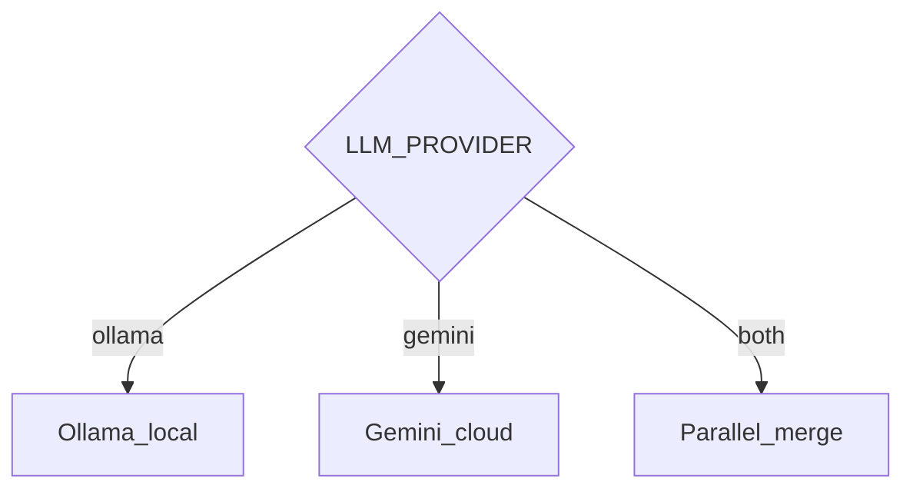

# TrustWise architecture

This document complements [README.md](../README.md) and [IMPLEMENTATION.md](../IMPLEMENTATION.md) with diagrams. The LLM produces **structured plan JSON only**; collection, trust, and storage run in separate stages ([implementationtest.md](../implementationtest.md)).

## End-to-end pipeline

The runtime path from a natural-language query to stored insights:

The planner (`call_llm` in `orchestrator/llm_client.py`) outputs **only** a validated execution plan, not final answers or trusted records.

## Planner versus execution boundary

Downstream stages use the plan to fetch and process data. They are **not** replaced by a single LLM completion; trust scoring and persistence remain explicit.

## Repository layout

High-level map of the main Python packages, bridge, web server, and data directories:

## Web UI and API bridge

How the browser reaches the same pipeline as the CLI (`main.py`):

Express is implemented in `web/src/server.ts`. It spawns `api_bridge.py` with the repo root as working directory; optional `PYTHON_EXE` / `TRUSTWISE_PYTHON` selects the interpreter.

## LLM provider modes

Configured via `LLM_PROVIDER` in `.env` (see `.env.example`). Resolution is implemented in `orchestrator/llm_client.py`.

All modes still produce **plan JSON** for the same downstream pipeline.

## Related documentation

- [FRONTEND.md](../FRONTEND.md) — REST contract and payloads
- [orchestrator/llm_client.py](../orchestrator/llm_client.py) — provider calls and merge logic
