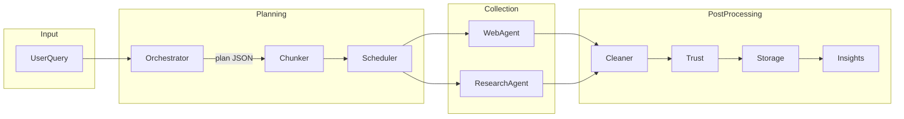
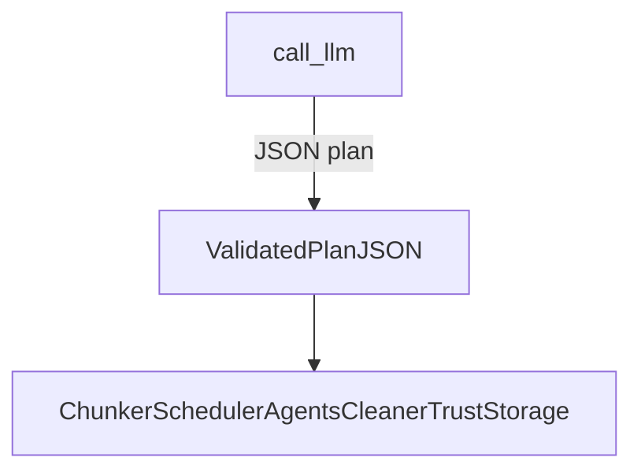
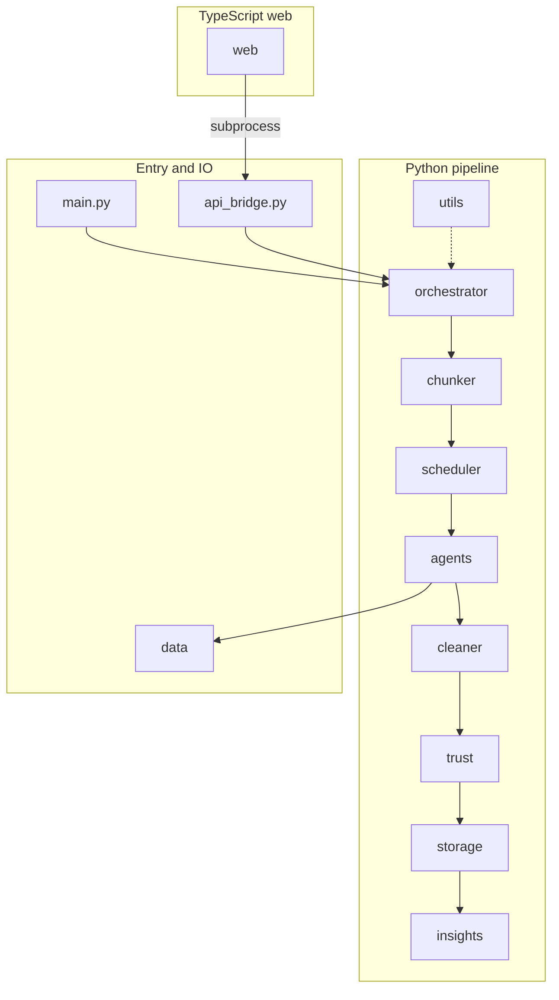
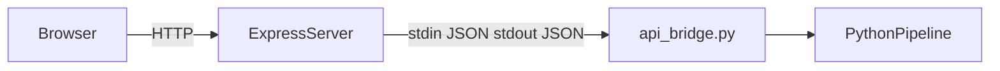
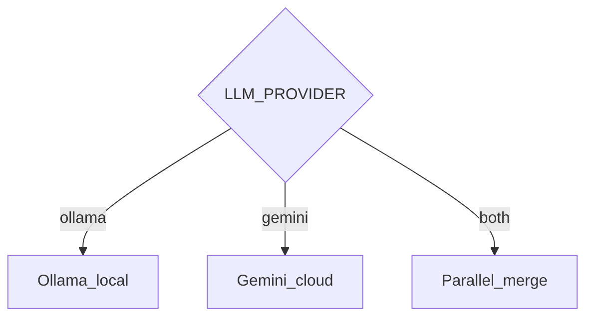
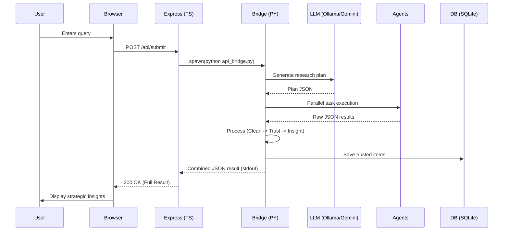
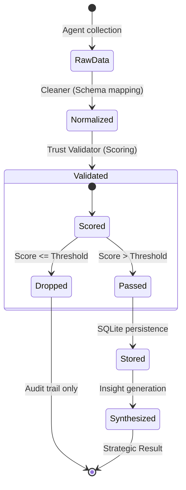

# TrustWise architecture

This document complements [README.md](../README.md) and [IMPLEMENTATION.md](../IMPLEMENTATION.md) with diagrams. The LLM produces **structured plan JSON only**; collection, trust, and storage run in separate stages ([implementationtest.md](../implementationtest.md)).

## End-to-end pipeline

The runtime path from a natural-language query to stored insights:



The planner (`call_llm` in `orchestrator/llm_client.py`) outputs **only** a validated execution plan, not final answers or trusted records.

## Planner versus execution boundary



Downstream stages use the plan to fetch and process data. They are **not** replaced by a single LLM completion; trust scoring and persistence remain explicit.

## Repository layout

High-level map of the main Python packages, bridge, web server, and data directories:



## Web UI and API bridge

How the browser reaches the same pipeline as the CLI (`main.py`):



Express is implemented in `web/src/server.ts`. It spawns `api_bridge.py` with the repo root as working directory; optional `PYTHON_EXE` / `TRUSTWISE_PYTHON` selects the interpreter.

## LLM provider modes

Configured via `LLM_PROVIDER` in `.env` (see `.env.example`). Resolution is implemented in `orchestrator/llm_client.py`.



All modes still produce **plan JSON** for the same downstream pipeline.

## Request/Response Lifecycle (Sequence Diagram)

The following sequence diagram illustrates the handoff between the TypeScript frontend and the Python research pipeline:



## Zero-Trust Validation State Machine

How a raw data item matures into a **Trusted Insight**:



## Component Interconnect Map

A detailed view of and dependency relationships between core services:

```mermaid
graph TB
  subgraph frontend [Frontend Experience]
    ui[React/TS Web UI]
    apiClient[API Bridge Client]
  end

  subgraph apiLayer [API Core]
    expressSrv[Express Server]
    bridgeLogic[api_bridge.py Dispatcher]
  end

  subgraph pipelineCore [Pipeline Core]
    planEngine[Orchestration Engine]
    executor[Chunker & Scheduler]
    trustEngine[Zero-Trust Scoring]
    insightEngine[Insight Synthesis]
  end

  subgraph sourceLayer [Research Sources]
    academic[Academic Source Academy (OpenAlex, etc.)]
    web[Web Search Academy (Tavily, etc.)]
  end

  ui --> apiClient
  apiClient --> expressSrv
  expressSrv --> bridgeLogic
  bridgeLogic --> planEngine
  planEngine --> executor
  executor --> academic
  executor --> web
  academic --> trustEngine
  web --> trustEngine
  trustEngine --> insightEngine
```

---

## Technical Specifications
Detailed REST contracts and internal function signatures are documented in:
- [PRD.md](PRD.md) — Product & Functional Requirements
- [BRD.md](BRD.md) — Business Value & Success KPIs
- [FRONTEND.md](../FRONTEND.md) — Full API Endpoint Specifications
