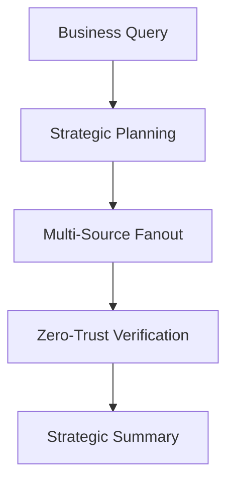

# TrustWise: Business Requirements Document (BRD)

**Version**: 1.0.0  
**Status**: Formal Draft  
**Owner**: TrustWise Intelligence Team

## 1. Executive Summary
TrustWise is a "Trust-First" AI intelligence pipeline designed to combat the rising challenge of AI hallucinations and misinformation in technology research. By establishing a zero-trust verification layer between raw AI planning and final research insights, TrustWise provides a verifiable, academic-grade alternative to standard LLM chat interfaces.

---

## 2. Business Objectives
- **Verifiable Intelligence**: To provide a research platform where every claim is backed by a trusted, academic source.
- **Operational Efficiency**: To reduce the time spent on manual literature reviews and technology scouting by 70%.
- **Risk Mitigation**: To eliminate the risk of strategic decisions being made based on hallucinated LLM data.

---

## 3. Success Metrics (KPIs)
- **Trust Ratio**: Percentage of retrieved records that pass the Zero-Trust validation layer (Target: >30%).
- **Citation Precision**: 100% of generated insights must link back to a valid, reachable academic URL.
- **Pipeline Latency**: End-to-end research query completion in under 3 minutes for complex (5-task) plans.

---

## 4. Stakeholders
| Role | Responsibility | Value Proposition |
| :--- | :--- | :--- |
| **Intelligence Analyst** | Market & Tech Scouting | Automated, high-confidence discovery. |
| **Academic Researcher** | Literature Review | Rapid aggregation of multi-source papers. |
| **Product Manager** | Competitive Intelligence | Factual, verified technology trends. |

---

## 5. Business Process Overview

---

## 6. Constraints & Compliance
- **Zero-Trust Default**: No data is trusted until it has passed the verification scoring algorithm.
- **Data Privacy**: Local SQLite storage ensures that research history remains within the organization's boundary.
- **Source Integrity**: Only academic-grade (OpenAlex, Semantic Scholar, etc.) sources are prioritized for high-confidence runs.
