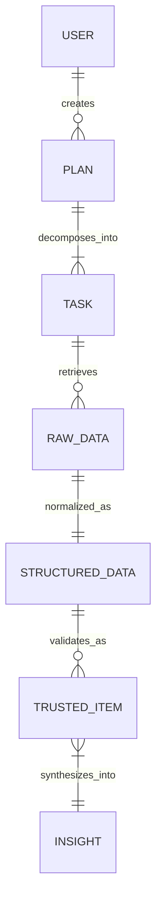

# TrustWise: Product Requirements Document (PRD)

**Version**: 1.0.0  
**Status**: Formal Draft  
**Product Manager**: TrustWise Intelligence Platform

## 1. User Personas & Stories
### 👤 Persona: Dr. Alice (Academic Researcher)
*   **Goal**: To rapidly scan 20+ recent papers on a technology trend without manual searching.
*   **User Story**: "As a researcher, I want to execute a 10-source academic fanout so I can find high-confidence citations for my report."

### 👤 Persona: Bob (Tech Scout)
*   **Goal**: To verify whether a new startup's technology claim is corroborated in recent journals.
*   **User Story**: "As a tech scout, I want a Zero-Trust validation score for every search result so I can filter out marketing noise."

---

## 2. Functional Requirements (FR)
- **FR-1**: **LLM-Based Intent Planning**: System must decompose a single natural-language query into a multi-step research plan.
- **FR-2**: **Multi-Source Academic Fanout**: System must concurrently search OpenAlex, Semantic Scholar, Crossref, and 7+ other academic sources.
- **FR-3**: **Zero-Trust Validation**: Every retrieved item must be scored based on domain authority, citation count, and relevance.
- **FR-4**: **Context-Aware Insights**: Final summaries must include inline citations (`[Source 1]`) and a global confidence score.

---

## 3. Non-Functional Requirements (NFR)
- **NFR-1**: **Portability**: System must be fully deployable via Docker and Docker Compose.
- **NFR-2**: **Interoperability**: API Bridge must support JSON-over-stdin communication with <5s overhead.
- **NFR-3**: **Persistence**: All research plans and trusted results must be stored locally in an encrypted-at-rest SQLite database.

---

## 4. Logical Data Model (ER)

---

## 5. Use Case: High-Confidence Technology Discovery
1.  **Input**: User enters "Recent breakthroughs in solid-state battery tech 2024".
2.  **Plan**: Orchestrator generates 5 research tasks.
3.  **Agents**: Parallel execution across academic and web sources.
4.  **Trust**: Validator drops 80% of low-confidence or duplicate results.
5.  **Output**: User receives a 400-word insight with 5 verified academic citations.

---

## 6. Constraints & Exceptions
- **Connectivity**: System requires a running Ollama instance (local) or Gemini API key (cloud).
- **Source Limits**: API rate limits apply to external sources (ArXiv, OpenAlex, etc.).
