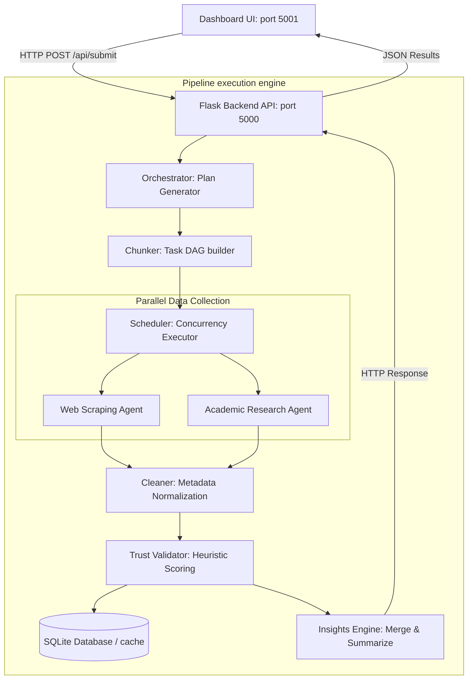

# TrustWise System Architecture

This document describes the runtime execution flows and component relations inside TrustWise.

---

## 🏛️ Core Architecture Layout

TrustWise uses a decoupled pipeline architecture. The UI static frontend interacts with a Python REST API, which decomposes requests into tasks, collects data concurrently, scores content for trust, and synthesizes summaries.

---

## 🧩 Pipeline Components

### 1. Flask API Endpoint (`legacy/app.py`)
Serves as the main gateway interface. It receives natural language requests, validates parameters, and triggers the Python pipeline steps.

### 2. Query Planner (`orchestrator/`)
Generates a structured execution plan containing a list of subtasks, Whitelist domains, and constraints. By default, it queries Gemini (`gemini-1.5-flash`), with a local Ollama instance (`llama3.2`) as a secondary option. If both are offline, it falls back to a query-aware mock plan generator.

### 3. Chunker (`chunker/chunker.py`)
Parses the Planner's tasks. It normalizes values into standard `Chunk` dictionaries, applies sequence similarity filters to drop duplicate task definitions, and maps prerequisite dependencies (e.g. making comparison tasks depend on data collection tasks).

### 4. Scheduler (`scheduler/scheduler.py`)
Translates the Chunk list into an execution schedule. It resolves topological dependencies and schedules independent chunks simultaneously inside a `ThreadPoolExecutor` (allowing concurrent web/academic queries).

### 5. Source Collectors (`agents/`)
Retrieves research records across different APIs:
* **Web Agent**: DuckDuckGo search + Crawl4AI headless browser (with basic HTTP BeautifulSoup scraper as fallback).
* **Research Agent**: Query adapters for arXiv, OpenAlex, Semantic Scholar, Crossref, bioRxiv, medRxiv, Tavily, Exa, Firecrawl, Jina AI Search, Scopus, and DeepSeek.

### 6. Content Cleaner (`cleaner/cleaner.py`)
Standardizes JSON results from all scraper adapters into a unified schema. It strips out HTML/markdown markup and filters out navigation/cookie boilerplate lines.

### 7. Trust Engine (`trust/validator.py`)
Scores normalized content items between `0.0` and `1.0` using heuristics (domain whitelist lookup, content length bonuses, query keyword matches, and boilerplate penalty deductions).

### 8. Storage Caching (`storage/db.py`)
Saves trusted items to a local SQLite database (`data/trustwise.db`). It prevents duplicates using a deterministic hash key (`title + url + content[:500]`) and performs query-to-cached-record matches.

### 9. Insights Engine (`insights/generator.py`)
Generates final synthesized responses using LLM summary merge tools, consensus validators, and rank-ordered extractive fallback sentences.
