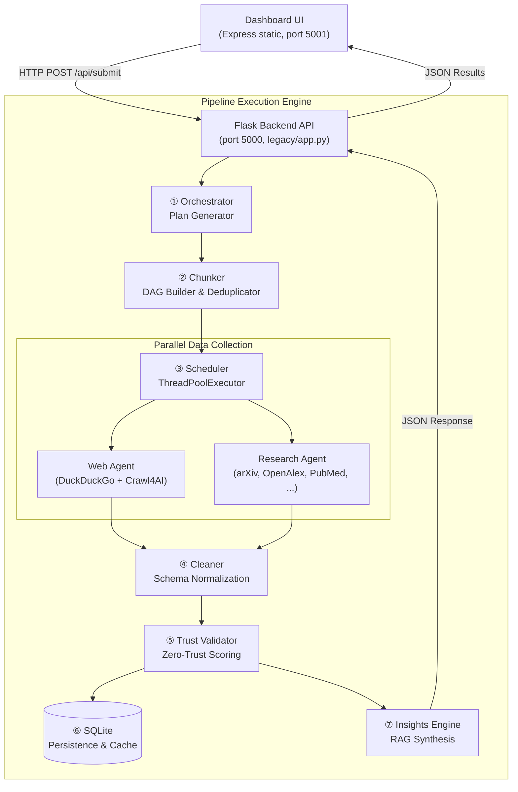
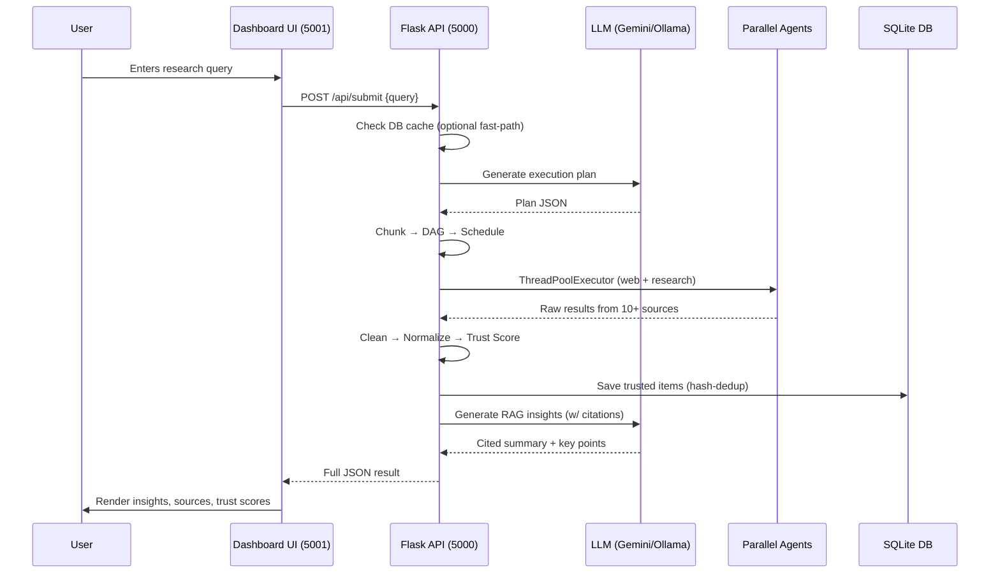

# TrustWise — Comprehensive Project Overview

> **Trust-First AI Intelligence Pipeline**
> A professional-grade research engine that converts natural-language queries into verifiable, citation-backed technology intelligence using a Zero-Trust validation layer.

---

## 1. What Is TrustWise?

TrustWise is an **end-to-end research automation system** that takes a plain-English question (e.g. *"What are the latest breakthroughs in quantum computing?"*), decomposes it into a structured execution plan, fans out across **10+ academic and web sources** simultaneously, validates every piece of collected content through a proprietary **Zero-Trust scoring engine**, and finally synthesizes a **cited, consensus-aware insight report**.

Unlike a standard ChatGPT-style conversation, TrustWise never presents information that hasn't been traced back to a reputable source. Every data item receives a trust score between `0.0` and `1.0`, and items below the threshold are dropped before they can influence the final answer.

### Core Value Propositions

| Pillar | What It Means |
|---|---|
| **Zero-Trust Validation** | Every claim is scored on domain authority, content relevance, metadata richness, and boilerplate contamination. Low-trust items are discarded. |
| **Multi-Source Corroboration** | Academic APIs (arXiv, OpenAlex, PubMed, Semantic Scholar, Crossref, Scopus, etc.) + web scraping (DuckDuckGo, Crawl4AI, Wikipedia) + optional premium tools (Tavily, Exa, Firecrawl, Jina). |
| **Consensus Discovery** | The insight engine flags key points that are independently confirmed across ≥ 2 distinct sources. |
| **Privacy-First** | All data persists in a local SQLite database. No third-party analytics or user tracking. |

---

## 2. High-Level Architecture

TrustWise uses a **decoupled 7-stage linear pipeline** coordinated by a Python backend, exposed through a Flask REST API, and consumed by a static Express-served dashboard.



### Dual Entry Points

| Entry Point | File | Purpose |
|---|---|---|
| **CLI** | [main.py](file:///c:/Anushk/Codes/TrustWise/main.py) | Interactive terminal pipeline — accepts a query via `input()`, prints step-by-step results. |
| **Web API** | [legacy/app.py](file:///c:/Anushk/Codes/TrustWise/legacy/app.py) | Flask REST server (port 5000) with `POST /api/submit`, `GET /api/status`, `GET /api/plans`, etc. |
| **Bridge (legacy)** | [api_bridge.py](file:///c:/Anushk/Codes/TrustWise/api_bridge.py) | JSON-over-stdin/stdout interface for subprocess invocation. Kept for integration testing. |

---

## 3. Technology Stack

### Backend — Python 3.11+

| Category | Technologies |
|---|---|
| **LLM Providers** | Google Gemini (`google-generativeai`, default: `gemini-1.5-flash`), Ollama (local, `llama3.2`), or **both** in parallel-merge mode |
| **Web Scraping** | `Crawl4AI` (headless Chromium), `duckduckgo_search` / `ddgs`, `BeautifulSoup4`, `requests` |
| **Academic APIs** | arXiv, OpenAlex, Semantic Scholar, Crossref, PubMed (EFetch XML), Scopus, CORE, DOAJ, BASE, bioRxiv, medRxiv |
| **Optional Premium Tools** | Tavily, Exa, Firecrawl, Jina AI Reader, DeepSeek |
| **Database** | SQLite (via raw `sqlite3`), content-hash deduplication |
| **Web Framework** | Flask (REST API), CORS headers for cross-origin dashboard |
| **Utilities** | `python-dotenv`, `feedparser`, custom retry/rate-limiter modules |
| **Concurrency** | `concurrent.futures.ThreadPoolExecutor` for DAG-based parallel task execution |

### Frontend — Node.js 20+

| Category | Technologies |
|---|---|
| **Static Server** | Express.js (port 5001), serves `frontend/public/` |
| **UI** | Vanilla HTML5 + CSS3 + JavaScript (premium dark-mode dashboard) |
| **Files** | [index.html](file:///c:/Anushk/Codes/TrustWise/frontend/public/index.html) (19 KB), [style.css](file:///c:/Anushk/Codes/TrustWise/frontend/public/style.css) (31 KB), [app.js](file:///c:/Anushk/Codes/TrustWise/frontend/public/app.js) (18 KB) |

### DevOps

| Tool | Purpose |
|---|---|
| Docker Compose | One-command deployment (`setup/docker-compose.yml`) |
| GitHub Actions | CI workflow (`.github/`) |
| Setup Scripts | `setup/setup.ps1` (Windows), `setup/setup.sh` (Linux/macOS) |

---

## 4. Complete Pipeline Flow — Stage by Stage

### Stage ① — Orchestrator (Plan Generation)

**Files**: [orchestrator/orchestrator.py](file:///c:/Anushk/Codes/TrustWise/orchestrator/orchestrator.py), [orchestrator/llm_client.py](file:///c:/Anushk/Codes/TrustWise/orchestrator/llm_client.py), [orchestrator/prompts.py](file:///c:/Anushk/Codes/TrustWise/orchestrator/prompts.py), [orchestrator/schema.py](file:///c:/Anushk/Codes/TrustWise/orchestrator/schema.py)

The user's natural-language query is sent to the configured LLM provider to produce a **structured JSON execution plan** containing:
- `goal` — what to research
- `domains` — topic categories
- `time_range` — temporal scope
- `sources` — data source types (`web`, `research_papers`)
- `tasks[]` — individual collection tasks with `task_id`, `source_type`, `agent`, and `prompt`

**LLM Provider modes** (set via `LLM_PROVIDER` in `.env`):

| Mode | Behavior |
|---|---|
| `gemini` | Calls Google Gemini API (cloud) |
| `ollama` | Calls local Ollama server (with `/api/chat` → `/api/generate` fallback) |
| `both` | Calls Gemini + Ollama **in parallel**, merges plans (interleave, deduplicate, renumber) |

**Fallback**: If both providers fail and `ALLOW_MOCK_FALLBACK=true`, a deterministic mock plan is generated from the query keywords.

Plans are optionally saved to `data/plans/plan_YYYYMMDD_HHMMSS.json`.

---

### Stage ② — Chunker (Task Decomposition & DAG Building)

**File**: [chunker/chunker.py](file:///c:/Anushk/Codes/TrustWise/chunker/chunker.py)

Transforms raw plan tasks into structured **Chunk** objects:

1. **Normalization**: Extracts description from `prompt` or `description` fields, assigns agent (`web_agent` / `research_agent`), source types, trust thresholds, and retry policies.
2. **Deduplication**: Uses `SequenceMatcher` to discard tasks with > 80% text overlap.
3. **Dependency Resolution** (two-pass):
   - *Explicit*: Regex-matches chunk IDs referenced in descriptions.
   - *Semantic*: Tasks containing synthesis keywords (`compare`, `summarize`, `consensus`) are made dependent on all collection-type chunks.

Each chunk follows a strict schema with fields: `chunk_id`, `parent_query`, `title`, `description`, `priority`, `dependencies`, `agent`, `source_types`, `trust_constraints`, `expected_output`, `retry_policy`.

---

### Stage ③ — Scheduler (DAG-Based Concurrent Execution)

**File**: [scheduler/scheduler.py](file:///c:/Anushk/Codes/TrustWise/scheduler/scheduler.py)

Executes chunks in **topological layers** using `ThreadPoolExecutor(max_workers=4)`:

```
Layer 1: [chunk_web_1, chunk_paper_1]   ← run in parallel (no dependencies)
Layer 2: [chunk_synthesis_1]             ← waits for Layer 1 to complete
```

- Detects circular dependencies and marks blocked chunks as failed.
- Each chunk is dispatched with `execute_with_retry()` (configurable retries + exponential backoff).
- Also retains a backward-compatible `schedule(tasks)` function that simply routes tasks by `source_type` into `(web_tasks, paper_tasks)` tuples.

---

### Stage ③a — Agents (Multi-Source Data Collection)

#### Web Agent — [agents/web_agent.py](file:///c:/Anushk/Codes/TrustWise/agents/web_agent.py) (~676 lines)

| Step | Action |
|---|---|
| 1 | Extract search terms from task prompt (stop-word filtering) |
| 2 | Search for URLs via DuckDuckGo + optional premium tools (Tavily, Exa, Firecrawl, Jina) |
| 3 | Crawl discovered URLs with **Crawl4AI** (headless Chromium, content-pruning filter, markdown output) |
| 4 | Fetch Wikipedia content for knowledge-type queries |
| 5 | Basic HTTP + BeautifulSoup fallback when Crawl4AI is unavailable |
| 6 | Content relevance filtering (query-term overlap, boilerplate detection) |

#### Research Agent — [agents/research_agent.py](file:///c:/Anushk/Codes/TrustWise/agents/research_agent.py)

Delegates to the **Source Registry** ([agents/source_registry.py](file:///c:/Anushk/Codes/TrustWise/agents/source_registry.py)) which manages 16+ adapter functions:

| Source | Type | API |
|---|---|---|
| arXiv | Keyless | arXiv API |
| OpenAlex | Keyless | `api.openalex.org/works` |
| Semantic Scholar | Keyless | `api.semanticscholar.org/graph/v1/paper/search` |
| Crossref | Keyless | `api.crossref.org/works` |
| PubMed | Keyless | NCBI E-utilities (ESearch → **EFetch XML** for full abstracts, DOI, keywords, MeSH, journal) |
| CORE | Key-optional | CORE API |
| DOAJ | Keyless | DOAJ Search API |
| BASE | Keyless | Bielefeld Academic Search Engine |
| bioRxiv / medRxiv | Keyless | bioRxiv API |
| Scopus | Keyed | Elsevier Search API (`view=COMPLETE` with credential fallback) |
| Tavily | Keyed | Tavily Search API |
| Exa | Keyed | Exa Search API |
| Firecrawl | Keyed | Firecrawl Crawl API |
| Jina | Keyed | Jina AI Reader/Search |
| DeepSeek | Keyed | DeepSeek Chat API |

All adapters run **concurrently** via `ThreadPoolExecutor(max_workers=6)` inside the source registry. Results are then **deduplicated** (by DOI or normalized title) and **ranked by relevance** (query-term overlap + cross-source corroboration confidence).

#### Citation Scraper — [agents/citation_scraper.py](file:///c:/Anushk/Codes/TrustWise/agents/citation_scraper.py) (~720 lines)

An additional scraping layer that queries curated trusted citation sources from [config/trusted_citations.json](file:///c:/Anushk/Codes/TrustWise/config/trusted_citations.json) using DuckDuckGo site-scoped searches + Crawl4AI, producing per-source markdown files and structured items that are merged into the pipeline.

---

### Stage ④ — Cleaner (Normalization)

**File**: [cleaner/cleaner.py](file:///c:/Anushk/Codes/TrustWise/cleaner/cleaner.py)

Maps diverse agent outputs into a **unified schema**:

```json
{
  "title": "...",
  "content": "...",
  "source": "...",
  "url": "...",
  "published_at": "...",
  "content_type": "web | research_paper",
  "authors": [],
  "categories": [],
  "doi": "",
  "journal": "",
  "keywords": [],
  "citation_count": 0
}
```

- Strips HTML/markdown boilerplate (cookie banners, privacy notices, navigation chrome).
- Extracts titles from markdown headings or link text.
- Truncates content to 3,500 characters.

---

### Stage ⑤ — Trust Validator (Zero-Trust Scoring)

**File**: [trust/validator.py](file:///c:/Anushk/Codes/TrustWise/trust/validator.py)

Each normalized item receives a composite trust score ∈ `[0.0, 1.0]`:

| Signal | Score Impact |
|---|---|
| **Domain whitelist** (from `config/sources.json` + `config/trusted_citations.json`) | +0.45 |
| **Recognized research source** (arXiv, OpenAlex, Semantic Scholar) | +0.38 to +0.40 |
| **Content length** (≥ 600 chars) | +0.20 |
| **Query relevance** (keyword overlap ratio) | up to +0.25 |
| **DOI present** | +0.05 |
| **Keywords present** | +0.05 |
| **Journal name present** | +0.02 |
| **High citation count** (≥ 50 or ≥ 100) | +0.03 to +0.05 |
| **Boilerplate contamination** (cookie/consent/subscribe markers) | up to −0.35 |
| **Duplicate detected** (content-signature match) | −0.35 |

**Trust thresholds**:
- Web content: score ≥ 0.65 AND relevance ≥ 0.28
- Research papers: score ≥ 0.60 AND relevance ≥ 0.15

Items failing these thresholds are dropped from the trusted set (but remain in the audit trail).

---

### Stage ⑥ — Storage (SQLite Persistence & Cache)

**File**: [storage/db.py](file:///c:/Anushk/Codes/TrustWise/storage/db.py)

- **Database**: `data/trustwise.db` (SQLite)
- **Deduplication**: SHA-256 hash of `title + url + content[:500]` → `UNIQUE` constraint
- **Query cache**: Normalizes queries into canonical sorted keyword keys. On repeat queries with ≥ `DB_CACHE_MIN_ITEMS` cached records, skips the entire pipeline and serves from cache.
- **Schema migrations**: Backward-compatible `ALTER TABLE` additions for `query_key`, `journal`, `citation_count`, `keywords` columns.

---

### Stage ⑦ — Insights Engine (RAG Synthesis)

**File**: [insights/generator.py](file:///c:/Anushk/Codes/TrustWise/insights/generator.py) (~481 lines)

Generates the final user-facing response through a **hybrid extractive + LLM approach**:

1. **Extractive fallback**: Splits trusted content into sentences, ranks by query-term overlap + novelty indicators (`improves`, `outperforms`, `study`, `results`) + numeric presence. Always available.
2. **LLM summary** (when provider is online): Builds a source-indexed context block and sends a structured prompt requesting:
   - `concise_answer`: 2-4 sentences with `[Source X]` inline citations.
   - `key_points`: 3-5 factual bullets with citations.
3. **Dual-provider merge** (when `LLM_PROVIDER=both`): Calls Gemini + Ollama in parallel, interleaves and deduplicates key points, attributes each to its origin (`gemini`, `ollama`, or `both`).
4. **Consensus Discovery**: Key points citing ≥ 2 distinct sources are flagged as `consensus: true`.

**Output structure**:
```json
{
  "summary": "...",
  "concise_answer": "...",
  "key_points": [...],
  "summary_method": "llm | extractive",
  "top_sources_detailed": [...],
  "recommended_reading": [...],
  "key_highlights": [...],
  "source_breakdown": {},
  "content_type_breakdown": {},
  "confidence": 0.78,
  "citation_links": [...]
}
```

---

## 5. Module Map & File Reference

```
TrustWise/
├── main.py                    # CLI entry point
├── api_bridge.py              # stdin/stdout JSON bridge (legacy/testing)
├── legacy/
│   └── app.py                 # Flask REST API (port 5000) — current web gateway
├── frontend/
│   ├── server.js              # Express static server (port 5001)
│   └── public/
│       ├── index.html         # Dashboard HTML
│       ├── style.css          # Premium dark-mode CSS (~31 KB)
│       └── app.js             # Client-side JS (~18 KB)
├── orchestrator/
│   ├── orchestrator.py        # Plan generation coordinator
│   ├── llm_client.py          # Gemini/Ollama/both LLM calls + mock fallback
│   ├── prompts.py             # System & user prompt templates
│   └── schema.py              # Plan JSON validation
├── chunker/
│   └── chunker.py             # DAG decomposition, dedup, dependency resolution
├── scheduler/
│   ├── scheduler.py           # DAG executor (ThreadPoolExecutor) + legacy router
│   └── continuous.py          # Cron-style continuous pipeline runner
├── agents/
│   ├── web_agent.py           # DuckDuckGo + Crawl4AI + Wikipedia + HTTP fallback
│   ├── research_agent.py      # Research paper collection orchestrator
│   ├── research_sources.py    # Keyless APIs (OpenAlex, S2, Crossref, PubMed)
│   ├── source_registry.py     # Unified adapter registry (16+ sources, parallel)
│   ├── keyed_adapters.py      # Premium API adapters (Tavily, Exa, Scopus, etc.)
│   ├── keyed_http.py          # Shared HTTP session for keyed adapters
│   └── citation_scraper.py    # Curated citation source scraper
├── cleaner/
│   └── cleaner.py             # Schema normalization + boilerplate stripping
├── trust/
│   └── validator.py           # Zero-Trust scoring engine
├── storage/
│   └── db.py                  # SQLite persistence, dedup, query cache
├── insights/
│   └── generator.py           # RAG synthesis, consensus discovery, LLM merge
├── utils/
│   ├── config.py              # Centralized Config class (env vars + defaults)
│   ├── logger.py              # Structured audit logging
│   ├── rate_limiter.py        # Token-bucket rate limiter for web requests
│   └── retry.py               # Retry with exponential backoff
├── config/
│   ├── sources.json           # Trusted web source whitelist
│   └── trusted_citations.json # Curated citation sources (by category)
├── data/                      # Runtime data directory
│   ├── plans/                 # Saved execution plans
│   ├── raw/                   # Raw agent output JSON
│   ├── structured/            # Normalized structured data
│   ├── trusted/               # Trust-validated report files
│   └── trustwise.db           # SQLite database
├── setup/
│   ├── setup.ps1              # Windows automated setup
│   ├── setup.sh               # Linux/macOS automated setup
│   └── docker-compose.yml     # Docker deployment
├── docs/
│   ├── ARCHITECTURE.md        # Mermaid architecture diagrams
│   ├── PRD.md                 # Product requirements
│   ├── BRD.md                 # Business requirements
│   └── architecture/
│       └── current_architecture.md  # Latest system architecture
├── test_basic.py              # Unit test suite (10/10 passing)
└── test_comprehensive.py      # Integration test suite (49/49 passing)
```

---

## 6. Configuration System

All configuration is managed through the [utils/config.py](file:///c:/Anushk/Codes/TrustWise/utils/config.py) `Config` class, loading values from the [.env](file:///c:/Anushk/Codes/TrustWise/.env) file.

### Key Configuration Groups

| Group | Variables | Description |
|---|---|---|
| **LLM** | `LLM_PROVIDER`, `GEMINI_API_KEY`, `GEMINI_MODEL`, `OLLAMA_BASE_URL`, `OLLAMA_MODEL`, `LLM_TEMPERATURE`, `LLM_MAX_TOKENS` | Provider selection and model configuration |
| **Research** | `RESEARCH_TOTAL_MAX`, `RESEARCH_MAX_WORKERS`, `RESEARCH_SOURCE_TIMEOUT`, 10× `ENABLE_SOURCE_*` toggles | Control which academic sources are active and concurrency limits |
| **Premium Keys** | `TAVILY_API_KEY`, `EXA_API_KEY`, `FIRECRAWL_API_KEY`, `JINA_API_KEY`, `SCOPUS_API_KEY`, `DEEPSEEK_API_KEY` | Optional; absent keys → empty contribution (no failure) |
| **Persistence** | `SAVE_PLANS`, `SAVE_RAW_DATA`, `SAVE_STRUCTURED_DATA`, `SAVE_TRUSTED_DATA`, `SAVE_TO_DB` | Toggle what gets written to disk |
| **Cache** | `ENABLE_DB_CACHE`, `DB_CACHE_MIN_ITEMS` | SQLite query cache behavior |
| **Scraping** | `WEB_SCRAPER_TIMEOUT`, `CITATION_MAX_SOURCES`, `CITATION_PAGES_PER_SOURCE` | Web collection limits |

---

## 7. Request Lifecycle — End-to-End Sequence



---

## 8. Deployment Options

| Method | Command | Details |
|---|---|---|
| **Automated Setup** | `.\setup\setup.ps1` (Win) / `bash setup/setup.sh` (Unix) | Installs Python deps, Node deps, creates `.env` |
| **Docker** | `docker-compose -f setup/docker-compose.yml up --build` | Full stack on `http://localhost:5000` |
| **Manual** | `python legacy/app.py` (backend) + `cd frontend && node server.js` (UI) | Backend on 5000, UI on 5001 |
| **CLI Only** | `python main.py` | Interactive terminal mode |

---

## 9. Development History & Sprint Progress

| Sprint | Version | Focus | Status |
|---|---|---|---|
| **Sprint 01** | `v0.1.0` | Baseline pipeline: orchestrator, agents, cleaner, trust, storage, insights, TypeScript web server + `api_bridge.py` | ✅ Complete |
| **Transition** | — | Express UI migration, Flask API adoption, CORS fixes, Gemini as default LLM | ✅ Complete |
| **Sprint 02** | `v0.2.0` | DAG Chunker (dedup + dependency resolution), concurrent ThreadPoolExecutor scheduler | ✅ Complete |
| **Sprint 03** | `v0.3.0` | PubMed EFetch XML (full abstracts), Scopus COMPLETE view + fallback, metadata-enriched trust scoring, RAG context enrichment, SQLite schema migrations | ✅ Complete |

### Test Coverage

| Suite | Results |
|---|---|
| `test_basic.py` | **10/10** passed |
| `test_comprehensive.py` | **49/49** passed |
| Integration runner | All phases passed |

---

## 10. Current Status & Known Gaps

> **Overall Implementation: ~85%**

### ✅ Fully Implemented
- Query planning (Gemini/Ollama/both/mock)
- DAG-based task chunking with deduplication
- Concurrent parallel scheduling
- 10+ academic source collectors with full metadata extraction
- Web scraping (Crawl4AI + DuckDuckGo + fallbacks)
- Zero-Trust scoring with metadata richness bonuses
- SQLite persistence with hash deduplication and query caching
- RAG insight synthesis with consensus discovery
- Premium dark-mode web dashboard
- Docker deployment
- Comprehensive test suites

### 🟡 Partially Complete
- **PDF Reporting**: Client-side `window.print()` only — no backend PDF generation
- **Chat Widget**: UI mockup exists, not connected to Flask backend

### 🔴 Known Gaps
- No user authentication
- No real-time push updates (polling/request model)
- DeepSeek adapter is synthetic (generates imaginary papers)
- No semantic embedding-based trust scoring (relies on keyword overlap)
- No SQLAlchemy connection pooling (raw `sqlite3` with potential lock contention under load)
