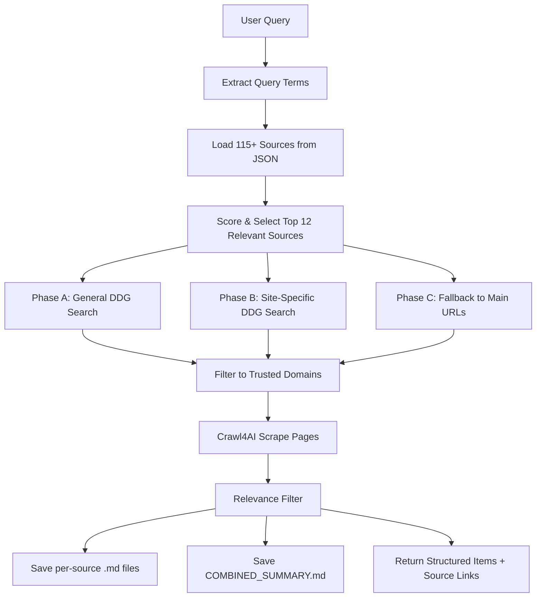
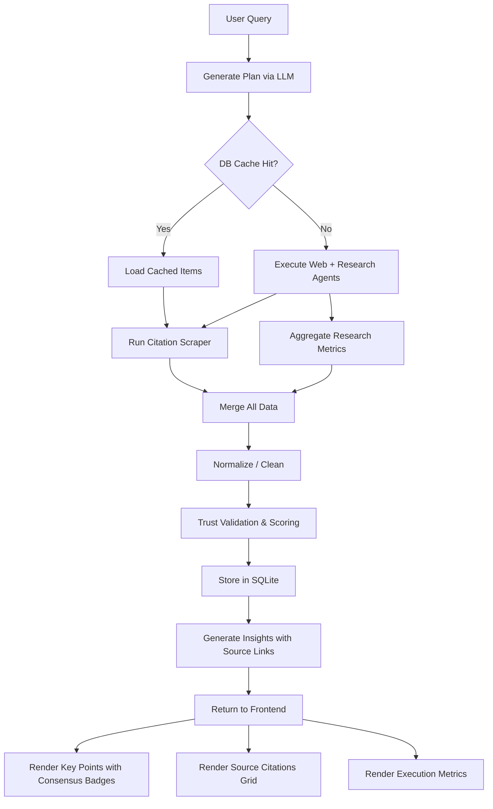

# TrustWise — Multi-Source Citation Scraping: Full Session Walkthrough

> **Date:** 2 April 2026  
> **Scope:** Implement multi-source citation scraping, debug pipeline failures, resolve merge conflicts, fix frontend rendering bugs

---

## 1. Objective

The TrustWise pipeline was only showing insights from **1 source** (OpenAlex). The goal was to integrate a robust, multi-source citation scraping system that:

- Leverages a curated list of **200+ technical and research blogs**
- Scrapes query-relevant data from each source
- Saves per-source [.md](file:///c:/Anushk/Codes/TrustWise_Anushk/README.md) files and a combined summary
- Surfaces cited insights with direct links in the frontend

---

## 2. New Files Created

### [config/trusted_citations.json](file:///c:/Anushk/Codes/TrustWise_Anushk/config/trusted_citations.json)
Structured JSON with **115+ curated citation sources** across 6 categories:

| Category | Count | Examples |
|----------|-------|---------|
| AI / ML / Data Science Research | 46 | OpenAI, DeepMind, Hugging Face, BAIR, Distill |
| Systems, Cloud & Distributed | 29 | Netflix, Meta, Stripe, Uber Engineering |
| Programming & Developer Learning | 13 | DEV.to, Real Python, GeeksForGeeks |
| Academic & Theory-Focused CS | 7 | Google Research, MIT CSAIL |
| Cybersecurity Research | 14 | Krebs on Security, Troy Hunt |
| DevOps & Infrastructure | 4 | HashiCorp, Pulumi |

Each source has `name`, [url](file:///c:/Anushk/Codes/TrustWise_Anushk/agents/citation_scraper.py#231-293), and `tags` for relevance matching.

### [agents/citation_scraper.py](file:///c:/Anushk/Codes/TrustWise_Anushk/agents/citation_scraper.py)
New 650-line module that orchestrates multi-source scraping:



Key features:
- **Tag-based relevance scoring** — matches query terms against source tags
- **3-phase search strategy** — general DDG → site-specific DDG → main URL fallback
- **Crawl4AI integration** with HTTP fallback
- **Content relevance filtering** — rejects boilerplate/noise
- **MD file generation** — per-source files + combined summary

---

## 3. Files Modified

### [api_bridge.py](file:///c:/Anushk/Codes/TrustWise_Anushk/api_bridge.py)

```diff:api_bridge.py
"""
TrustWise API Bridge

Thin JSON-over-stdin/stdout bridge so the TypeScript web server can invoke
the Python pipeline without embedding a Python runtime.

Usage (called by the TypeScript server, not by users directly):
    echo '{"action":"status"}' | python api_bridge.py
"""

import json
import logging
import sys
import os
from datetime import datetime
from pathlib import Path

# Redirect ALL logging to stderr so stdout is clean JSON for the caller.
logging.basicConfig(stream=sys.stderr, level=logging.WARNING)
for _handler in logging.root.handlers:
    _handler.stream = sys.stderr

# Ensure the repo root is on sys.path so relative imports work.
sys.path.insert(0, os.path.dirname(os.path.abspath(__file__)))

from dotenv import load_dotenv

load_dotenv()

# Patch the logger module so any future setup_logger() calls also go to stderr.
import utils.logger as _logger_mod
_orig_setup = _logger_mod.setup_logger

def _patched_setup_logger(name: str):
    logger = _orig_setup(name)
    for h in logger.handlers:
        if hasattr(h, 'stream'):
            h.stream = sys.stderr
    return logger

_logger_mod.setup_logger = _patched_setup_logger

from orchestrator.orchestrator import generate_plan
from chunker.chunker import chunk_tasks
from scheduler.scheduler import schedule
from agents import web_agent, research_agent
from cleaner import normalize_results
from trust import validate_structured_data
from storage import get_cached_trusted_items, save_trusted_items
from insights import generate_insights
from utils.config import Config
from utils.logger import setup_logger
from utils.retry import execute_with_retry

logger = setup_logger(__name__)


# ── Action handlers ──────────────────────────────────────

def handle_submit(payload: dict) -> dict:
    """Run the full pipeline for a query."""
    query = payload.get("query", "").strip()
    if not query:
        return {"success": False, "error": "Query cannot be empty"}

    logger.info(f"Bridge: Processing query: {query}")

    # Step 1: Generate Plan
    plan = generate_plan(query)

    # Step 1.5: Check cache
    if Config.ENABLE_DB_CACHE:
        cached_items = get_cached_trusted_items(
            query=query, min_items=Config.DB_CACHE_MIN_ITEMS, limit=8
        )
        if cached_items:
            insights = generate_insights(cached_items, query=query)
            return {
                "success": True,
                "plan": {
                    "goal": plan.get("goal"),
                    "domains": plan.get("domains"),
                    "time_range": plan.get("time_range"),
                    "sources": plan.get("sources"),
                    "total_tasks": len(plan.get("tasks", [])),
                },
                "execution": {
                    "web_tasks": 0,
                    "paper_tasks": 0,
                    "total_results": 0,
                    "successful": 0,
                    "structured_items": len(cached_items),
                    "trusted_items": len(cached_items),
                    "db_inserted": 0,
                    "db_skipped": 0,
                    "cache_hit": True,
                },
                "results": [],
                "structured_data": cached_items,
                "trusted_data": cached_items,
                "insights": insights,
                "trust_report": {
                    "validated_count": len(cached_items),
                    "trusted_count": len(cached_items),
                    "dropped_count": 0,
                },
            }

    # Step 2-4: Chunk, Schedule, Execute
    tasks = chunk_tasks(plan)
    web_tasks, paper_tasks = schedule(tasks)

    results = []
    for task in web_tasks:
        try:
            result = execute_with_retry(
                web_agent.run,
                task,
                max_retries=2,
                base_delay=1.0,
                retryable_exceptions=(ConnectionError, TimeoutError, OSError),
            )
            results.append(result)
        except Exception as e:
            logger.error(f"Web task {task.get('task_id')} failed: {e}")
            results.append(
                {"task_id": task.get("task_id"), "status": "failed", "error": str(e)}
            )

    for task in paper_tasks:
        try:
            result = execute_with_retry(
                research_agent.run,
                task,
                max_retries=2,
                base_delay=1.0,
                retryable_exceptions=(ConnectionError, TimeoutError, OSError),
            )
            results.append(result)
        except Exception as e:
            logger.error(f"Research task {task.get('task_id')} failed: {e}")
            results.append(
                {"task_id": task.get("task_id"), "status": "failed", "error": str(e)}
            )

    # Step 5-8: Clean, Trust, Store, Insights
    structured_data = normalize_results(results, query=query)
    trust_report = validate_structured_data(structured_data, query=query)
    trusted_data = trust_report["trusted_items"]

    db_stats = {"inserted": 0, "skipped": 0}
    if Config.SAVE_TO_DB:
        db_stats = save_trusted_items(trusted_data, query=query)

    insight_input = trusted_data if trusted_data else structured_data
    insights = generate_insights(insight_input, query=query)

    return {
        "success": True,
        "plan": {
            "goal": plan.get("goal"),
            "domains": plan.get("domains"),
            "time_range": plan.get("time_range"),
            "sources": plan.get("sources"),
            "total_tasks": len(plan.get("tasks", [])),
        },
        "execution": {
            "web_tasks": len(web_tasks),
            "paper_tasks": len(paper_tasks),
            "total_results": len(results),
            "successful": sum(1 for r in results if r.get("status") == "success"),
            "structured_items": len(structured_data),
            "trusted_items": len(trusted_data),
            "db_inserted": db_stats["inserted"],
            "db_skipped": db_stats["skipped"],
            "cache_hit": False,
        },
        "results": results,
        "structured_data": structured_data,
        "trusted_data": trusted_data,
        "insights": insights,
        "trust_report": {
            "validated_count": trust_report["validated_count"],
            "trusted_count": trust_report["trusted_count"],
            "dropped_count": trust_report["dropped_count"],
        },
    }


def handle_status(_payload: dict) -> dict:
    """Return system status."""
    ollama_reachable = False
    gemini_configured = bool(Config.GEMINI_API_KEY)

    try:
        import requests
        resp = requests.get(f"{Config.OLLAMA_BASE_URL}/api/tags", timeout=2)
        ollama_reachable = resp.status_code == 200
    except Exception:
        ollama_reachable = False

    if Config.LLM_PROVIDER == "both":
        has_api_key = gemini_configured or ollama_reachable
    elif Config.LLM_PROVIDER == "gemini":
        has_api_key = gemini_configured
    elif Config.LLM_PROVIDER == "ollama":
        has_api_key = ollama_reachable
    else:
        has_api_key = False

    providers_available = []
    if gemini_configured:
        providers_available.append("gemini")
    if ollama_reachable:
        providers_available.append("ollama")

    return {
        "success": True,
        "status": {
            "llm_provider": Config.LLM_PROVIDER,
            "llm_model": Config.LLM_MODEL,
            "has_api_key": has_api_key,
            "ollama_reachable": ollama_reachable,
            "gemini_configured": gemini_configured,
            "providers_available": providers_available,
            "save_plans": Config.SAVE_PLANS,
            "save_raw_data": Config.SAVE_RAW_DATA,
            "save_structured_data": Config.SAVE_STRUCTURED_DATA,
            "save_trusted_data": Config.SAVE_TRUSTED_DATA,
            "save_to_db": Config.SAVE_TO_DB,
            "enable_db_cache": Config.ENABLE_DB_CACHE,
            "is_running": False,
        },
    }


def handle_list_plans(_payload: dict) -> dict:
    """List saved plans."""
    plans_dir = Config.PLANS_DIR
    plan_files = sorted(plans_dir.glob("plan_*.json"), reverse=True)

    plans = []
    for plan_file in list(plan_files)[:20]:
        try:
            with open(plan_file, "r", encoding="utf-8") as f:
                plan_data = json.load(f)
                plans.append(
                    {
                        "filename": plan_file.name,
                        "goal": plan_data.get("goal", "N/A"),
                        "created_at": plan_data.get("_metadata", {}).get(
                            "created_at", "Unknown"
                        ),
                        "query": plan_data.get("_metadata", {}).get("query", "N/A"),
                        "tasks": len(plan_data.get("tasks", [])),
                    }
                )
        except Exception as e:
            logger.warning(f"Failed to read plan {plan_file}: {e}")
            continue

    return {"success": True, "plans": plans}


def handle_get_plan(payload: dict) -> dict:
    """Get a specific plan by filename."""
    filename = payload.get("filename", "")
    if ".." in filename or "/" in filename or "\\" in filename:
        return {"success": False, "error": "Invalid filename"}

    plan_file = (Config.PLANS_DIR / filename).resolve()
    plans_dir = Config.PLANS_DIR.resolve()

    try:
        plan_file.relative_to(plans_dir)
    except ValueError:
        return {"success": False, "error": "Invalid filename"}

    if not plan_file.exists():
        return {"success": False, "error": "Plan not found"}

    with open(plan_file, "r", encoding="utf-8") as f:
        plan_data = json.load(f)

    return {"success": True, "plan": plan_data}


def handle_list_raw_data(_payload: dict) -> dict:
    """List raw data files."""
    raw_dir = Config.RAW_DATA_DIR
    raw_files = sorted(raw_dir.glob("task_*.json"), reverse=True)

    files = []
    for raw_file in list(raw_files)[:50]:
        try:
            stat = raw_file.stat()
            files.append(
                {
                    "filename": raw_file.name,
                    "size": stat.st_size,
                    "modified": datetime.fromtimestamp(stat.st_mtime).isoformat(),
                }
            )
        except Exception as e:
            logger.warning(f"Failed to stat file {raw_file}: {e}")
            continue

    return {"success": True, "files": files}


# ── Main dispatcher ──────────────────────────────────────

ACTIONS = {
    "submit": handle_submit,
    "status": handle_status,
    "list_plans": handle_list_plans,
    "get_plan": handle_get_plan,
    "list_raw_data": handle_list_raw_data,
}


def main() -> None:
    raw = sys.stdin.read()
    try:
        request = json.loads(raw)
    except json.JSONDecodeError:
        json.dump({"success": False, "error": "Invalid JSON input"}, sys.stdout)
        return

    action = request.pop("action", "")
    handler = ACTIONS.get(action)

    if handler is None:
        json.dump({"success": False, "error": f"Unknown action: {action}"}, sys.stdout)
        return

    try:
        result = handler(request)
    except Exception as e:
        logger.error(f"Bridge action '{action}' failed: {e}", exc_info=True)
        result = {"success": False, "error": "An internal error occurred."}

    json.dump(result, sys.stdout)


if __name__ == "__main__":
    main()
===
"""
TrustWise API Bridge

Thin JSON-over-stdin/stdout bridge so the TypeScript web server can invoke
the Python pipeline without embedding a Python runtime.

Usage (called by the TypeScript server, not by users directly):
    echo '{"action":"status"}' | python api_bridge.py
"""

import json
import logging
import sys
import os
from datetime import datetime
from pathlib import Path

# Redirect ALL logging to stderr so stdout is clean JSON for the caller.
logging.basicConfig(stream=sys.stderr, level=logging.WARNING)
for _handler in logging.root.handlers:
    _handler.stream = sys.stderr

# Ensure the repo root is on sys.path so relative imports work.
sys.path.insert(0, os.path.dirname(os.path.abspath(__file__)))

from dotenv import load_dotenv

load_dotenv()

# Patch the logger module so any future setup_logger() calls also go to stderr.
import utils.logger as _logger_mod
_orig_setup = _logger_mod.setup_logger

def _patched_setup_logger(name: str):
    logger = _orig_setup(name)
    for h in logger.handlers:
        if hasattr(h, 'stream'):
            h.stream = sys.stderr
    return logger

_logger_mod.setup_logger = _patched_setup_logger

from orchestrator.orchestrator import generate_plan
from chunker.chunker import chunk_tasks
from scheduler.scheduler import schedule
from agents import web_agent, research_agent
from agents.citation_scraper import scrape_citations
from cleaner import normalize_results
from trust import validate_structured_data
from storage import get_cached_trusted_items, save_trusted_items
from insights import generate_insights
from utils.config import Config
from utils.logger import setup_logger
from utils.retry import execute_with_retry

logger = setup_logger(__name__)


def _keyed_research_snapshot(source_stats: dict) -> dict:
    """Per-keyed-provider config flags + last-run counts (from aggregated research_source_stats)."""
    key_cfg = {
        "tavily": "TAVILY_API_KEY",
        "exa": "EXA_API_KEY",
        "firecrawl": "FIRECRAWL_API_KEY",
        "jina_reader": "JINA_API_KEY",
        "deepseek": "DEEPSEEK_API_KEY",
        "scopus": "SCOPUS_API_KEY",
    }
    out: dict = {}
    for sid, cfg in key_cfg.items():
        st = source_stats.get(sid) or {}
        ok_val = st.get("ok")
        ok_ok = (ok_val > 0) if isinstance(ok_val, (int, float)) else bool(ok_val)
        out[sid] = {
            "configured": bool(getattr(Config, cfg, None)),
            "items_last_run": int(st.get("count", 0)),
            "ok_last_run": ok_ok,
        }
    out["jina_search_allow_keyless"] = Config.JINA_SEARCH_ALLOW_KEYLESS
    return out


# ── Action handlers ──────────────────────────────────────

def handle_submit(payload: dict) -> dict:
    """Run the full pipeline for a query."""
    query = payload.get("query", "").strip()
    if not query:
        return {"success": False, "error": "Query cannot be empty"}

    logger.info(f"Bridge: Processing query: {query}")

    # Step 1: Generate Plan
    plan = generate_plan(query)

    # Step 1.5: Check cache
    if Config.ENABLE_DB_CACHE:
        cached_items = get_cached_trusted_items(
            query=query, min_items=Config.DB_CACHE_MIN_ITEMS, limit=8
        )
        if cached_items:
            # Even on cache hit, run citation scraper for multi-source data
            citation_result = {"scraped_items": [], "source_links": [], "sources_used": 0}
            try:
                citation_result = scrape_citations(
                    query=query,
                    max_sources=Config.CITATION_MAX_SOURCES,
                    max_pages_per_source=Config.CITATION_PAGES_PER_SOURCE,
                )
                logger.info(
                    f"Bridge: Citation scraper (cache-hit path) returned "
                    f"{citation_result.get('sources_used', 0)} sources"
                )
            except Exception as e:
                logger.error(f"Bridge: Citation scraper failed on cache path: {e}")

            # Merge citation items into cached items for richer insights
            all_items = list(cached_items)
            citation_items = citation_result.get("scraped_items", [])
            if citation_items:
                all_items.extend(citation_items)

            source_links = citation_result.get("source_links", [])
            insights = generate_insights(all_items, query=query, source_links=source_links)
            return {
                "success": True,
                "plan": {
                    "goal": plan.get("goal"),
                    "domains": plan.get("domains"),
                    "time_range": plan.get("time_range"),
                    "sources": plan.get("sources"),
                    "total_tasks": len(plan.get("tasks", [])),
                },
                "execution": {
                    "web_tasks": 0,
                    "paper_tasks": 0,
                    "total_results": 0,
                    "successful": 0,
                    "structured_items": len(all_items),
                    "trusted_items": len(all_items),
                    "citation_sources": citation_result.get("sources_used", 0),
                    "db_inserted": 0,
                    "db_skipped": 0,
                    "cache_hit": True,
                    "research_raw_count": 0,
                    "research_unique_count": 0,
                    "research_returned_count": 0,
                    "research_unique_ratio": 0,
                    "enabled_research_sources": [],
                    "research_source_stats": {},
                    "keyed_research_providers": _keyed_research_snapshot({}),
                },
                "results": [],
                "structured_data": all_items,
                "trusted_data": all_items,
                "insights": insights,
                "trust_report": {
                    "validated_count": len(all_items),
                    "trusted_count": len(all_items),
                    "dropped_count": 0,
                },
            }

    # Step 2-4: Chunk, Schedule, Execute
    tasks = chunk_tasks(plan)
    web_tasks, paper_tasks = schedule(tasks)

    results = []
    for task in web_tasks:
        try:
            result = execute_with_retry(
                web_agent.run,
                task,
                max_retries=2,
                base_delay=1.0,
                retryable_exceptions=(ConnectionError, TimeoutError, OSError),
            )
            results.append(result)
        except Exception as e:
            logger.error(f"Web task {task.get('task_id')} failed: {e}")
            results.append(
                {"task_id": task.get("task_id"), "status": "failed", "error": str(e)}
            )

    for task in paper_tasks:
        try:
            result = execute_with_retry(
                research_agent.run,
                task,
                max_retries=2,
                base_delay=1.0,
                retryable_exceptions=(ConnectionError, TimeoutError, OSError),
            )
            results.append(result)
        except Exception as e:
            logger.error(f"Research task {task.get('task_id')} failed: {e}")
            results.append(
                {"task_id": task.get("task_id"), "status": "failed", "error": str(e)}
            )

    # Step 4.5: Scrape trusted citation sources for multi-source data
    citation_result = {"scraped_items": [], "source_links": [], "sources_used": 0}
    try:
        citation_result = scrape_citations(
            query=query,
            max_sources=Config.CITATION_MAX_SOURCES,
            max_pages_per_source=Config.CITATION_PAGES_PER_SOURCE,
        )
        logger.info(
            f"Bridge: Citation scraper returned {citation_result.get('sources_used', 0)} sources"
        )
    except Exception as e:
        logger.error(f"Bridge: Citation scraper failed: {e}")

    # Aggregate source-level metrics from research agents.
    source_stats: dict = {}
    enabled_sources: set = set()
    raw_count = 0
    unique_count = 0
    returned_count = 0
    for r in results:
        sm = r.get("source_metrics") if isinstance(r, dict) else None
        if not isinstance(sm, dict):
            continue
        raw_count += int(sm.get("raw_count", 0))
        unique_count += int(sm.get("unique_count", 0))
        returned_count += int(sm.get("returned_count", 0))
        for src in sm.get("enabled_sources", []) or []:
            enabled_sources.add(src)
        for source_id, stat in (sm.get("source_stats") or {}).items():
            item = source_stats.setdefault(source_id, {"count": 0, "ok": 0, "fail": 0})
            item["count"] += int(stat.get("count", 0))
            if stat.get("ok"):
                item["ok"] += 1
            else:
                item["fail"] += 1

    # Step 5-8: Clean, Trust, Store, Insights
    structured_data = normalize_results(results, query=query)

    # Merge citation-scraped items into structured data
    citation_items = citation_result.get("scraped_items", [])
    if citation_items:
        structured_data.extend(citation_items)
        logger.info(f"Bridge: Merged {len(citation_items)} citation items into structured data")

    trust_report = validate_structured_data(structured_data, query=query)
    trusted_data = trust_report["trusted_items"]

    db_stats = {"inserted": 0, "skipped": 0}
    if Config.SAVE_TO_DB:
        db_stats = save_trusted_items(trusted_data, query=query)

    insight_input = trusted_data if trusted_data else structured_data
    source_links = citation_result.get("source_links", [])
    insights = generate_insights(insight_input, query=query, source_links=source_links)

    return {
        "success": True,
        "plan": {
            "goal": plan.get("goal"),
            "domains": plan.get("domains"),
            "time_range": plan.get("time_range"),
            "sources": plan.get("sources"),
            "total_tasks": len(plan.get("tasks", [])),
        },
        "execution": {
            "web_tasks": len(web_tasks),
            "paper_tasks": len(paper_tasks),
            "total_results": len(results),
            "successful": sum(1 for r in results if r.get("status") == "success"),
            "structured_items": len(structured_data),
            "trusted_items": len(trusted_data),
            "citation_sources": citation_result.get("sources_used", 0),
            "db_inserted": db_stats["inserted"],
            "db_skipped": db_stats["skipped"],
            "cache_hit": False,
            "research_raw_count": raw_count,
            "research_unique_count": unique_count,
            "research_returned_count": returned_count,
            "research_unique_ratio": round(unique_count / max(raw_count, 1), 4),
            "enabled_research_sources": sorted(list(enabled_sources)),
            "research_source_stats": source_stats,
            "keyed_research_providers": _keyed_research_snapshot(source_stats),
        },
        "results": results,
        "structured_data": structured_data,
        "trusted_data": trusted_data,
        "insights": insights,
        "trust_report": {
            "validated_count": trust_report["validated_count"],
            "trusted_count": trust_report["trusted_count"],
            "dropped_count": trust_report["dropped_count"],
        },
    }


def handle_status(_payload: dict) -> dict:
    """Return system status."""
    ollama_reachable = False
    gemini_configured = bool(Config.GEMINI_API_KEY)

    try:
        import requests
        resp = requests.get(f"{Config.OLLAMA_BASE_URL}/api/tags", timeout=2)
        ollama_reachable = resp.status_code == 200
    except Exception:
        ollama_reachable = False

    if Config.LLM_PROVIDER == "both":
        has_api_key = gemini_configured or ollama_reachable
    elif Config.LLM_PROVIDER == "gemini":
        has_api_key = gemini_configured
    elif Config.LLM_PROVIDER == "ollama":
        has_api_key = ollama_reachable
    else:
        has_api_key = False

    providers_available = []
    if gemini_configured:
        providers_available.append("gemini")
    if ollama_reachable:
        providers_available.append("ollama")

    return {
        "success": True,
        "status": {
            "llm_provider": Config.LLM_PROVIDER,
            "llm_model": Config.LLM_MODEL,
            "has_api_key": has_api_key,
            "ollama_reachable": ollama_reachable,
            "gemini_configured": gemini_configured,
            "providers_available": providers_available,
            "save_plans": Config.SAVE_PLANS,
            "save_raw_data": Config.SAVE_RAW_DATA,
            "save_structured_data": Config.SAVE_STRUCTURED_DATA,
            "save_trusted_data": Config.SAVE_TRUSTED_DATA,
            "save_to_db": Config.SAVE_TO_DB,
            "enable_db_cache": Config.ENABLE_DB_CACHE,
            "is_running": False,
        },
    }


def handle_list_plans(_payload: dict) -> dict:
    """List saved plans."""
    plans_dir = Config.PLANS_DIR
    plan_files = sorted(plans_dir.glob("plan_*.json"), reverse=True)

    plans = []
    for plan_file in list(plan_files)[:20]:
        try:
            with open(plan_file, "r", encoding="utf-8") as f:
                plan_data = json.load(f)
                plans.append(
                    {
                        "filename": plan_file.name,
                        "goal": plan_data.get("goal", "N/A"),
                        "created_at": plan_data.get("_metadata", {}).get(
                            "created_at", "Unknown"
                        ),
                        "query": plan_data.get("_metadata", {}).get("query", "N/A"),
                        "tasks": len(plan_data.get("tasks", [])),
                    }
                )
        except Exception as e:
            logger.warning(f"Failed to read plan {plan_file}: {e}")
            continue

    return {"success": True, "plans": plans}


def handle_get_plan(payload: dict) -> dict:
    """Get a specific plan by filename."""
    filename = payload.get("filename", "")
    if ".." in filename or "/" in filename or "\\" in filename:
        return {"success": False, "error": "Invalid filename"}

    plan_file = (Config.PLANS_DIR / filename).resolve()
    plans_dir = Config.PLANS_DIR.resolve()

    try:
        plan_file.relative_to(plans_dir)
    except ValueError:
        return {"success": False, "error": "Invalid filename"}

    if not plan_file.exists():
        return {"success": False, "error": "Plan not found"}

    with open(plan_file, "r", encoding="utf-8") as f:
        plan_data = json.load(f)

    return {"success": True, "plan": plan_data}


def handle_list_raw_data(_payload: dict) -> dict:
    """List raw data files."""
    raw_dir = Config.RAW_DATA_DIR
    raw_files = sorted(raw_dir.glob("task_*.json"), reverse=True)

    files = []
    for raw_file in list(raw_files)[:50]:
        try:
            stat = raw_file.stat()
            files.append(
                {
                    "filename": raw_file.name,
                    "size": stat.st_size,
                    "modified": datetime.fromtimestamp(stat.st_mtime).isoformat(),
                }
            )
        except Exception as e:
            logger.warning(f"Failed to stat file {raw_file}: {e}")
            continue

    return {"success": True, "files": files}


# ── Main dispatcher ──────────────────────────────────────

ACTIONS = {
    "submit": handle_submit,
    "status": handle_status,
    "list_plans": handle_list_plans,
    "get_plan": handle_get_plan,
    "list_raw_data": handle_list_raw_data,
}


def main() -> None:
    raw = sys.stdin.read()
    try:
        request = json.loads(raw)
    except json.JSONDecodeError:
        json.dump({"success": False, "error": "Invalid JSON input"}, sys.stdout)
        return

    action = request.pop("action", "")
    handler = ACTIONS.get(action)

    if handler is None:
        json.dump({"success": False, "error": f"Unknown action: {action}"}, sys.stdout)
        return

    try:
        result = handler(request)
    except Exception as e:
        logger.error(f"Bridge action '{action}' failed: {e}", exc_info=True)
        result = {"success": False, "error": "An internal error occurred."}

    json.dump(result, sys.stdout)


if __name__ == "__main__":
    main()
```

**Changes:**
- Added [scrape_citations](file:///c:/Anushk/Codes/TrustWise_Anushk/agents/citation_scraper.py#525-719) import
- **Cache-hit path (line ~78):** Now runs citation scraper even when DB cache returns items, merges citation data into cached results, and passes `source_links` to [generate_insights](file:///c:/Anushk/Codes/TrustWise_Anushk/insights/generator.py#329-481)
- **Non-cache path (line ~201):** Added citation scraper as Step 4.5 between agent execution and cleaner
- Added [_keyed_research_snapshot()](file:///c:/Anushk/Codes/TrustWise_Anushk/api_bridge.py#59-81) helper (user's change)
- Added research metrics aggregation (user's change)
- Both paths now include `citation_sources` count in execution stats

### [agents/web_agent.py](file:///c:/Anushk/Codes/TrustWise_Anushk/agents/web_agent.py)

```diff:web_agent.py
"""
TrustWise Web Agent — powered by Crawl4AI

Strategy:
  1. Takes the task prompt (e.g. "Find news about quantum computing")
  2. Searches the web for relevant URLs using DuckDuckGo
  3. Crawls those specific pages with Crawl4AI (headless Chromium)
  4. Returns clean Markdown content

Falls back to Wikipedia API + basic HTTP when Crawl4AI is unavailable.

Phase 1:
  - Collects raw text/markdown from web sources
  - No trust validation; no LLM summarisation
"""

import asyncio
import json
import re
from datetime import datetime
from typing import Dict, Any, List
from utils.config import Config
from utils.logger import setup_logger
from utils.rate_limiter import web_limiter

logger = setup_logger(__name__)

# ───────────────────────────────────────────
# Crawl4AI availability check
# ───────────────────────────────────────────
try:
    from crawl4ai import AsyncWebCrawler, BrowserConfig, CrawlerRunConfig, CacheMode
    from crawl4ai.markdown_generation_strategy import DefaultMarkdownGenerator
    from crawl4ai.content_filter_strategy import PruningContentFilter
    CRAWL4AI_AVAILABLE = True
    logger.info("[WebAgent] Crawl4AI is available — using headless browser scraping")
except ImportError:
    CRAWL4AI_AVAILABLE = False
    logger.warning("[WebAgent] Crawl4AI not installed — falling back to basic HTTP scraping")


# ═══════════════════════════════════════════
# Public entry point
# ═══════════════════════════════════════════

def run(task: Dict[str, Any]) -> Dict[str, Any]:
    """
    Execute a web scraping task.

    Flow:
      1. Extract search terms from the task prompt
      2. Search the web (DuckDuckGo) for relevant URLs
      3. Crawl those pages with Crawl4AI
      4. Also fetch Wikipedia for knowledge queries
      5. Return collected data

    Args:
        task: Dict with task_id, prompt, source_type, agent

    Returns:
        Dict with task results including status and raw data
    """
    task_id = task.get("task_id", "unknown")
    prompt = task.get("prompt", "")

    logger.info(f"[WebAgent] Processing task: {task_id}")
    logger.info(f"[WebAgent] Prompt: {prompt}")

    result = {
        "task_id": task_id,
        "agent": "web_agent",
        "status": "success",
        "timestamp": datetime.utcnow().isoformat(),
        "prompt": prompt,
        "data": [],
    }

    try:
        search_terms = _extract_search_terms(prompt)
        query_terms = _extract_query_terms(prompt)
        logger.info(f"[WebAgent] Search terms: {search_terms}")

        is_news_query = any(
            w in prompt.lower()
            for w in ["news", "latest", "recent", "update", "announcement", "release"]
        )

        # ── Step 1: Search the web for relevant URLs ──
        if CRAWL4AI_AVAILABLE and search_terms:
            logger.info("[WebAgent] Searching the web for relevant pages...")
            trusted_domains = _trusted_domain_set(_load_trusted_sources())
            search_urls = _search_duckduckgo(search_terms, max_results=6, preferred_domains=trusted_domains)

            if search_urls:
                logger.info(f"[WebAgent] Found {len(search_urls)} relevant URLs to crawl")
                crawl_results = _run_async(_crawl_with_crawl4ai(search_urls, prompt, query_terms))
                result["data"].extend(crawl_results)
            else:
                logger.warning("[WebAgent] No search results — crawling trusted topic pages")
                sources = _load_trusted_sources()
                if sources:
                    fallback_urls = _expand_sources_for_query(sources, is_news_query)
                    crawl_results = _run_async(_crawl_with_crawl4ai(fallback_urls[:4], prompt, query_terms))
                    result["data"].extend(crawl_results)

        # ── Step 2: Wikipedia for knowledge queries ──
        if (not is_news_query and search_terms) or not result["data"]:
            logger.info("[WebAgent] Trying Wikipedia for knowledge content...")
            wiki_content = _fetch_from_wikipedia(search_terms)
            if wiki_content and len(wiki_content) > 500:
                result["data"].append({
                    "source": "Wikipedia",
                    "content": wiki_content,
                    "content_type": "text",
                    "fetch_time": datetime.utcnow().isoformat(),
                })

        # ── Step 3: Basic HTTP fallback if nothing collected ──
        if not result["data"] and not CRAWL4AI_AVAILABLE:
            logger.info("[WebAgent] Crawl4AI unavailable — using basic HTTP")
            sources = _load_trusted_sources()
            for url in sources[:2]:
                try:
                    content = _fetch_basic_http(url)
                    if not _is_relevant_content(content, query_terms, url):
                        continue
                    if content and len(content) > 200:
                        result["data"].append({
                            "source": url,
                            "content": content,
                            "content_type": "text",
                            "fetch_time": datetime.utcnow().isoformat(),
                        })
                except Exception as e:
                    logger.warning(f"[WebAgent] Failed to fetch {url}: {e}")

        if not result["data"]:
            result["status"] = "partial"
            result["message"] = "No data collected from any source"
            logger.warning(f"[WebAgent] Task {task_id} collected no data")

        if Config.SAVE_RAW_DATA:
            _save_raw_data(task_id, result)

    except Exception as e:
        logger.error(f"[WebAgent] Task {task_id} failed: {e}")
        result["status"] = "failed"
        result["error"] = str(e)

    return result


# ═══════════════════════════════════════════
# Web Search — find URLs relevant to the query
# ═══════════════════════════════════════════

def _search_duckduckgo(query: str, max_results: int = 5, preferred_domains: set | None = None) -> List[str]:
    """
    Search DuckDuckGo for relevant URLs matching the query.

    Uses the duckduckgo_search library for reliable results.

    Returns:
        List of URLs relevant to the query
    """
    try:
        import warnings
        warnings.filterwarnings("ignore", category=RuntimeWarning)
        from duckduckgo_search import DDGS
    except ImportError:
        logger.warning("[WebAgent] duckduckgo_search not installed — cannot search web")
        return []

    try:
        logger.info(f"[WebAgent] DuckDuckGo search: {query}")

        # Try multiple backends — 'api' is most reliable,
        # fall back to 'lite' then default if needed
        results = []
        for backend in ("api", "lite", None):
            try:
                kwargs = {"keywords": query, "max_results": max_results}
                if backend:
                    kwargs["backend"] = backend
                results = DDGS().text(**kwargs)
                if results:
                    logger.info(f"[WebAgent] DDG backend '{backend or 'default'}' returned {len(results)} results")
                    break
            except Exception:
                continue

        urls = []
        skip_domains = [
            "youtube.com", "facebook.com", "twitter.com", "x.com",
            "instagram.com", "reddit.com", "linkedin.com", "pinterest.com",
            "zhihu.com", "baidu.com",
        ]

        preferred = []
        non_preferred = []

        for r in results:
            href = r.get("href", "")
            if href and href.startswith("http") and not any(d in href for d in skip_domains):
                domain = _domain_from_url(href)
                if preferred_domains and domain in preferred_domains:
                    preferred.append(href)
                else:
                    non_preferred.append(href)
                logger.info(f"[WebAgent]   → {r.get('title', '?')[:70]}")
                logger.info(f"[WebAgent]     {href[:100]}")

        urls = (preferred + non_preferred)[:max_results]

        logger.info(f"[WebAgent] DuckDuckGo returning {len(urls)} usable URLs")
        return urls

    except Exception as e:
        logger.warning(f"[WebAgent] DuckDuckGo search failed: {e}")
        return []


# ═══════════════════════════════════════════
# Crawl4AI — crawl specific URLs
# ═══════════════════════════════════════════

async def _crawl_with_crawl4ai(
    urls: List[str],
    prompt: str,
    query_terms: List[str],
) -> List[Dict[str, Any]]:
    """
    Use Crawl4AI to crawl specific URLs with a headless browser.

    Returns a list of dicts suitable for result["data"].
    """
    collected: List[Dict[str, Any]] = []

    browser_conf = BrowserConfig(
        headless=True,
        verbose=False,
    )

    # Markdown generator with content-pruning filter
    md_generator = DefaultMarkdownGenerator(
        content_filter=PruningContentFilter(
            threshold=0.4,
            threshold_type="fixed",
        )
    )

    run_conf = CrawlerRunConfig(
        cache_mode=CacheMode.BYPASS,      # always fetch fresh
        markdown_generator=md_generator,
        page_timeout=15000,                # 15 s per page
        wait_until="domcontentloaded",
    )

    try:
        async with AsyncWebCrawler(config=browser_conf) as crawler:
            for url in urls:
                try:
                    logger.info(f"[WebAgent][Crawl4AI] Crawling: {url[:100]}")
                    result = await crawler.arun(url=url, config=run_conf)

                    if result.success:
                        # Prefer the filtered "fit" markdown; fall back to raw
                        content = ""
                        if result.markdown:
                            content = (
                                getattr(result.markdown, "fit_markdown", "")
                                or getattr(result.markdown, "raw_markdown", "")
                                or str(result.markdown)
                            )

                        if not content:
                            content = result.cleaned_html or ""

                        # Trim to a reasonable size
                        max_chars = 8_000
                        if len(content) > max_chars:
                            content = content[:max_chars] + "\n\n... (truncated)"

                        if len(content) > 100:
                            if not _is_relevant_content(content, query_terms, url):
                                logger.info(f"[WebAgent][Crawl4AI] Skipping low-signal page: {url[:80]}")
                                continue
                            # Use the final URL (after redirects)
                            final_url = getattr(result, "url", url) or url
                            collected.append({
                                "source": final_url,
                                "content": content,
                                "content_type": "markdown",
                                "fetch_time": datetime.utcnow().isoformat(),
                                "crawl4ai_status": "success",
                            })
                            logger.info(
                                f"[WebAgent][Crawl4AI] ✓ {len(content)} chars from {url[:80]}"
                            )
                        else:
                            logger.warning(
                                f"[WebAgent][Crawl4AI] Content too short "
                                f"({len(content)} chars) from {url[:80]}"
                            )
                    else:
                        logger.warning(
                            f"[WebAgent][Crawl4AI] Crawl failed for {url[:80]}: "
                            f"{result.error_message}"
                        )

                except Exception as e:
                    logger.warning(f"[WebAgent][Crawl4AI] Error on {url[:80]}: {e}")
                    continue

    except Exception as e:
        logger.error(f"[WebAgent][Crawl4AI] Crawler init failed: {e}")

    return collected


# ═══════════════════════════════════════════
# Helpers
# ═══════════════════════════════════════════

def _run_async(coro):
    """Run an async coroutine from sync code (Flask context)."""
    try:
        loop = asyncio.get_running_loop()
    except RuntimeError:
        loop = None

    if loop and loop.is_running():
        import concurrent.futures
        with concurrent.futures.ThreadPoolExecutor() as pool:
            return pool.submit(asyncio.run, coro).result()
    else:
        return asyncio.run(coro)


def _load_trusted_sources() -> list:
    """Load trusted web sources from config/sources.json."""
    sources_file = Config.CONFIG_DIR / "sources.json"
    if not sources_file.exists():
        logger.warning(f"Sources file not found: {sources_file}")
        return []

    try:
        with open(sources_file, "r") as f:
            data = json.load(f)
            if isinstance(data, list):
                return data
            elif isinstance(data, dict) and "trusted_web_sources" in data:
                return data["trusted_web_sources"]
            else:
                logger.warning("Invalid sources.json format")
                return []
    except Exception as e:
        logger.error(f"Failed to load sources: {e}")
        return []


def _extract_search_terms(prompt: str) -> str:
    """Extract key search terms from the task prompt."""
    stop_words = {
        "fetch", "retrieve", "find", "get", "search", "for", "about",
        "articles", "papers", "from", "top", "blogs", "websites",
        "published", "recent", "latest", "the", "and", "or", "in",
        "on", "at", "to", "a", "an", "reputable", "online", "sources",
        "that", "have", "been", "with", "their", "this", "these",
        "those", "such", "also", "other", "some", "many", "more",
    }
    words = prompt.lower().split()
    terms = [w for w in words if w not in stop_words and (len(w) > 2 or w in {"ai", "ml"})]
    return " ".join(terms[:6])


def _extract_query_terms(prompt: str) -> List[str]:
    words = re.findall(r"[a-zA-Z0-9]+", (prompt or "").lower())
    stop_words = {
        "fetch", "retrieve", "find", "get", "search", "for", "about", "articles", "papers",
        "from", "top", "blogs", "websites", "published", "recent", "latest", "the", "and",
        "or", "in", "on", "at", "to", "a", "an", "reputable", "online", "sources", "that",
        "have", "been", "with", "their", "this", "these", "those", "such", "also", "other",
        "some", "many", "more", "information", "give", "me", "updates",
    }
    aliases = {
        "ai": ["artificial", "intelligence"],
        "ml": ["machine", "learning"],
    }
    terms: List[str] = []
    for w in words:
        if w in stop_words:
            continue
        if len(w) > 2 or w in aliases:
            terms.append(w)
            terms.extend(aliases.get(w, []))
    # Preserve order while removing duplicates.
    return list(dict.fromkeys(terms))[:8]


def _expand_sources_for_query(sources: List[str], is_news_query: bool) -> List[str]:
    if not sources:
        return []

    urls: List[str] = []
    for src in sources:
        src = src.rstrip("/")
        if "techcrunch.com" in src:
            urls.append(f"{src}/category/artificial-intelligence/")
            urls.append(f"{src}/tag/ai/")
        elif "arstechnica.com" in src:
            urls.append(f"{src}/information-technology/")
            urls.append(f"{src}/science/")
        elif "nature.com" in src:
            urls.append(f"{src}/news")
            urls.append(f"{src}/subjects/machine-learning")
        elif "sciencedaily.com" in src:
            urls.append(f"{src}/news/computers_math/artificial_intelligence/")
        elif is_news_query:
            urls.append(src)

    return urls or sources


def _trusted_domain_set(sources: List[str]) -> set:
    domains = set()
    for src in sources:
        d = _domain_from_url(src)
        if d:
            domains.add(d)
    return domains


def _domain_from_url(url: str) -> str:
    m = re.search(r"https?://([^/]+)", (url or "").lower())
    if not m:
        return ""
    return m.group(1).replace("www.", "")


def _is_relevant_content(content: str, query_terms: List[str], url: str) -> bool:
    if not content or len(content) < 220:
        return False

    lowered = content.lower()
    noisy_markers = [
        "privacy policy",
        "cookie",
        "consent",
        "manage preferences",
        "do not store directly personal information",
        "terms of use",
        "sign in",
        "subscribe now",
    ]
    marker_hits = sum(1 for marker in noisy_markers if marker in lowered)
    if marker_hits >= 2:
        return False

    if query_terms:
        overlap = sum(1 for term in query_terms if term in lowered)
        if overlap == 0:
            return False

    if re.search(r"https?://[^\s]+/?$", url or "") and "homepage" in lowered:
        return False

    return True


def _fetch_from_wikipedia(search_terms: str) -> str:
    """Fetch content from Wikipedia API."""
    try:
        import requests
    except ImportError:
        return ""

    try:
        url = "https://en.wikipedia.org/w/api.php"

        search_params = {
            "action": "opensearch",
            "search": search_terms,
            "limit": 1,
            "format": "json",
        }
        web_limiter.acquire()
        response = requests.get(url, params=search_params, timeout=10)
        response.raise_for_status()
        search_results = response.json()

        if not search_results[1]:
            logger.info(f"[WebAgent] No Wikipedia article found for: {search_terms}")
            return ""

        article_title = search_results[1][0]
        logger.info(f"[WebAgent] Found Wikipedia article: {article_title}")

        content_params = {
            "action": "query",
            "prop": "extracts",
            "titles": article_title,
            "explaintext": True,
            "exintro": False,
            "format": "json",
        }
        web_limiter.acquire()
        response = requests.get(url, params=content_params, timeout=10)
        response.raise_for_status()
        data = response.json()

        pages = data.get("query", {}).get("pages", {})
        for page_id, page_data in pages.items():
            if page_id != "-1":
                extract = page_data.get("extract", "")
                if extract:
                    max_chars = 5000
                    if len(extract) > max_chars:
                        extract = extract[:max_chars] + "\n... (truncated)"
                    wiki_url = (
                        f"https://en.wikipedia.org/wiki/"
                        f"{article_title.replace(' ', '_')}"
                    )
                    content = (
                        f"Wikipedia Article: {article_title}\n"
                        f"URL: {wiki_url}\n\n{extract}"
                    )
                    return content

        return ""

    except Exception as e:
        logger.warning(f"[WebAgent] Wikipedia fetch failed: {e}")
        return ""


def _fetch_basic_http(url: str) -> str:
    """Basic HTTP fallback (used when Crawl4AI is not available)."""
    try:
        import requests
        from bs4 import BeautifulSoup
    except ImportError:
        raise ImportError(
            "requests and beautifulsoup4 required. "
            "Install with: pip install requests beautifulsoup4"
        )

    headers = {
        "User-Agent": (
            "Mozilla/5.0 (Windows NT 10.0; Win64; x64) "
            "AppleWebKit/537.36"
        )
    }
    web_limiter.acquire()
    response = requests.get(url, headers=headers, timeout=Config.WEB_SCRAPER_TIMEOUT)
    response.raise_for_status()

    soup = BeautifulSoup(response.content, "html.parser")
    for tag in soup(["script", "style", "nav", "footer", "header"]):
        tag.decompose()

    text = soup.get_text(separator="\n", strip=True)
    lines = [line.strip() for line in text.split("\n") if line.strip()]
    content = "\n".join(lines)

    max_chars = 8_000
    if len(content) > max_chars:
        content = content[:max_chars] + "\n... (truncated)"

    return content


def _save_raw_data(task_id: str, result: Dict[str, Any]):
    """Save raw agent output to file."""
    filename = f"{task_id}_{datetime.utcnow().strftime('%Y%m%d_%H%M%S')}.json"
    filepath = Config.RAW_DATA_DIR / filename

    try:
        with open(filepath, "w", encoding="utf-8") as f:
            json.dump(result, f, indent=2, ensure_ascii=False)
        logger.info(f"[WebAgent] Saved raw data to {filepath}")
    except Exception as e:
        logger.error(f"[WebAgent] Failed to save raw data: {e}")
===
```

**Changes:**
- **Fixed DDG import:** Now tries `from ddgs import DDGS` first (new package), falls back to old `duckduckgo_search`
- **Fixed DDG API call:** Uses positional [query](file:///c:/Anushk/Codes/TrustWise_Anushk/insights/generator.py#14-34) arg (new API) with fallback to `keywords=` kwarg (old API)
- Added keyed adapter imports and search functions (user's change)
- Added [_is_balanced_fallback_content](file:///c:/Anushk/Codes/TrustWise_Anushk/agents/web_agent.py#182-191) (user's change)
- Expanded fallback HTTP scraping (user's change)

### [insights/generator.py](file:///c:/Anushk/Codes/TrustWise_Anushk/insights/generator.py)

```diff:generator.py
from collections import Counter
from concurrent.futures import ThreadPoolExecutor, as_completed
from difflib import SequenceMatcher
import json
import re
from typing import Any, Dict, List, Tuple

from utils.config import Config
from utils.logger import setup_logger

logger = setup_logger(__name__)


def _extract_query_terms(query: str) -> List[str]:
    words = re.findall(r"[a-zA-Z0-9]+", (query or "").lower())
    aliases = {
        "ai": ["artificial", "intelligence"],
        "ml": ["machine", "learning"],
        "nlp": ["language", "model", "models"],
    }
    stopwords = {
        "the", "a", "an", "and", "or", "to", "of", "for", "in", "on", "with",
        "about", "latest", "recent", "new", "tell", "me", "what", "is", "are",
        "from", "into", "at", "by", "as", "their", "its", "be", "this", "that",
    }
    terms: List[str] = []
    for w in words:
        if w in stopwords:
            continue
        if len(w) > 2 or w in aliases:
            terms.append(w)
            terms.extend(aliases.get(w, []))
    return list(dict.fromkeys(terms))


def _split_sentences(text: str) -> List[str]:
    if not text:
        return []
    compact = re.sub(r"\s+", " ", text).strip()
    if not compact:
        return []
    parts = re.split(r"(?<=[.!?])\s+", compact)
    cleaned = []
    for sentence in parts:
        s = _normalize_sentence(sentence)
        if 45 <= len(s) <= 240:
            cleaned.append(s)
    return cleaned


def _normalize_sentence(sentence: str) -> str:
    s = (sentence or "").strip()
    s = re.sub(r"^#+\s*", "", s)
    s = re.sub(r"\[([^\]]+)\]\([^\)]+\)", r"\1", s)
    s = re.sub(r"`([^`]+)`", r"\1", s)
    s = re.sub(r"\s+", " ", s)
    return s.strip()


def _rank_sentences(sentences: List[str], query_terms: List[str], require_overlap: bool = True) -> List[str]:
    scored = []
    for sentence in sentences:
        lowered = sentence.lower()
        overlap = sum(1 for term in query_terms if term in lowered)
        if require_overlap and query_terms and overlap == 0:
            continue
        digits_bonus = 1 if re.search(r"\d", sentence) else 0
        novelty_bonus = 1 if any(k in lowered for k in ["improves", "reduces", "outperforms", "study", "results"]) else 0
        score = overlap * 2 + digits_bonus + novelty_bonus
        scored.append((score, sentence))
    scored.sort(key=lambda item: item[0], reverse=True)
    ranked = []
    seen = set()
    for _, sentence in scored:
        key = sentence.lower()
        if key in seen:
            continue
        seen.add(key)
        ranked.append(sentence)
    return ranked


def _build_summary_context(items: List[Dict[str, Any]], max_items: int = 4, max_chars: int = 900) -> str:
    blocks: List[str] = []
    for idx, item in enumerate(items[:max_items], start=1):
        title = (item.get("title") or "Untitled").strip()
        source = (item.get("source") or "unknown").strip()
        content = _normalize_sentence((item.get("content") or "").replace("\n", " "))
        snippet = content[:max_chars]
        blocks.append(
            f"Source {idx}: {source}\n"
            f"Title {idx}: {title}\n"
            f"Content {idx}: {snippet}"
        )
    return "\n\n".join(blocks)


def _parse_json_response(raw: str) -> Dict[str, Any]:
    text = (raw or "").strip()
    if not text:
        return {}

    text = re.sub(r"^```json\s*", "", text, flags=re.IGNORECASE)
    text = re.sub(r"^```\s*", "", text)
    text = re.sub(r"\s*```$", "", text)
    try:
        return json.loads(text)
    except Exception:
        start = text.find("{")
        end = text.rfind("}")
        if start >= 0 and end > start:
            try:
                return json.loads(text[start : end + 1])
            except Exception:
                return {}
        return {}


def _summary_prompt(query: str, context: str) -> Tuple[str, str]:
    """Return (system_prompt, user_prompt) pair for summary generation."""
    system_prompt = (
        "You are a precise research summarizer. "
        "Write concise, factual summaries from provided sources only. "
        "Do not include cookie/privacy/legal boilerplate."
    )
    user_prompt = (
        "Summarize the information for the query below.\n"
        "Return ONLY valid JSON with keys: concise_answer (string), key_points (array of 3-5 strings).\n"
        "Rules:\n"
        "- concise_answer: 2-4 sentences, plain English, max 120 words\n"
        "- key_points: 3-5 bullets, each 1 sentence\n"
        "- keep it brief and relevant to the query\n"
        "- if evidence is weak, say so clearly\n\n"
        f"Query: {query}\n\n"
        f"Sources:\n{context}"
    )
    return system_prompt, user_prompt


def _ollama_summary(system_prompt: str, user_prompt: str) -> Dict[str, Any]:
    """Call Ollama for an insight summary."""
    import requests

    model_name = Config.get_ollama_model()
    payload = {
        "model": model_name,
        "messages": [
            {"role": "system", "content": system_prompt},
            {"role": "user", "content": user_prompt},
        ],
        "stream": False,
        "format": "json",
        "options": {"temperature": 0.1, "num_predict": 500},
    }
    response = requests.post(
        f"{Config.OLLAMA_BASE_URL}/api/chat",
        json=payload,
        timeout=90,
    )
    response.raise_for_status()
    content = response.json().get("message", {}).get("content", "")
    return _parse_json_response(content)


def _gemini_summary(system_prompt: str, user_prompt: str) -> Dict[str, Any]:
    """Call Gemini for an insight summary."""
    import google.generativeai as genai

    genai.configure(api_key=Config.GEMINI_API_KEY)
    model_name = Config.get_gemini_model()
    model = genai.GenerativeModel(
        model_name=model_name,
        generation_config=genai.GenerationConfig(
            temperature=0.1,
            max_output_tokens=500,
            response_mime_type="application/json",
        ),
        system_instruction=system_prompt,
    )
    response = model.generate_content(user_prompt)
    content = response.text or ""
    return _parse_json_response(content)


# ---------------------------------------------------------------------------
# Merge helpers for insight summaries
# ---------------------------------------------------------------------------

def _point_similarity(a: str, b: str) -> float:
    return SequenceMatcher(None, a.lower(), b.lower()).ratio()


def _merge_summaries(
    gemini_result: Dict[str, Any],
    ollama_result: Dict[str, Any],
) -> Dict[str, Any]:
    """Merge two LLM summaries with source attribution on every field."""
    g_answer = str(gemini_result.get("concise_answer") or "").strip()
    o_answer = str(ollama_result.get("concise_answer") or "").strip()

    if len(g_answer) >= len(o_answer) and g_answer:
        concise_answer = g_answer
        concise_answer_origin = "gemini"
    elif o_answer:
        concise_answer = o_answer
        concise_answer_origin = "ollama"
    else:
        concise_answer = ""
        concise_answer_origin = ""

    g_points = gemini_result.get("key_points") or []
    o_points = ollama_result.get("key_points") or []
    if not isinstance(g_points, list):
        g_points = []
    if not isinstance(o_points, list):
        o_points = []
    g_points = [str(p).strip() for p in g_points if str(p).strip()]
    o_points = [str(p).strip() for p in o_points if str(p).strip()]

    tagged_g = [{"text": p, "origin": "gemini"} for p in g_points]
    tagged_o = [{"text": p, "origin": "ollama"} for p in o_points]

    # Balanced interleave
    interleaved: List[Dict[str, str]] = []
    it_g, it_o = iter(tagged_g), iter(tagged_o)
    done_g = done_o = False
    sentinel = object()
    while not (done_g and done_o):
        if not done_g:
            val = next(it_g, sentinel)
            if val is sentinel:
                done_g = True
            else:
                interleaved.append(val)  # type: ignore[arg-type]
        if not done_o:
            val = next(it_o, sentinel)
            if val is sentinel:
                done_o = True
            else:
                interleaved.append(val)  # type: ignore[arg-type]

    # Deduplicate near-identical points
    kept: List[Dict[str, str]] = []
    for item in interleaved:
        dup = False
        for existing in kept:
            if _point_similarity(item["text"], existing["text"]) >= 0.75:
                existing["origin"] = "both"
                dup = True
                break
        if not dup:
            kept.append(item)

    return {
        "concise_answer": concise_answer,
        "concise_answer_origin": concise_answer_origin,
        "key_points": kept[:5],
    }


def _call_both_for_summary(query: str, context: str) -> Dict[str, Any]:
    """Call Gemini and Ollama in parallel for summary, merge results."""
    sys_p, usr_p = _summary_prompt(query, context)

    results: Dict[str, Dict[str, Any]] = {}
    errors: Dict[str, str] = {}

    def _run_gemini() -> Tuple[str, Dict[str, Any]]:
        return "gemini", _gemini_summary(sys_p, usr_p)

    def _run_ollama() -> Tuple[str, Dict[str, Any]]:
        return "ollama", _ollama_summary(sys_p, usr_p)

    with ThreadPoolExecutor(max_workers=2) as pool:
        futures = {pool.submit(fn): fn for fn in (_run_gemini, _run_ollama)}
        for future in as_completed(futures):
            try:
                provider, data = future.result()
                results[provider] = data
            except Exception as exc:
                fn = futures[future]
                provider = "gemini" if fn is _run_gemini else "ollama"
                errors[provider] = str(exc)
                logger.warning("[Insights] %s summary failed in 'both' mode: %s", provider, exc)

    gemini_res = results.get("gemini") or {}
    ollama_res = results.get("ollama") or {}

    if gemini_res and ollama_res:
        return _merge_summaries(gemini_res, ollama_res)

    if gemini_res:
        return gemini_res
    if ollama_res:
        return ollama_res
    return {}


def _call_llm_for_summary(query: str, context: str) -> Dict[str, Any]:
    """Route to the correct summary provider(s)."""
    provider = Config.LLM_PROVIDER

    if provider == "both":
        return _call_both_for_summary(query, context)

    sys_p, usr_p = _summary_prompt(query, context)

    if provider == "ollama":
        try:
            return _ollama_summary(sys_p, usr_p)
        except Exception as exc:
            logger.warning("[Insights] Ollama summary failed: %s", exc)
            return {}

    if provider == "gemini" and Config.GEMINI_API_KEY:
        try:
            return _gemini_summary(sys_p, usr_p)
        except Exception as exc:
            logger.warning("[Insights] Gemini summary failed: %s", exc)
            return {}

    return {}


def generate_insights(trusted_items: List[Dict[str, Any]], query: str) -> Dict[str, Any]:
    """Generate easy-to-read insights from trusted items."""
    if not trusted_items:
        return {
            "summary": "No trusted data available to generate insights.",
            "concise_answer": "No reliable information is available yet for this query.",
            "key_points": [],
            "top_sources_detailed": [],
            "recommended_reading": [],
            "key_highlights": [],
            "source_breakdown": {},
            "content_type_breakdown": {},
            "confidence": 0.0,
        }

    sources = Counter((item.get("source") or "unknown") for item in trusted_items)
    content_types = Counter((item.get("content_type") or "unknown") for item in trusted_items)

    # Prefer diverse highlights: unique titles in order.
    seen = set()
    highlights = []
    for item in trusted_items:
        title = (item.get("title") or "").strip()
        if title and title.lower() not in seen:
            seen.add(title.lower())
            highlights.append(title)
        if len(highlights) >= 5:
            break

    avg_score = 0.0
    scores = [float((item.get("trust") or {}).get("score", 0.0)) for item in trusted_items]
    if scores:
        avg_score = sum(scores) / len(scores)

    query_terms = _extract_query_terms(query)
    ranked_items = sorted(
        trusted_items,
        key=lambda item: float((item.get("trust") or {}).get("score", 0.0)),
        reverse=True,
    )

    candidate_sentences: List[str] = []
    for item in ranked_items[:8]:
        candidate_sentences.extend(_split_sentences(item.get("content") or ""))
    ranked_sentences = _rank_sentences(candidate_sentences, query_terms, require_overlap=True)
    if not ranked_sentences and candidate_sentences:
        # Fallback for sparse/noisy content where exact term overlap is unavailable.
        ranked_sentences = _rank_sentences(candidate_sentences, query_terms, require_overlap=False)

    # Default extractive result (always available as fallback).
    key_points = ranked_sentences[:5]
    concise_answer = " ".join(ranked_sentences[:3]).strip()

    summary_method = "extractive"
    concise_answer_origin = ""
    context = _build_summary_context(ranked_items)
    if context:
        llm_json = _call_llm_for_summary(query=query, context=context)
        llm_answer = _normalize_sentence(str(llm_json.get("concise_answer") or ""))
        concise_answer_origin = llm_json.get("concise_answer_origin", "")
        llm_points = llm_json.get("key_points") or []

        if isinstance(llm_points, list):
            # In "both" mode points are dicts {"text": ..., "origin": ...};
            # in single-provider mode they are plain strings.
            normalized: list = []
            for p in llm_points:
                if isinstance(p, dict):
                    txt = _normalize_sentence(str(p.get("text") or ""))
                    if txt:
                        normalized.append({"text": txt, "origin": p.get("origin", "")})
                else:
                    txt = _normalize_sentence(str(p))
                    if txt:
                        normalized.append(txt)
            llm_points = normalized
        else:
            llm_points = []

        if llm_answer:
            concise_answer = llm_answer
            summary_method = "llm"
        if llm_points:
            key_points = llm_points[:5]
            summary_method = "llm"

    if not concise_answer:
        concise_answer = (
            f"TrustWise found {len(trusted_items)} trusted sources for '{query}'. "
            "Open the source cards below for details and references."
        )

    top_sources_detailed = [
        {"source": source_name, "count": count}
        for source_name, count in sources.most_common(5)
    ]

    recommended_reading = []
    for item in ranked_items:
        title = (item.get("title") or "").strip()
        url = (item.get("url") or "").strip()
        if not title:
            continue
        recommended_reading.append(
            {
                "title": title,
                "source": item.get("source") or "unknown",
                "url": url,
                "published_at": item.get("published_at") or "",
            }
        )
        if len(recommended_reading) >= 4:
            break

    summary = (
        f"For query '{query}', the system retained {len(trusted_items)} trusted items "
        f"with average trust score {avg_score:.2f}."
    )

    result = {
        "summary": summary,
        "concise_answer": concise_answer,
        "key_points": key_points,
        "summary_method": summary_method,
        "top_sources_detailed": top_sources_detailed,
        "recommended_reading": recommended_reading,
        "key_highlights": highlights,
        "source_breakdown": dict(sources),
        "content_type_breakdown": dict(content_types),
        "confidence": round(avg_score, 3),
    }
    if concise_answer_origin:
        result["concise_answer_origin"] = concise_answer_origin
    return result
===
```

**Changes:**
- [generate_insights()](file:///c:/Anushk/Codes/TrustWise_Anushk/insights/generator.py#329-481) now accepts `source_links` parameter
- Returns `citation_links` in the output dict for frontend display
- Key points are now objects with [text](file:///c:/Anushk/Codes/TrustWise_Anushk/cleaner/cleaner.py#97-125), `consensus`, `citation_count` fields (user's change)
- Updated summary prompt for citation-aware output (user's change)

### [trust/validator.py](file:///c:/Anushk/Codes/TrustWise_Anushk/trust/validator.py)

```diff:validator.py
import json
import re
from datetime import datetime
from pathlib import Path
from typing import Any, Dict, List, Set, Tuple
from urllib.parse import urlparse

from utils.config import Config
from utils.logger import setup_logger

logger = setup_logger(__name__)


def validate_structured_data(items: List[Dict[str, Any]], query: str = "") -> Dict[str, Any]:
    """Apply simple zero-trust checks and return trusted subset with scoring."""
    trusted_domains = _load_trusted_domains()
    query_terms = _extract_query_terms(query)

    seen_signatures: Set[str] = set()
    validated: List[Dict[str, Any]] = []

    for item in items:
        scored_item, signature = _score_item(item, trusted_domains, query_terms)

        # Duplicate check across normalized signatures.
        if signature in seen_signatures:
            scored_item["trust"]["duplicate"] = True
            scored_item["trust"]["score"] = max(0.0, scored_item["trust"]["score"] - 0.35)
            scored_item["trust"]["reasons"].append("Duplicate content detected")
        else:
            seen_signatures.add(signature)

        min_relevance = 0.28 if (scored_item.get("content_type") == "web") else 0.15
        min_score = 0.65 if (scored_item.get("content_type") == "web") else 0.6
        scored_item["trust"]["trusted"] = (
            scored_item["trust"]["score"] >= min_score
            and not scored_item["trust"]["duplicate"]
            and scored_item["trust"]["relevance"] >= min_relevance
        )
        validated.append(scored_item)

    trusted_items = [item for item in validated if item["trust"]["trusted"]]

    report = {
        "query": query,
        "validated_count": len(validated),
        "trusted_count": len(trusted_items),
        "dropped_count": len(validated) - len(trusted_items),
        "trusted_items": trusted_items,
        "all_items": validated,
    }

    if Config.SAVE_TRUSTED_DATA:
        _save_trusted_data(report)

    logger.info(
        "[Trust] Validation complete: %s trusted / %s total",
        len(trusted_items),
        len(validated),
    )
    return report


def _score_item(item: Dict[str, Any], trusted_domains: Set[str], query_terms: Set[str]) -> Tuple[Dict[str, Any], str]:
    title = (item.get("title") or "").strip()
    content = (item.get("content") or "").strip()
    source = (item.get("source") or "").strip()
    url = (item.get("url") or "").strip()

    score = 0.0
    reasons: List[str] = []

    domain = _get_domain(url or source)
    if item.get("content_type") == "research_paper":
        sl = source.lower()
        if "arxiv" in sl or sl in {"arxiv", "arxiv.org"}:
            score += 0.55
            reasons.append("Research source recognized (arXiv)")
        elif "openalex" in sl or "semantic" in sl:
            score += 0.52
            reasons.append("Research source recognized (OpenAlex / Semantic Scholar)")
    elif domain in trusted_domains:
        score += 0.45
        reasons.append(f"Trusted domain: {domain}")
    else:
        score += 0.1
        reasons.append("Source not in trusted whitelist")

    content_len = len(content)
    if content_len >= 600:
        score += 0.2
        reasons.append("Sufficient content length")
    elif content_len >= 200:
        score += 0.1
        reasons.append("Moderate content length")
    else:
        reasons.append("Very short content")

    relevance = _relevance_score(title, content, query_terms)
    score += min(0.25, relevance)
    reasons.append(f"Query relevance: {relevance:.2f}")

    penalty = _suspicious_penalty(content)
    if penalty > 0:
        score -= penalty
        reasons.append(f"Suspicious/noisy content penalty: -{penalty:.2f}")

    score = max(0.0, min(1.0, score))

    enriched = dict(item)
    enriched["trust"] = {
        "score": round(score, 3),
        "relevance": round(relevance, 3),
        "trusted": False,
        "duplicate": False,
        "domain": domain,
        "reasons": reasons,
    }

    signature_base = f"{title.lower()}::{content[:220].lower()}"
    signature = re.sub(r"\s+", " ", signature_base).strip()
    return enriched, signature


def _relevance_score(title: str, content: str, query_terms: Set[str]) -> float:
    if not query_terms:
        return 0.0

    text = f"{title} {content[:1200]}".lower()
    matched = sum(1 for term in query_terms if term in text)
    return matched / max(1, len(query_terms))


def _suspicious_penalty(content: str) -> float:
    markers = [
        "accept all cookies",
        "privacy policy",
        "manage preferences",
        "consent",
        "do not store directly personal information",
        "all information these cookies collect is aggregated",
        "subscribe now",
        "advertisement",
        "consent management",
        "please complete the following challenge",
    ]
    lowered = content.lower()
    hits = sum(1 for m in markers if m in lowered)
    return min(0.35, hits * 0.08)


def _extract_query_terms(query: str) -> Set[str]:
    words = re.findall(r"[a-zA-Z0-9]+", query.lower())
    stop = {
        "tell", "me", "about", "latest", "recent", "find", "get", "show", "the", "a", "an", "on", "in", "for"
    }
    return {w for w in words if len(w) > 2 and w not in stop}


def _load_trusted_domains() -> Set[str]:
    sources_file = Config.CONFIG_DIR / "sources.json"
    if not sources_file.exists():
        return set()

    try:
        data = json.loads(sources_file.read_text(encoding="utf-8"))
        urls = data.get("trusted_web_sources", []) if isinstance(data, dict) else data
        domains = {_get_domain(url) for url in urls}
        return {d for d in domains if d}
    except Exception as e:
        logger.warning(f"[Trust] Could not load trusted sources: {e}")
        return set()


def _get_domain(url_or_source: str) -> str:
    if not url_or_source:
        return ""

    parsed = urlparse(url_or_source if "://" in url_or_source else f"https://{url_or_source}")
    return parsed.netloc.lower().replace("www.", "")


def _save_trusted_data(report: Dict[str, Any]) -> None:
    filename = f"trusted_{datetime.utcnow().strftime('%Y%m%d_%H%M%S')}.json"
    filepath = Config.TRUSTED_DATA_DIR / filename

    try:
        with open(filepath, "w", encoding="utf-8") as f:
            json.dump(report, f, indent=2, ensure_ascii=False)
        logger.info(f"[Trust] Saved trusted data report to {filepath}")
    except Exception as e:
        logger.error(f"[Trust] Failed to save trusted data report: {e}")
===
import json
import re
from datetime import datetime
from pathlib import Path
from typing import Any, Dict, List, Set, Tuple
from urllib.parse import urlparse

from utils.config import Config
from utils.logger import setup_logger

logger = setup_logger(__name__)


def validate_structured_data(items: List[Dict[str, Any]], query: str = "") -> Dict[str, Any]:
    """Apply simple zero-trust checks and return trusted subset with scoring."""
    trusted_domains = _load_trusted_domains()
    query_terms = _extract_query_terms(query)

    seen_signatures: Set[str] = set()
    validated: List[Dict[str, Any]] = []

    for item in items:
        scored_item, signature = _score_item(item, trusted_domains, query_terms)

        # Duplicate check across normalized signatures.
        if signature in seen_signatures:
            scored_item["trust"]["duplicate"] = True
            scored_item["trust"]["score"] = max(0.0, scored_item["trust"]["score"] - 0.35)
            scored_item["trust"]["reasons"].append("Duplicate content detected")
        else:
            seen_signatures.add(signature)

        min_relevance = 0.35 if (scored_item.get("content_type") in ("web", "web_article")) else 0.25
        min_score = 0.75 if (scored_item.get("content_type") in ("web", "web_article")) else 0.65
        scored_item["trust"]["trusted"] = (
            scored_item["trust"]["score"] >= min_score
            and not scored_item["trust"]["duplicate"]
            and scored_item["trust"]["relevance"] >= min_relevance
        )
        validated.append(scored_item)

    trusted_items = [item for item in validated if item["trust"]["trusted"]]

    report = {
        "query": query,
        "validated_count": len(validated),
        "trusted_count": len(trusted_items),
        "dropped_count": len(validated) - len(trusted_items),
        "trusted_items": trusted_items,
        "all_items": validated,
    }

    if Config.SAVE_TRUSTED_DATA:
        _save_trusted_data(report)

    logger.info(
        "[Trust] Validation complete: %s trusted / %s total",
        len(trusted_items),
        len(validated),
    )
    return report


def _score_item(item: Dict[str, Any], trusted_domains: Set[str], query_terms: Set[str]) -> Tuple[Dict[str, Any], str]:
    title = (item.get("title") or "").strip()
    content = (item.get("content") or "").strip()
    source = (item.get("source") or "").strip()
    url = (item.get("url") or "").strip()

    score = 0.0
    reasons: List[str] = []

    domain = _get_domain(url or source)
    if item.get("content_type") == "research_paper":
        sl = source.lower()
        if "arxiv" in sl or sl in {"arxiv", "arxiv.org"}:
            score += 0.40
            reasons.append("Research source recognized (arXiv)")
        elif "openalex" in sl or "semantic" in sl:
            score += 0.38
            reasons.append("Research source recognized (OpenAlex / Semantic Scholar)")
    elif domain in trusted_domains:
        score += 0.45
        reasons.append(f"Trusted domain: {domain}")
    else:
        score += 0.1
        reasons.append("Source not in trusted whitelist")

    content_len = len(content)
    if content_len >= 600:
        score += 0.2
        reasons.append("Sufficient content length")
    elif content_len >= 200:
        score += 0.1
        reasons.append("Moderate content length")
    else:
        reasons.append("Very short content")

    relevance = _relevance_score(title, content, query_terms)
    score += min(0.25, relevance)
    reasons.append(f"Query relevance: {relevance:.2f}")

    penalty = _suspicious_penalty(content)
    if penalty > 0:
        score -= penalty
        reasons.append(f"Suspicious/noisy content penalty: -{penalty:.2f}")

    score = max(0.0, min(1.0, score))

    enriched = dict(item)
    enriched["trust"] = {
        "score": round(score, 3),
        "relevance": round(relevance, 3),
        "trusted": False,
        "duplicate": False,
        "domain": domain,
        "reasons": reasons,
    }

    signature_base = f"{title.lower()}::{content[:220].lower()}"
    signature = re.sub(r"\s+", " ", signature_base).strip()
    return enriched, signature


def _relevance_score(title: str, content: str, query_terms: Set[str]) -> float:
    if not query_terms:
        return 0.0

    text = f"{title} {content[:1200]}".lower()
    matched = sum(1 for term in query_terms if term in text)
    return matched / max(1, len(query_terms))


def _suspicious_penalty(content: str) -> float:
    markers = [
        "accept all cookies",
        "privacy policy",
        "manage preferences",
        "consent",
        "do not store directly personal information",
        "all information these cookies collect is aggregated",
        "subscribe now",
        "advertisement",
        "consent management",
        "please complete the following challenge",
    ]
    lowered = content.lower()
    hits = sum(1 for m in markers if m in lowered)
    return min(0.35, hits * 0.08)


def _extract_query_terms(query: str) -> Set[str]:
    words = re.findall(r"[a-zA-Z0-9]+", query.lower())
    stop = {
        "tell", "me", "about", "latest", "recent", "find", "get", "show", "the", "a", "an", "on", "in", "for"
    }
    return {w for w in words if len(w) > 2 and w not in stop}


def _load_trusted_domains() -> Set[str]:
    domains: Set[str] = set()

    # Load from sources.json
    sources_file = Config.CONFIG_DIR / "sources.json"
    if sources_file.exists():
        try:
            data = json.loads(sources_file.read_text(encoding="utf-8"))
            urls = data.get("trusted_web_sources", []) if isinstance(data, dict) else data
            for url in urls:
                d = _get_domain(url)
                if d:
                    domains.add(d)
        except Exception as e:
            logger.warning(f"[Trust] Could not load trusted sources: {e}")

    # Load from trusted_citations.json
    citations_file = Config.CONFIG_DIR / "trusted_citations.json"
    if citations_file.exists():
        try:
            data = json.loads(citations_file.read_text(encoding="utf-8"))
            categories = data.get("categories", {})
            for cat_data in categories.values():
                for source in cat_data.get("sources", []):
                    d = _get_domain(source.get("url", ""))
                    if d:
                        domains.add(d)
        except Exception as e:
            logger.warning(f"[Trust] Could not load trusted citations: {e}")

    return domains


def _get_domain(url_or_source: str) -> str:
    if not url_or_source:
        return ""

    parsed = urlparse(url_or_source if "://" in url_or_source else f"https://{url_or_source}")
    return parsed.netloc.lower().replace("www.", "")


def _save_trusted_data(report: Dict[str, Any]) -> None:
    filename = f"trusted_{datetime.utcnow().strftime('%Y%m%d_%H%M%S')}.json"
    filepath = Config.TRUSTED_DATA_DIR / filename

    try:
        with open(filepath, "w", encoding="utf-8") as f:
            json.dump(report, f, indent=2, ensure_ascii=False)
        logger.info(f"[Trust] Saved trusted data report to {filepath}")
    except Exception as e:
        logger.error(f"[Trust] Failed to save trusted data report: {e}")
```

**Changes:**
- [_load_trusted_domains()](file:///c:/Anushk/Codes/TrustWise_Anushk/trust/validator.py#160-191) now also loads domains from [trusted_citations.json](file:///c:/Anushk/Codes/TrustWise_Anushk/config/trusted_citations.json)
- Content type `"web_article"` (from citation scraper) treated like `"web"` for trust thresholds
- Stricter thresholds: 0.35/0.75 for web, 0.25/0.65 for research (user's change)
- Lowered arXiv/OpenAlex bonus scores (user's change)

### [utils/config.py](file:///c:/Anushk/Codes/TrustWise_Anushk/utils/config.py)

```diff:config.py
import os
from pathlib import Path
from typing import Optional
from dotenv import load_dotenv

# Load environment variables from .env file
load_dotenv()

class Config:
    """
    Configuration manager for TrustWise.
    Loads settings from environment variables with sensible defaults.
    """
    
    # Project Paths
    BASE_DIR = Path(__file__).parent.parent
    DATA_DIR = BASE_DIR / "data"
    RAW_DATA_DIR = DATA_DIR / "raw"
    PLANS_DIR = DATA_DIR / "plans"
    STRUCTURED_DATA_DIR = DATA_DIR / "structured"
    TRUSTED_DATA_DIR = DATA_DIR / "trusted"
    DB_PATH = DATA_DIR / "trustwise.db"
    CONFIG_DIR = BASE_DIR / "config"
    
    # LLM Settings — Gemini (cloud), Ollama (local), or both; default is local Ollama
    LLM_PROVIDER: str = os.getenv("LLM_PROVIDER", "ollama")  # gemini, ollama, or both
    GEMINI_API_KEY: Optional[str] = os.getenv("GEMINI_API_KEY")
    OLLAMA_BASE_URL: str = os.getenv("OLLAMA_BASE_URL", "http://localhost:11434")
    LLM_MODEL: str = os.getenv("LLM_MODEL", "llama3.2")
    GEMINI_MODEL: str = os.getenv("GEMINI_MODEL", "")  # per-provider override (falls back to LLM_MODEL)
    OLLAMA_MODEL: str = os.getenv("OLLAMA_MODEL", "")   # per-provider override (falls back to LLM_MODEL)
    LLM_TEMPERATURE: float = float(os.getenv("LLM_TEMPERATURE", "0.0"))
    LLM_MAX_TOKENS: int = int(os.getenv("LLM_MAX_TOKENS", "2000"))
    
    # Agent Settings
    WEB_SCRAPER_TIMEOUT: int = int(os.getenv("WEB_SCRAPER_TIMEOUT", "10"))
    ARXIV_MAX_RESULTS: int = int(os.getenv("ARXIV_MAX_RESULTS", "5"))
    RESEARCH_OPENALEX_MAX: int = int(os.getenv("RESEARCH_OPENALEX_MAX", "5"))
    RESEARCH_SEMANTIC_SCHOLAR_MAX: int = int(os.getenv("RESEARCH_SEMANTIC_SCHOLAR_MAX", "5"))
    RESEARCH_TOTAL_MAX: int = int(os.getenv("RESEARCH_TOTAL_MAX", "15"))
    # OpenAlex polite-pool: include a contact in User-Agent (set your email for production)
    OPENALEX_MAILTO: str = os.getenv("OPENALEX_MAILTO", "mailto:dev@localhost")
    
    # System Settings
    SAVE_PLANS: bool = os.getenv("SAVE_PLANS", "true").lower() == "true"
    SAVE_RAW_DATA: bool = os.getenv("SAVE_RAW_DATA", "true").lower() == "true"
    SAVE_STRUCTURED_DATA: bool = os.getenv("SAVE_STRUCTURED_DATA", "true").lower() == "true"
    SAVE_TRUSTED_DATA: bool = os.getenv("SAVE_TRUSTED_DATA", "true").lower() == "true"
    SAVE_TO_DB: bool = os.getenv("SAVE_TO_DB", "true").lower() == "true"
    ENABLE_DB_CACHE: bool = os.getenv("ENABLE_DB_CACHE", "true").lower() == "true"
    DB_CACHE_MIN_ITEMS: int = int(os.getenv("DB_CACHE_MIN_ITEMS", "3"))
    LOG_LEVEL: str = os.getenv("LOG_LEVEL", "INFO")
    
    @classmethod
    def ensure_directories(cls):
        """Create necessary directories if they don't exist."""
        cls.RAW_DATA_DIR.mkdir(parents=True, exist_ok=True)
        cls.PLANS_DIR.mkdir(parents=True, exist_ok=True)
        cls.STRUCTURED_DATA_DIR.mkdir(parents=True, exist_ok=True)
        cls.TRUSTED_DATA_DIR.mkdir(parents=True, exist_ok=True)
        cls.CONFIG_DIR.mkdir(parents=True, exist_ok=True)
    
    @classmethod
    def get_gemini_model(cls) -> str:
        """Resolved model name for Gemini (per-provider override or shared default)."""
        return cls.GEMINI_MODEL or cls.LLM_MODEL

    @classmethod
    def get_ollama_model(cls) -> str:
        """Resolved model name for Ollama (per-provider override or shared default)."""
        return cls.OLLAMA_MODEL or cls.LLM_MODEL

    @classmethod
    def validate(cls):
        """Validate required configuration."""
        if cls.LLM_PROVIDER in ("gemini", "both") and not cls.GEMINI_API_KEY:
            raise ValueError("GEMINI_API_KEY is required when LLM_PROVIDER is 'gemini' or 'both'")
        if cls.LLM_PROVIDER not in ("gemini", "ollama", "both"):
            raise ValueError(f"Invalid LLM_PROVIDER: {cls.LLM_PROVIDER}. Must be 'gemini', 'ollama', or 'both'")

# Initialize directories on import
Config.ensure_directories()
===
```

**Changes:**
- Added `CITATION_MAX_SOURCES` (default: 12) and `CITATION_PAGES_PER_SOURCE` (default: 2)
- Added many new research source configs and API key settings (user's change)

### [web/src/client/main.ts](file:///c:/Anushk/Codes/TrustWise_Anushk/web/src/client/main.ts)

```diff:main.ts
/**
 * TrustWise web client — professional light UI, full pipeline visibility.
 * Build: npm run build:client (from web/)
 */

let pipelineTimer: ReturnType<typeof setInterval> | null = null;

interface StatusPayload {
  success?: boolean;
  status?: {
    llm_provider?: string;
    llm_model?: string;
    has_api_key?: boolean;
    ollama_reachable?: boolean;
    gemini_configured?: boolean;
  };
}

interface SubmitResponse {
  success?: boolean;
  error?: string;
  plan?: Record<string, unknown>;
  execution?: Record<string, unknown>;
  insights?: Record<string, unknown>;
  trust_report?: Record<string, unknown>;
  trusted_data?: unknown[];
  structured_data?: unknown[];
  results?: unknown[];
}

const PIPELINE_STEPS = [
  { id: "plan", label: "Planning", detail: "LLM produces JSON execution plan" },
  { id: "agents", label: "Agents", detail: "Web + research tasks (DDG, arXiv, OpenAlex, Semantic Scholar)" },
  { id: "structure", label: "Structure", detail: "Cleaner normalizes records" },
  { id: "trust", label: "Trust", detail: "Validation and scoring" },
  { id: "store", label: "Storage", detail: "SQLite deduplication / cache" },
  { id: "insights", label: "Insights", detail: "Summary and highlights" },
];

document.addEventListener("DOMContentLoaded", () => {
  loadSystemStatus();
  loadPlans();
  setupFormHandler();
  setupChipHandler();
  setupModalHandler();
  setupClearHandler();
  setupRefreshHandler();
  setupExportHandlers();
});

let currentResults: SubmitResponse | null = null;

function showToast(message: string, type: "info" | "success" | "error" = "info") {
  const container = document.getElementById("toastContainer");
  if (!container) return;
  const toast = document.createElement("div");
  toast.className = `toast ${type}`;
  toast.innerHTML = `<span>${type === "error" ? "!" : type === "success" ? "OK" : "i"}</span> <span>${escapeHtml(message)}</span>`;
  container.appendChild(toast);
  setTimeout(() => {
    toast.classList.add("toast-exit");
    toast.addEventListener("animationend", () => toast.remove());
  }, 4500);
}

async function loadSystemStatus() {
  const indicator = document.getElementById("statusIndicator");
  if (!indicator) return;
  const statusText = indicator.querySelector(".status-text");
  const statusDot = indicator.querySelector(".status-dot");
  if (!statusText || !statusDot) return;

  try {
    const response = await fetch("/api/status");
    const data = (await response.json()) as StatusPayload;
    if (!data.success) throw new Error("bad status");

    const s = data.status!;
    const provider = (s.llm_provider || "").toLowerCase();
    const model = s.llm_model || "";

    if (provider === "ollama") {
      const ok = s.ollama_reachable === true || s.has_api_key === true;
      if (ok) {
        statusText.textContent = `Local · Ollama · ${model}`;
        statusDot.className = "status-dot status-dot--ok";
      } else {
        statusText.textContent = "Ollama unreachable — start Ollama or check OLLAMA_BASE_URL";
        statusDot.className = "status-dot status-dot--warn";
      }
      return;
    }

    if (provider === "gemini") {
      const ok = s.gemini_configured === true || (s.has_api_key === true && !!s.llm_model);
      if (ok) {
        statusText.textContent = `Gemini · ${model}`;
        statusDot.className = "status-dot status-dot--ok";
      } else {
        statusText.textContent = "Gemini API key not set — using mock plan";
        statusDot.className = "status-dot status-dot--warn";
      }
      return;
    }

    statusText.textContent = `${provider || "LLM"} · ${model}`;
    statusDot.className = "status-dot status-dot--ok";
  } catch (error) {
    console.error("Failed to load status:", error);
    statusText.textContent = "API offline";
    statusDot.className = "status-dot status-dot--err";
  }
}

function setupFormHandler() {
  document.getElementById("queryForm").addEventListener("submit", async (e) => {
    e.preventDefault();
    await submitQuery();
  });
}

function setupChipHandler() {
  document.querySelectorAll(".chip[data-query]").forEach((chip) => {
    chip.addEventListener("click", () => {
      const q = chip.getAttribute("data-query");
      const input = document.getElementById("queryInput");
      input.value = q;
      input.focus();
    });
  });
}

function setupModalHandler() {
  const overlay = document.getElementById("planModal");
  document.getElementById("modalCloseBtn").addEventListener("click", closeModal);
  overlay.addEventListener("click", (e) => {
    if (e.target === overlay) closeModal();
  });
  document.addEventListener("keydown", (e) => {
    if (e.key === "Escape") closeModal();
  });
}

function openModal(title, bodyHtml) {
  document.getElementById("modalTitle").textContent = title;
  document.getElementById("modalBody").innerHTML = bodyHtml;
  document.getElementById("planModal").style.display = "flex";
  document.body.style.overflow = "hidden";
}

function closeModal() {
  document.getElementById("planModal").style.display = "none";
  document.body.style.overflow = "";
}

function setupClearHandler() {
  document.getElementById("clearResultsBtn").addEventListener("click", () => {
    document.getElementById("resultsSection").style.display = "none";
    document.getElementById("queryInput").value = "";
  });
}

function setupRefreshHandler() {
  document.getElementById("refreshPlansBtn").addEventListener("click", () => {
    loadPlans();
    showToast("Plans refreshed", "success");
  });
}

function setupExportHandlers() {
  document.getElementById("exportCsvBtn").addEventListener("click", () => {
    if (!currentResults || !currentResults.trusted_data) return;
    exportToCsv(currentResults.trusted_data, "trustwise-results.csv");
  });

  document.getElementById("exportPdfBtn").addEventListener("click", () => {
    window.print();
  });
}

function exportToCsv(data: any[], filename: string) {
  if (!data.length) return;
  const headers = Object.keys(data[0]).join(",");
  const rows = data.map((obj) =>
    Object.values(obj)
      .map((val) => `"${String(val).replace(/"/g, '""')}"`)
      .join(","),
  );
  const csvContent = [headers, ...rows].join("\n");
  const blob = new Blob([csvContent], { type: "text/csv;charset=utf-8;" });
  const link = document.createElement("a");
  const url = URL.createObjectURL(blob);
  link.setAttribute("href", url);
  link.setAttribute("download", filename);
  link.style.visibility = "hidden";
  document.body.appendChild(link);
  link.click();
  document.body.removeChild(link);
  showToast("CSV exported", "success");
}

async function submitQuery() {
  const queryInput = document.getElementById("queryInput");
  const query = queryInput.value.trim();
  if (!query) {
    showToast("Enter a research query.", "error");
    return;
  }

  showLoading();
  const submitBtn = document.getElementById("submitBtn");
  submitBtn.disabled = true;
  submitBtn.querySelector(".btn-text").textContent = "Running…";

  try {
    const response = await fetch("/api/submit", {
      method: "POST",
      headers: { "Content-Type": "application/json" },
      body: JSON.stringify({ query }),
    });
    const data = (await response.json()) as SubmitResponse;
    if (data.success) {
      currentResults = data;
      displayResults(data);
      loadPlans();
      showToast("Pipeline completed.", "success");
    } else {
      showToast(data.error || "Request failed", "error");
    }
  } catch (error: unknown) {
    console.error(error);
    showToast("Network error: " + (error instanceof Error ? error.message : String(error)), "error");
  } finally {
    hideLoading();
    submitBtn.disabled = false;
    submitBtn.querySelector(".btn-text").textContent = "Run pipeline";
  }
}

function displayResults(data: SubmitResponse) {
  const resultsSection = document.getElementById("resultsSection");
  resultsSection.style.display = "block";
  resultsSection.scrollIntoView({ behavior: "smooth", block: "start" });

  displayPlanSummary(data.plan);
  displayExecutionSummary(data.execution);

  document.getElementById("insightsMount").innerHTML = data.insights
    ? renderInsightsPanelHtml(data.insights)
    : '<p class="text-muted">No insights object returned.</p>';

  document.getElementById("trustMount").innerHTML = data.trust_report
    ? renderTrustPanelHtml(data.trust_report, data.execution)
    : '<p class="text-muted">No trust report.</p>';

  displayItemCards(
    data.trusted_data || [],
    document.getElementById("taskResultsTrusted"),
    { empty: "No trusted items (threshold not met or cache-only)." },
  );

  displayItemCards(
    data.structured_data || [],
    document.getElementById("taskResultsStructured"),
    { empty: "No structured records." },
  );

  displayRawTaskResults(data.results || [], document.getElementById("taskResultsRaw"));
}

function displayPlanSummary(plan: Record<string, unknown>) {
  const el = document.getElementById("planSummary");
  const renderList = (items) => {
    if (!items) return "—";
    if (Array.isArray(items)) {
      return items.map((d) => `<span class="chip">${escapeHtml(d)}</span>`).join(" ");
    }
    return escapeHtml(String(items));
  };

  el.innerHTML = `
    <h3>Execution plan</h3>
    <div class="plan-detail">
      <div class="plan-item">
        <div class="plan-item-label">Goal</div>
        <div class="plan-item-value">${escapeHtml(String(plan.goal ?? ""))}</div>
      </div>
      <div class="plan-item">
        <div class="plan-item-label">Domains</div>
        <div class="plan-item-value">${renderList(plan.domains)}</div>
      </div>
      <div class="plan-item">
        <div class="plan-item-label">Time range</div>
        <div class="plan-item-value">${escapeHtml(String(plan.time_range ?? ""))}</div>
      </div>
      <div class="plan-item">
        <div class="plan-item-label">Sources</div>
        <div class="plan-item-value">${renderList(plan.sources)}</div>
      </div>
      <div class="plan-item">
        <div class="plan-item-label">Tasks</div>
        <div class="plan-item-value plan-item-value--num">${plan.total_tasks as number}</div>
      </div>
    </div>
  `;
}

function displayExecutionSummary(execution: Record<string, unknown>) {
  const cacheCard = execution.cache_hit
    ? `<div class="stat-card stat-card--highlight"><div class="stat-value">Yes</div><div class="stat-label">Cache hit</div></div>`
    : `<div class="stat-card"><div class="stat-value">No</div><div class="stat-label">Cache hit</div></div>`;

  document.getElementById("executionSummary").innerHTML = `
    <h3>Execution metrics</h3>
    <div class="stat-grid">
      <div class="stat-card"><div class="stat-value">${execution.web_tasks}</div><div class="stat-label">Web tasks</div></div>
      <div class="stat-card"><div class="stat-value">${execution.paper_tasks}</div><div class="stat-label">Research tasks</div></div>
      <div class="stat-card"><div class="stat-value">${execution.total_results}</div><div class="stat-label">Agent results</div></div>
      <div class="stat-card"><div class="stat-value">${execution.successful}</div><div class="stat-label">Successful</div></div>
      <div class="stat-card"><div class="stat-value">${execution.structured_items ?? 0}</div><div class="stat-label">Structured</div></div>
      <div class="stat-card"><div class="stat-value">${execution.trusted_items ?? 0}</div><div class="stat-label">Trusted</div></div>
      <div class="stat-card"><div class="stat-value">${execution.db_inserted ?? 0}</div><div class="stat-label">DB inserted</div></div>
      <div class="stat-card"><div class="stat-value">${execution.db_skipped ?? 0}</div><div class="stat-label">DB skipped</div></div>
      ${cacheCard}
    </div>
  `;
}

function renderTrustPanelHtml(trustReport: Record<string, unknown>, execution?: Record<string, unknown>) {
  const v = trustReport.validated_count ?? 0;
  const t = trustReport.trusted_count ?? 0;
  const d = trustReport.dropped_count ?? 0;
  const cache = execution && execution.cache_hit ? " (served from SQLite cache)" : "";
  return `
    <h3>Trust validation</h3>
    <p class="trust-line"><strong>${t}</strong> trusted / <strong>${v}</strong> validated · <strong>${d}</strong> dropped${cache}</p>
  `;
}

function renderInsightsPanelHtml(insights: Record<string, unknown>) {
  const summary = escapeHtml(insights.concise_answer || insights.summary || "—");
  const keyPoints = Array.isArray(insights.key_points)
    ? insights.key_points
    : Array.isArray(insights.key_highlights)
      ? insights.key_highlights
      : [];
  const keyHtml = keyPoints.length
    ? `<ul class="insights-list">${keyPoints.map((p) => `<li>${escapeHtml(p)}</li>`).join("")}</ul>`
    : '<p class="text-muted">No key points.</p>';

  const top = Array.isArray(insights.top_sources_detailed) ? insights.top_sources_detailed : [];
  const topHtml = top.length
    ? `<div class="chip-row">${top
        .map((x: { source?: string; count?: number }) => `<span class="chip">${escapeHtml(x.source ?? "")} (${escapeHtml(String(x.count ?? ""))})</span>`)
        .join("")}</div>`
    : "";

  const conf =
    insights.confidence !== undefined && insights.confidence !== null
      ? `<p class="insights-meta">Confidence: ${escapeHtml(String(insights.confidence))}</p>`
      : "";

  return `
    <h3>Insights</h3>
    ${conf}
    <p class="insights-summary">${summary}</p>
    <div class="insights-block"><strong>Key points</strong>${keyHtml}</div>
    ${topHtml ? `<div class="insights-block"><strong>Sources</strong>${topHtml}</div>` : ""}
  `;
}

function displayItemCards(
  items: Record<string, unknown>[],
  container: HTMLElement | null,
  opts?: { empty?: string },
) {
  if (!container) return;
  const emptyMsg = (opts && opts.empty) || "No items.";
  if (!items || items.length === 0) {
    container.innerHTML = `<p class="text-muted">${emptyMsg}</p>`;
    return;
  }

  container.innerHTML = items
    .slice(0, 24)
    .map(
      (item, i) => {
        const trust = item.trust as { score?: number } | undefined;
        const content = String(item.content ?? "");
        return `
      <div class="task-card" style="animation-delay:${i * 40}ms">
        <div class="task-header">
          <div class="task-title">${item.content_type === "research_paper" ? "Research" : "Web"} · ${escapeHtml(String(item.title || "Untitled"))}</div>
          <span class="task-badge">${escapeHtml(String(item.content_type || "item"))}</span>
        </div>
        <div class="task-body">
          <div class="task-meta"><strong>Source</strong> ${escapeHtml(String(item.source || "—"))}</div>
          <div class="task-meta">${item.url ? `<a href="${escapeHtml(String(item.url))}" target="_blank" rel="noopener">Open link</a>` : "No URL"}</div>
          ${trust ? `<div class="task-meta"><strong>Trust score</strong> ${escapeHtml(String(trust.score))}</div>` : ""}
          ${item.published_at ? `<div class="task-meta"><strong>Published</strong> ${escapeHtml(String(item.published_at))}</div>` : ""}
          <div class="task-snippet">${escapeHtml(content.substring(0, 500))}${content.length > 500 ? "…" : ""}</div>
        </div>
      </div>`;
      },
    )
    .join("");
}

function displayRawTaskResults(results: Record<string, unknown>[], el: HTMLElement | null) {
  if (!el) return;
  if (!results || results.length === 0) {
    el.innerHTML = '<p class="text-muted">No raw task results.</p>';
    return;
  }

  el.innerHTML = results
    .map((result, i) => {
      const statusClass = result.status || "unknown";
      const agent = result.agent || "";
      let inner = "";
      if (result.data && result.data.length > 0) {
        inner = `<pre class="raw-pre">${escapeHtml(JSON.stringify(result.data.slice(0, 3), null, 2))}</pre>`;
      } else if (result.error) {
        inner = `<p class="task-error">${escapeHtml(result.error)}</p>`;
      }
      return `
        <div class="task-card">
          <div class="task-header">
            <div class="task-title">${escapeHtml(result.task_id || "task")}</div>
            <span class="task-badge task-badge--${statusClass}">${escapeHtml(statusClass)}</span>
          </div>
          <div class="task-body">
            <div class="task-meta"><strong>Agent</strong> ${escapeHtml(agent)}</div>
            <div class="task-meta"><strong>Prompt</strong> ${escapeHtml(result.prompt || "")}</div>
            ${inner}
          </div>
        </div>`;
    })
    .join("");
}

async function loadPlans() {
  const plansList = document.getElementById("plansList");
  plansList.innerHTML = '<p class="loading-text">Loading…</p>';
  try {
    const response = await fetch("/api/plans");
    const data = await response.json();
    if (data.success && data.plans.length > 0) {
      plansList.innerHTML = data.plans
        .map(
          (plan, i) => `
          <div class="plan-card" data-filename="${escapeHtml(plan.filename)}" style="animation-delay:${i * 40}ms">
            <div class="plan-card-title">${escapeHtml(plan.goal)}</div>
            <div class="plan-card-meta">
              <span>${formatTimestamp(plan.created_at)}</span>
              <span>${plan.tasks} tasks</span>
            </div>
            <div class="plan-card-query">${escapeHtml(plan.query)}</div>
          </div>`,
        )
        .join("");
      plansList.querySelectorAll(".plan-card[data-filename]").forEach((card) => {
        card.addEventListener("click", () => viewPlan(card.getAttribute("data-filename")));
      });
    } else {
      plansList.innerHTML =
        '<p class="text-muted text-center" style="padding:2rem">No saved plans yet.</p>';
    }
  } catch (error) {
    plansList.innerHTML = '<p class="text-muted text-center">Failed to load plans</p>';
  }
}

async function viewPlan(filename) {
  try {
    const response = await fetch(`/api/plan/${filename}`);
    const data = await response.json();
    if (data.success) {
      const plan = data.plan;
      const domains = Array.isArray(plan.domains) ? plan.domains.join(", ") : plan.domains || "—";
      const sources = Array.isArray(plan.sources) ? plan.sources.join(", ") : plan.sources || "—";
      const body = `
        <div class="detail-row"><span class="detail-label">Goal</span><span class="detail-value">${escapeHtml(plan.goal)}</span></div>
        <div class="detail-row"><span class="detail-label">Domains</span><span class="detail-value">${escapeHtml(domains)}</span></div>
        <div class="detail-row"><span class="detail-label">Time range</span><span class="detail-value">${escapeHtml(plan.time_range)}</span></div>
        <div class="detail-row"><span class="detail-label">Sources</span><span class="detail-value">${escapeHtml(sources)}</span></div>
        <div class="detail-row"><span class="detail-label">Tasks</span><span class="detail-value">${plan.tasks ? plan.tasks.length : 0}</span></div>
        <div class="detail-row"><span class="detail-label">Query</span><span class="detail-value">${escapeHtml(plan._metadata?.query || "N/A")}</span></div>
        <div class="detail-row"><span class="detail-label">Created</span><span class="detail-value">${formatTimestamp(plan._metadata?.created_at)}</span></div>`;
      openModal("Plan details", body);
    }
  } catch (error) {
    showToast("Failed to load plan", "error");
  }
}

function showLoading() {
  const loading = document.getElementById("loadingIndicator");
  loading.style.display = "block";
  const ol = document.getElementById("pipelineSteps");
  ol.innerHTML = PIPELINE_STEPS.map(
    (s, idx) =>
      `<li class="pipeline-step" data-idx="${idx}"><span class="pipeline-step-num">${idx + 1}</span><div><strong>${escapeHtml(s.label)}</strong><span class="pipeline-step-detail">${escapeHtml(s.detail)}</span></div></li>`,
  ).join("");

  let active = 0;
  const steps = ol.querySelectorAll(".pipeline-step");
  const tick = () => {
    steps.forEach((n, i) => {
      n.classList.toggle("pipeline-step--active", i === active);
      n.classList.toggle("pipeline-step--done", i < active);
    });
    active = (active + 1) % steps.length;
  };
  tick();
  pipelineTimer = setInterval(tick, 900);
  loading.scrollIntoView({ behavior: "smooth", block: "center" });
}

function hideLoading() {
  document.getElementById("loadingIndicator").style.display = "none";
  if (pipelineTimer) {
    clearInterval(pipelineTimer);
    pipelineTimer = null;
  }
}

function formatTimestamp(timestamp) {
  if (!timestamp) return "N/A";
  try {
    return new Date(timestamp).toLocaleString(undefined, {
      year: "numeric",
      month: "short",
      day: "numeric",
      hour: "2-digit",
      minute: "2-digit",
    });
  } catch {
    return timestamp;
  }
}

function escapeHtml(text) {
  if (text === undefined || text === null) return "";
  const div = document.createElement("div");
  div.textContent = String(text);
  return div.innerHTML;
}

window.setQuery = function (query) {
  document.getElementById("queryInput").value = query;
  document.getElementById("queryInput").focus();
};
window.clearResults = function () {
  document.getElementById("resultsSection").style.display = "none";
  document.getElementById("queryInput").value = "";
};
window.loadPlans = loadPlans;
===
/**
 * TrustWise web client — professional light UI, full pipeline visibility.
 * Build: npm run build:client (from web/)
 */

let pipelineTimer: ReturnType<typeof setInterval> | null = null;

interface StatusPayload {
  success?: boolean;
  status?: {
    llm_provider?: string;
    llm_model?: string;
    has_api_key?: boolean;
    ollama_reachable?: boolean;
    gemini_configured?: boolean;
  };
}

interface SubmitResponse {
  success?: boolean;
  error?: string;
  plan?: Record<string, unknown>;
  execution?: Record<string, unknown>;
  insights?: Record<string, unknown>;
  trust_report?: Record<string, unknown>;
  trusted_data?: unknown[];
  structured_data?: unknown[];
  results?: unknown[];
}

const PIPELINE_STEPS = [
  { id: "plan", label: "Planning", detail: "LLM produces JSON execution plan" },
  { id: "agents", label: "Agents", detail: "Web + multi-source research adapters" },
  { id: "citations", label: "Citations", detail: "Scraping curated trusted sources for query-relevant data" },
  { id: "structure", label: "Structure", detail: "Cleaner normalizes records" },
  { id: "trust", label: "Trust", detail: "Validation and scoring" },
  { id: "store", label: "Storage", detail: "SQLite deduplication / cache" },
  { id: "insights", label: "Insights", detail: "Summary and highlights" },
];

/** Wire up UI events and initial status/history fetches. */
document.addEventListener("DOMContentLoaded", () => {
  loadSystemStatus();
  loadPlans();
  setupFormHandler();
  setupChipHandler();
  setupModalHandler();
  setupClearHandler();
  setupRefreshHandler();
  setupExportHandlers();
});

let currentResults: SubmitResponse | null = null;

/** Show transient toast feedback in the UI. */
function showToast(message: string, type: "info" | "success" | "error" = "info") {
  const container = document.getElementById("toastContainer");
  if (!container) return;
  const toast = document.createElement("div");
  toast.className = `toast ${type}`;
  toast.innerHTML = `<span>${type === "error" ? "!" : type === "success" ? "OK" : "i"}</span> <span>${escapeHtml(message)}</span>`;
  container.appendChild(toast);
  setTimeout(() => {
    toast.classList.add("toast-exit");
    toast.addEventListener("animationend", () => toast.remove());
  }, 4500);
}

async function loadSystemStatus() {
  const indicator = document.getElementById("statusIndicator");
  if (!indicator) return;
  const statusText = indicator.querySelector(".status-text");
  const statusDot = indicator.querySelector(".status-dot");
  if (!statusText || !statusDot) return;

  try {
    const response = await fetch("/api/status");
    const data = (await response.json()) as StatusPayload;
    if (!data.success) throw new Error("bad status");

    const s = data.status!;
    const provider = (s.llm_provider || "").toLowerCase();
    const model = s.llm_model || "";

    if (provider === "ollama") {
      const ok = s.ollama_reachable === true || s.has_api_key === true;
      if (ok) {
        statusText.textContent = `Local · Ollama · ${model}`;
        statusDot.className = "status-dot status-dot--ok";
      } else {
        statusText.textContent = "Ollama unreachable — start Ollama or check OLLAMA_BASE_URL";
        statusDot.className = "status-dot status-dot--warn";
      }
      return;
    }

    if (provider === "gemini") {
      const ok = s.gemini_configured === true || (s.has_api_key === true && !!s.llm_model);
      if (ok) {
        statusText.textContent = `Gemini · ${model}`;
        statusDot.className = "status-dot status-dot--ok";
      } else {
        statusText.textContent = "Gemini API key not set";
        statusDot.className = "status-dot status-dot--warn";
      }
      return;
    }

    statusText.textContent = `${provider || "LLM"} · ${model}`;
    statusDot.className = "status-dot status-dot--ok";
  } catch (error) {
    console.error("Failed to load status:", error);
    statusText.textContent = "API offline";
    statusDot.className = "status-dot status-dot--err";
  }
}

/** Bind query form submit to pipeline execution. */
function setupFormHandler() {
  document.getElementById("queryForm").addEventListener("submit", async (e) => {
    e.preventDefault();
    await submitQuery();
  });
}

/** Populate query input from suggestion chips. */
function setupChipHandler() {
  document.querySelectorAll(".chip[data-query]").forEach((chip) => {
    chip.addEventListener("click", () => {
      const q = chip.getAttribute("data-query");
      const input = document.getElementById("queryInput");
      input.value = q;
      input.focus();
    });
  });
}

function setupModalHandler() {
  const overlay = document.getElementById("planModal");
  document.getElementById("modalCloseBtn").addEventListener("click", closeModal);
  overlay.addEventListener("click", (e) => {
    if (e.target === overlay) closeModal();
  });
  document.addEventListener("keydown", (e) => {
    if (e.key === "Escape") closeModal();
  });
}

function openModal(title, bodyHtml) {
  document.getElementById("modalTitle").textContent = title;
  document.getElementById("modalBody").innerHTML = bodyHtml;
  document.getElementById("planModal").style.display = "flex";
  document.body.style.overflow = "hidden";
}

function closeModal() {
  document.getElementById("planModal").style.display = "none";
  document.body.style.overflow = "";
}

function setupClearHandler() {
  document.getElementById("clearResultsBtn").addEventListener("click", () => {
    document.getElementById("resultsSection").style.display = "none";
    document.getElementById("queryInput").value = "";
  });
}

function setupRefreshHandler() {
  document.getElementById("refreshPlansBtn").addEventListener("click", () => {
    loadPlans();
    showToast("Plans refreshed", "success");
  });
}

function setupExportHandlers() {
  document.getElementById("exportCsvBtn").addEventListener("click", () => {
    if (!currentResults || !currentResults.trusted_data) return;
    exportToCsv(currentResults.trusted_data, "trustwise-results.csv");
  });

  document.getElementById("exportPdfBtn").addEventListener("click", () => {
    window.print();
  });
}

function exportToCsv(data: any[], filename: string) {
  if (!data.length) return;
  const headers = Object.keys(data[0]).join(",");
  const rows = data.map((obj) =>
    Object.values(obj)
      .map((val) => `"${String(val).replace(/"/g, '""')}"`)
      .join(","),
  );
  const csvContent = [headers, ...rows].join("\n");
  const blob = new Blob([csvContent], { type: "text/csv;charset=utf-8;" });
  const link = document.createElement("a");
  const url = URL.createObjectURL(blob);
  link.setAttribute("href", url);
  link.setAttribute("download", filename);
  link.style.visibility = "hidden";
  document.body.appendChild(link);
  link.click();
  document.body.removeChild(link);
  showToast("CSV exported", "success");
}

async function submitQuery() {
  const queryInput = document.getElementById("queryInput");
  const query = queryInput.value.trim();
  if (!query) {
    showToast("Enter a research query.", "error");
    return;
  }

  showLoading();
  const submitBtn = document.getElementById("submitBtn");
  submitBtn.disabled = true;
  submitBtn.querySelector(".btn-text").textContent = "Running…";

  try {
    const response = await fetch("/api/submit", {
      method: "POST",
      headers: { "Content-Type": "application/json" },
      body: JSON.stringify({ query }),
    });
    const data = (await response.json()) as SubmitResponse;
    if (data.success) {
      currentResults = data;
      displayResults(data);
      loadPlans();
      showToast("Pipeline completed.", "success");
    } else {
      showToast(data.error || "Request failed", "error");
    }
  } catch (error: unknown) {
    console.error(error);
    showToast("Network error: " + (error instanceof Error ? error.message : String(error)), "error");
  } finally {
    hideLoading();
    submitBtn.disabled = false;
    submitBtn.querySelector(".btn-text").textContent = "Run pipeline";
  }
}

/** Render all primary result panels after submit. */
function displayResults(data: SubmitResponse) {
  const resultsSection = document.getElementById("resultsSection");
  resultsSection.style.display = "block";
  resultsSection.scrollIntoView({ behavior: "smooth", block: "start" });

  displayPlanSummary(data.plan);
  displayExecutionSummary(data.execution);

  document.getElementById("insightsMount").innerHTML = data.insights
    ? renderInsightsPanelHtml(data.insights)
    : '<p class="text-muted">No insights object returned.</p>';

  document.getElementById("trustMount").innerHTML = data.trust_report
    ? renderTrustPanelHtml(data.trust_report, data.execution)
    : '<p class="text-muted">No trust report.</p>';

  displayItemCards(
    data.trusted_data || [],
    document.getElementById("taskResultsTrusted"),
    { empty: "No trusted items (threshold not met or cache-only)." },
  );

  displayItemCards(
    data.structured_data || [],
    document.getElementById("taskResultsStructured"),
    { empty: "No structured records." },
  );

  displayRawTaskResults(data.results || [], document.getElementById("taskResultsRaw"));
}

function displayPlanSummary(plan: Record<string, unknown>) {
  const el = document.getElementById("planSummary");
  const renderList = (items) => {
    if (!items) return "—";
    if (Array.isArray(items)) {
      return items.map((d) => `<span class="chip">${escapeHtml(d)}</span>`).join(" ");
    }
    return escapeHtml(String(items));
  };

  el.innerHTML = `
    <h3>Execution plan</h3>
    <div class="plan-detail">
      <div class="plan-item">
        <div class="plan-item-label">Goal</div>
        <div class="plan-item-value">${escapeHtml(String(plan.goal ?? ""))}</div>
      </div>
      <div class="plan-item">
        <div class="plan-item-label">Domains</div>
        <div class="plan-item-value">${renderList(plan.domains)}</div>
      </div>
      <div class="plan-item">
        <div class="plan-item-label">Time range</div>
        <div class="plan-item-value">${escapeHtml(String(plan.time_range ?? ""))}</div>
      </div>
      <div class="plan-item">
        <div class="plan-item-label">Sources</div>
        <div class="plan-item-value">${renderList(plan.sources)}</div>
      </div>
      <div class="plan-item">
        <div class="plan-item-label">Tasks</div>
        <div class="plan-item-value plan-item-value--num">${plan.total_tasks as number}</div>
      </div>
    </div>
  `;
}

function displayExecutionSummary(execution: Record<string, unknown>) {
  const cacheCard = execution.cache_hit
    ? `<div class="stat-card stat-card--highlight"><div class="stat-value">Yes</div><div class="stat-label">Cache hit</div></div>`
    : `<div class="stat-card"><div class="stat-value">No</div><div class="stat-label">Cache hit</div></div>`;

  const enabledSources = Array.isArray(execution.enabled_research_sources)
    ? execution.enabled_research_sources
    : [];
  const enabledSourcesHtml = enabledSources.length
    ? `<div class="chip-row">${enabledSources.map((s) => `<span class="chip">${escapeHtml(String(s))}</span>`).join("")}</div>`
    : '<span class="text-muted">—</span>';

  document.getElementById("executionSummary").innerHTML = `
    <h3>Execution metrics</h3>
    <div class="stat-grid">
      <div class="stat-card"><div class="stat-value">${execution.web_tasks}</div><div class="stat-label">Web tasks</div></div>
      <div class="stat-card"><div class="stat-value">${execution.paper_tasks}</div><div class="stat-label">Research tasks</div></div>
      <div class="stat-card"><div class="stat-value">${execution.citation_sources ?? 0}</div><div class="stat-label">Citation sources</div></div>
      <div class="stat-card"><div class="stat-value">${execution.total_results}</div><div class="stat-label">Agent results</div></div>
      <div class="stat-card"><div class="stat-value">${execution.successful}</div><div class="stat-label">Successful</div></div>
      <div class="stat-card"><div class="stat-value">${execution.structured_items ?? 0}</div><div class="stat-label">Structured</div></div>
      <div class="stat-card"><div class="stat-value">${execution.trusted_items ?? 0}</div><div class="stat-label">Trusted</div></div>
      <div class="stat-card"><div class="stat-value">${execution.db_inserted ?? 0}</div><div class="stat-label">DB inserted</div></div>
      <div class="stat-card"><div class="stat-value">${execution.db_skipped ?? 0}</div><div class="stat-label">DB skipped</div></div>
      <div class="stat-card"><div class="stat-value">${execution.research_raw_count ?? 0}</div><div class="stat-label">Research raw</div></div>
      <div class="stat-card"><div class="stat-value">${execution.research_unique_count ?? 0}</div><div class="stat-label">Research unique</div></div>
      <div class="stat-card"><div class="stat-value">${execution.research_unique_ratio ?? 0}</div><div class="stat-label">Unique ratio</div></div>
      ${cacheCard}
    </div>
    <div class="insights-block"><strong>Enabled research sources</strong>${enabledSourcesHtml}</div>
  `;
}

function renderTrustPanelHtml(trustReport: Record<string, unknown>, execution?: Record<string, unknown>) {
  const v = trustReport.validated_count ?? 0;
  const t = trustReport.trusted_count ?? 0;
  const d = trustReport.dropped_count ?? 0;
  const cache = execution && execution.cache_hit ? " (served from SQLite cache)" : "";
  return `
    <h3>Trust validation</h3>
    <p class="trust-line"><strong>${t}</strong> trusted / <strong>${v}</strong> validated · <strong>${d}</strong> dropped${cache}</p>
  `;
}

function renderInsightsPanelHtml(insights: Record<string, unknown>) {
  const summary = escapeHtml(insights.concise_answer || insights.summary || "—");
  const keyPoints = Array.isArray(insights.key_points)
    ? insights.key_points
    : Array.isArray(insights.key_highlights)
      ? insights.key_highlights
      : [];

  // key_points may be strings OR objects {text, consensus, citation_count}
  const keyHtml = keyPoints.length
    ? `<ul class="insights-list">${keyPoints.map((p: unknown) => {
        if (typeof p === "string") return `<li>${escapeHtml(p)}</li>`;
        if (p && typeof p === "object") {
          const obj = p as { text?: string; consensus?: boolean; citation_count?: number };
          const text = escapeHtml(obj.text || String(p));
          const badge = obj.consensus
            ? ' <span class="consensus-badge">consensus</span>'
            : "";
          return `<li>${text}${badge}</li>`;
        }
        return `<li>${escapeHtml(String(p))}</li>`;
      }).join("")}</ul>`
    : '<p class="text-muted">No key points.</p>';

  const top = Array.isArray(insights.top_sources_detailed) ? insights.top_sources_detailed : [];
  const topHtml = top.length
    ? `<div class="chip-row">${top
        .map((x: { source?: string; count?: number }) => `<span class="chip">${escapeHtml(x.source ?? "")} (${escapeHtml(String(x.count ?? ""))})</span>`)
        .join("")}</div>`
    : "";

  const conf =
    insights.confidence !== undefined && insights.confidence !== null
      ? `<p class="insights-meta">Confidence: ${escapeHtml(String(insights.confidence))}</p>`
      : "";

  // Citation links section
  const citationLinks = Array.isArray(insights.citation_links) ? insights.citation_links : [];
  let citationHtml = "";
  if (citationLinks.length > 0) {
    // Group by category
    const byCategory: Record<string, typeof citationLinks> = {};
    for (const link of citationLinks) {
      const cat = link.category || "Other";
      if (!byCategory[cat]) byCategory[cat] = [];
      byCategory[cat].push(link);
    }

    let linksInner = "";
    for (const [cat, links] of Object.entries(byCategory)) {
      linksInner += `<div class="src-cite-category"><div class="src-cite-category-label">${escapeHtml(cat)}</div><div class="src-cite-items">`;
      for (const link of links) {
        const displayUrl = link.page_url || link.url || "";
        const displayName = link.name || "Source";
        const title = link.page_title ? ` — ${escapeHtml(link.page_title)}` : "";
        linksInner += `<a class="src-cite-item" href="${escapeHtml(displayUrl)}" target="_blank" rel="noopener">🔗 ${escapeHtml(displayName)}${title}</a>`;
      }
      linksInner += `</div></div>`;
    }

    citationHtml = `<div class="insights-block"><strong>Source Citations (${citationLinks.length} sources)</strong><div class="src-cite-grid">${linksInner}</div></div>`;
  }

  return `
    <h3>Insights</h3>
    ${conf}
    <p class="insights-summary">${summary}</p>
    <div class="insights-block"><strong>Key points</strong>${keyHtml}</div>
    ${topHtml ? `<div class="insights-block"><strong>Sources</strong>${topHtml}</div>` : ""}
    ${citationHtml}
  `;
}

function displayItemCards(
  items: Record<string, unknown>[],
  container: HTMLElement | null,
  opts?: { empty?: string },
) {
  if (!container) return;
  const emptyMsg = (opts && opts.empty) || "No items.";
  if (!items || items.length === 0) {
    container.innerHTML = `<p class="text-muted">${emptyMsg}</p>`;
    return;
  }

  container.innerHTML = items
    .slice(0, 24)
    .map(
      (item, i) => {
        const trust = item.trust as { score?: number } | undefined;
        const content = String(item.content ?? "");
        return `
      <div class="task-card" style="animation-delay:${i * 40}ms">
        <div class="task-header">
          <div class="task-title">${item.content_type === "research_paper" ? "Research" : "Web"} · ${escapeHtml(String(item.title || "Untitled"))}</div>
          <span class="task-badge">${escapeHtml(String(item.content_type || "item"))}</span>
        </div>
        <div class="task-body">
          <div class="task-meta"><strong>Source</strong> ${escapeHtml(String(item.source || "—"))}</div>
          <div class="task-meta">${item.url ? `<a href="${escapeHtml(String(item.url))}" target="_blank" rel="noopener">Open link</a>` : "No URL"}</div>
          ${trust ? `<div class="task-meta"><strong>Trust score</strong> ${escapeHtml(String(trust.score))}</div>` : ""}
          ${item.published_at ? `<div class="task-meta"><strong>Published</strong> ${escapeHtml(String(item.published_at))}</div>` : ""}
          <div class="task-snippet">${escapeHtml(content.substring(0, 500))}${content.length > 500 ? "…" : ""}</div>
        </div>
      </div>`;
      },
    )
    .join("");
}

function displayRawTaskResults(results: Record<string, unknown>[], el: HTMLElement | null) {
  if (!el) return;
  if (!results || results.length === 0) {
    el.innerHTML = '<p class="text-muted">No raw task results.</p>';
    return;
  }

  el.innerHTML = results
    .map((result, i) => {
      const statusClass = result.status || "unknown";
      const agent = result.agent || "";
      let inner = "";
      if (result.data && result.data.length > 0) {
        inner = `<pre class="raw-pre">${escapeHtml(JSON.stringify(result.data.slice(0, 3), null, 2))}</pre>`;
      } else if (result.error) {
        inner = `<p class="task-error">${escapeHtml(result.error)}</p>`;
      }
      return `
        <div class="task-card">
          <div class="task-header">
            <div class="task-title">${escapeHtml(result.task_id || "task")}</div>
            <span class="task-badge task-badge--${statusClass}">${escapeHtml(statusClass)}</span>
          </div>
          <div class="task-body">
            <div class="task-meta"><strong>Agent</strong> ${escapeHtml(agent)}</div>
            <div class="task-meta"><strong>Prompt</strong> ${escapeHtml(result.prompt || "")}</div>
            ${inner}
          </div>
        </div>`;
    })
    .join("");
}

async function loadPlans() {
  const plansList = document.getElementById("plansList");
  plansList.innerHTML = '<p class="loading-text">Loading…</p>';
  try {
    const response = await fetch("/api/plans");
    const data = await response.json();
    if (data.success && data.plans.length > 0) {
      plansList.innerHTML = data.plans
        .map(
          (plan, i) => `
          <div class="plan-card" data-filename="${escapeHtml(plan.filename)}" style="animation-delay:${i * 40}ms">
            <div class="plan-card-title">${escapeHtml(plan.goal)}</div>
            <div class="plan-card-meta">
              <span>${formatTimestamp(plan.created_at)}</span>
              <span>${plan.tasks} tasks</span>
            </div>
            <div class="plan-card-query">${escapeHtml(plan.query)}</div>
          </div>`,
        )
        .join("");
      plansList.querySelectorAll(".plan-card[data-filename]").forEach((card) => {
        card.addEventListener("click", () => viewPlan(card.getAttribute("data-filename")));
      });
    } else {
      plansList.innerHTML =
        '<p class="text-muted text-center" style="padding:2rem">No saved plans yet.</p>';
    }
  } catch (error) {
    plansList.innerHTML = '<p class="text-muted text-center">Failed to load plans</p>';
  }
}

async function viewPlan(filename) {
  try {
    const response = await fetch(`/api/plan/${filename}`);
    const data = await response.json();
    if (data.success) {
      const plan = data.plan;
      const domains = Array.isArray(plan.domains) ? plan.domains.join(", ") : plan.domains || "—";
      const sources = Array.isArray(plan.sources) ? plan.sources.join(", ") : plan.sources || "—";
      const body = `
        <div class="detail-row"><span class="detail-label">Goal</span><span class="detail-value">${escapeHtml(plan.goal)}</span></div>
        <div class="detail-row"><span class="detail-label">Domains</span><span class="detail-value">${escapeHtml(domains)}</span></div>
        <div class="detail-row"><span class="detail-label">Time range</span><span class="detail-value">${escapeHtml(plan.time_range)}</span></div>
        <div class="detail-row"><span class="detail-label">Sources</span><span class="detail-value">${escapeHtml(sources)}</span></div>
        <div class="detail-row"><span class="detail-label">Tasks</span><span class="detail-value">${plan.tasks ? plan.tasks.length : 0}</span></div>
        <div class="detail-row"><span class="detail-label">Query</span><span class="detail-value">${escapeHtml(plan._metadata?.query || "N/A")}</span></div>
        <div class="detail-row"><span class="detail-label">Created</span><span class="detail-value">${formatTimestamp(plan._metadata?.created_at)}</span></div>`;
      openModal("Plan details", body);
    }
  } catch (error) {
    showToast("Failed to load plan", "error");
  }
}

function showLoading() {
  const loading = document.getElementById("loadingIndicator");
  loading.style.display = "block";
  const ol = document.getElementById("pipelineSteps");
  ol.innerHTML = PIPELINE_STEPS.map(
    (s, idx) =>
      `<li class="pipeline-step" data-idx="${idx}"><span class="pipeline-step-num">${idx + 1}</span><div><strong>${escapeHtml(s.label)}</strong><span class="pipeline-step-detail">${escapeHtml(s.detail)}</span></div></li>`,
  ).join("");

  let active = 0;
  const steps = ol.querySelectorAll(".pipeline-step");
  const tick = () => {
    steps.forEach((n, i) => {
      n.classList.toggle("pipeline-step--active", i === active);
      n.classList.toggle("pipeline-step--done", i < active);
    });
    active = (active + 1) % steps.length;
  };
  tick();
  pipelineTimer = setInterval(tick, 900);
  loading.scrollIntoView({ behavior: "smooth", block: "center" });
}

function hideLoading() {
  document.getElementById("loadingIndicator").style.display = "none";
  if (pipelineTimer) {
    clearInterval(pipelineTimer);
    pipelineTimer = null;
  }
}

function formatTimestamp(timestamp) {
  if (!timestamp) return "N/A";
  try {
    return new Date(timestamp).toLocaleString(undefined, {
      year: "numeric",
      month: "short",
      day: "numeric",
      hour: "2-digit",
      minute: "2-digit",
    });
  } catch {
    return timestamp;
  }
}

function escapeHtml(text) {
  if (text === undefined || text === null) return "";
  const div = document.createElement("div");
  div.textContent = String(text);
  return div.innerHTML;
}

window.setQuery = function (query) {
  document.getElementById("queryInput").value = query;
  document.getElementById("queryInput").focus();
};
window.clearResults = function () {
  document.getElementById("resultsSection").style.display = "none";
  document.getElementById("queryInput").value = "";
};
window.loadPlans = loadPlans;
```

**Changes:**
- Added "Citations" pipeline step
- **Fixed `[object Object]` bug:** [renderInsightsPanelHtml](file:///c:/Anushk/Codes/TrustWise_Anushk/static/js/main.js#286-333) now handles key_points as objects — extracts `.text`, shows consensus badges
- **Fixed citation links rendering:** Renamed CSS classes from `citation-category/citation-link` (conflicted with inline badges) to `src-cite-category/src-cite-item`
- Added research metrics display (user's change)

### [static/css/style.css](file:///c:/Anushk/Codes/TrustWise_Anushk/static/css/style.css)

```diff:style.css
/* TrustWise — White Professional Premium (Ice Glass) UI */

:root {
  --bg: #f8fafc;
  --bg-subtle: #ffffff;
  --glass: rgba(255, 255, 255, 0.75);
  --glass-surface: rgba(241, 245, 249, 0.65);
  --glass-border: rgba(0, 0, 0, 0.06);
  --border: rgba(0, 0, 0, 0.08);
  --text: #0f172a;
  --text-secondary: #475569;
  --text-muted: #94a3b8;
  --accent: #6366f1;
  --accent-glow: rgba(99, 102, 241, 0.15);
  --accent-hover: #4f46e5;
  --success: #059669;
  --warning: #d97706;
  --error: #dc2626;
  --radius: 16px;
  --radius-sm: 10px;
  --shadow: 0 4px 20px -1px rgba(15, 23, 42, 0.05);
  --shadow-lg: 0 12px 40px -10px rgba(15, 23, 42, 0.08);
  --font: "Outfit", "Inter", system-ui, -apple-system, sans-serif;
  --ease: cubic-bezier(0.4, 0, 0.2, 1);
}

*,
*::before,
*::after {
  box-sizing: border-box;
  margin: 0;
  padding: 0;
}

html {
  scroll-behavior: smooth;
  -webkit-font-smoothing: antialiased;
}

body {
  font-family: var(--font);
  background: var(--bg);
  background-image: 
    radial-gradient(at 0% 0%, rgba(99, 102, 241, 0.05) 0px, transparent 50%),
    radial-gradient(at 100% 0%, rgba(139, 92, 246, 0.04) 0px, transparent 50%);
  color: var(--text);
  line-height: 1.6;
  min-height: 100vh;
}

.container {
  max-width: 1120px;
  margin: 0 auto;
  padding: 3rem 1.5rem 5rem;
}

/* Header */
.header {
  display: flex;
  align-items: center;
  justify-content: space-between;
  gap: 1.5rem;
  padding-bottom: 2.5rem;
  margin-bottom: 2.5rem;
  border-bottom: 1px solid var(--glass-border);
}

.header-content {
  display: flex;
  align-items: center;
  gap: 1.25rem;
}

.brand-mark {
  width: 52px;
  height: 52px;
  border-radius: 14px;
  background: linear-gradient(135deg, var(--accent), #8b5cf6);
  color: #fff;
  font-weight: 800;
  font-size: 0.95rem;
  display: flex;
  align-items: center;
  justify-content: center;
  letter-spacing: -0.01em;
  box-shadow: 0 0 20px var(--accent-glow);
}

.header h1 {
  font-size: 1.75rem;
  font-weight: 800;
  letter-spacing: -0.04em;
  background: linear-gradient(to bottom right, var(--text), var(--text-secondary));
  -webkit-background-clip: text;
  background-clip: text;
  -webkit-text-fill-color: transparent;
}

.subtitle {
  color: var(--text-secondary);
  font-size: 0.95rem;
  font-weight: 500;
  margin-top: 0.15rem;
}

.status-indicator {
  display: flex;
  align-items: center;
  gap: 0.65rem;
  font-size: 0.85rem;
  font-weight: 500;
  color: var(--text-secondary);
  padding: 0.5rem 1rem;
  background: var(--glass-surface);
  border: 1px solid var(--glass-border);
  border-radius: 999px;
  backdrop-filter: blur(10px);
}

.status-dot {
  width: 8px;
  height: 8px;
  border-radius: 50%;
  background: var(--text-muted);
  box-shadow: 0 0 8px var(--text-muted);
}

.status-dot--ok {
  background: var(--success);
  box-shadow: 0 0 12px var(--success);
  animation: pulse 2s infinite;
}

@keyframes pulse {
  0% { opacity: 1; transform: scale(1); }
  50% { opacity: 0.6; transform: scale(1.15); }
  100% { opacity: 1; transform: scale(1); }
}

/* Sections */
.query-section {
  background: var(--glass);
  backdrop-filter: blur(20px);
  border: 1px solid var(--glass-border);
  border-radius: var(--radius);
  padding: 2rem;
  box-shadow: var(--shadow-lg);
  margin-bottom: 2rem;
}

.section-header h2 {
  font-size: 1.25rem;
  font-weight: 700;
  color: var(--text);
}

.section-lead {
  color: var(--text-secondary);
  font-size: 0.95rem;
  margin-top: 0.5rem;
  max-width: 58ch;
}

.form-group label {
  display: block;
  font-size: 0.8rem;
  font-weight: 600;
  color: var(--text-secondary);
  margin-bottom: 0.5rem;
}

textarea {
  width: 100%;
  padding: 1rem 1.25rem;
  border: 1px solid var(--glass-border);
  border-radius: var(--radius-sm);
  font-family: inherit;
  font-size: 1rem;
  resize: vertical;
  min-height: 110px;
  background: #fff;
  color: var(--text);
  transition: all 0.2s var(--ease);
}

textarea:focus {
  outline: none;
  border-color: var(--accent);
  background: #ffffff;
  box-shadow: 0 0 0 4px var(--accent-glow);
}

.btn {
  display: inline-flex;
  align-items: center;
  justify-content: center;
  padding: 0.75rem 1.75rem;
  font-family: inherit;
  font-size: 0.95rem;
  font-weight: 700;
  border-radius: var(--radius-sm);
  border: 1px solid transparent;
  cursor: pointer;
  transition: all 0.25s var(--ease);
  letter-spacing: -0.01em;
}

.btn-primary {
  background: linear-gradient(135deg, var(--accent), #4f46e5);
  color: #fff;
  margin-top: 1.25rem;
  box-shadow: 0 4px 12px var(--accent-glow);
}

.btn-primary:hover:not(:disabled) {
  transform: translateY(-2px);
  box-shadow: 0 8px 20px var(--accent-glow);
  filter: brightness(1.1);
}

.btn-primary:disabled {
  opacity: 0.5;
  cursor: not-allowed;
  transform: none;
}

.btn-secondary {
  background: var(--glass-surface);
  border-color: var(--glass-border);
  color: var(--text);
  backdrop-filter: blur(8px);
}

.btn-secondary:hover:not(:disabled) {
  background: var(--border);
  border-color: var(--text-muted);
}

.btn-sm {
  padding: 0.45rem 1rem;
  font-size: 0.8rem;
}

.example-queries {
  margin-top: 1.75rem;
  padding-top: 1.75rem;
  border-top: 1px solid var(--glass-border);
}

.examples-label {
  font-size: 0.75rem;
  font-weight: 700;
  color: var(--text-muted);
  text-transform: uppercase;
  letter-spacing: 0.1em;
  margin-bottom: 0.85rem;
}

.example-chips {
  display: flex;
  flex-wrap: wrap;
  gap: 0.65rem;
}

.chip {
  padding: 0.45rem 1rem;
  font-size: 0.85rem;
  font-weight: 500;
  border: 1px solid var(--glass-border);
  border-radius: 99px;
  background: var(--glass-surface);
  cursor: pointer;
  font-family: inherit;
  color: var(--text-secondary);
  transition: all 0.2s var(--ease);
}

.chip:hover {
  background: var(--accent);
  border-color: var(--accent);
  color: #fff;
  transform: scale(1.03);
}

/* Loading / pipeline */
.loading-section {
  background: var(--glass);
  backdrop-filter: blur(15px);
  border: 1px solid var(--glass-border);
  border-radius: var(--radius);
  padding: 2rem;
  margin-bottom: 2rem;
  box-shadow: var(--shadow-lg);
}

.loading-head {
  display: flex;
  align-items: center;
  gap: 1.25rem;
  margin-bottom: 1.5rem;
}

.spinner {
  width: 40px;
  height: 40px;
  border: 3px solid rgba(255, 255, 255, 0.05);
  border-top-color: var(--accent);
  border-radius: 50%;
  animation: spin 0.8s cubic-bezier(0.5, 0.1, 0.4, 0.9) infinite;
  box-shadow: 0 0 15px var(--accent-glow);
}

.loading-title {
  font-weight: 700;
  font-size: 1.1rem;
  color: var(--text);
}

.loading-sub {
  font-size: 0.9rem;
  color: var(--text-secondary);
  margin-top: 0.25rem;
}

.pipeline-steps {
  list-style: none;
  display: flex;
  flex-direction: column;
  gap: 0;
}

.pipeline-step {
  display: flex;
  gap: 1rem;
  padding: 0.85rem 0;
  border-left: 2px solid rgba(255, 255, 255, 0.05);
  padding-left: 1.5rem;
  margin-left: 0.75rem;
  opacity: 0.4;
  transition: all 0.3s var(--ease);
}

.pipeline-step--active {
  opacity: 1;
  border-left-color: var(--accent);
  transform: translateX(4px);
}

.pipeline-step--done {
  opacity: 0.8;
  border-left-color: var(--success);
}

.pipeline-step-num {
  display: inline-flex;
  width: 1.75rem;
  height: 1.75rem;
  align-items: center;
  justify-content: center;
  border-radius: 50%;
  background: var(--glass-surface);
  border: 1px solid var(--glass-border);
  font-size: 0.8rem;
  font-weight: 800;
  flex-shrink: 0;
  color: var(--text-secondary);
}

.pipeline-step-detail {
  display: block;
  font-size: 0.85rem;
  color: var(--text-secondary);
  font-weight: 400;
  margin-top: 0.25rem;
}

/* Results */
.results-section {
  margin-bottom: 2rem;
}

.results-header {
  display: flex;
  justify-content: space-between;
  align-items: center;
}

.panel-title {
  font-size: 0.95rem;
  font-weight: 600;
  margin: 1.5rem 0 0.5rem;
}

.panel-hint {
  font-size: 0.8rem;
  color: var(--text-muted);
  margin-bottom: 0.75rem;
}

.plan-summary,
.execution-summary {
  margin-bottom: 1.25rem;
}

.plan-summary h3,
.execution-summary h3 {
  font-size: 0.85rem;
  font-weight: 600;
  text-transform: uppercase;
  letter-spacing: 0.04em;
  color: var(--text-muted);
  margin-bottom: 0.75rem;
}

.plan-detail {
  display: grid;
  gap: 0.75rem;
  background: var(--bg);
  border: 1px solid var(--border);
  border-radius: var(--radius-sm);
  padding: 1rem;
}

.plan-item-label {
  font-size: 0.72rem;
  font-weight: 600;
  color: var(--text-muted);
  text-transform: uppercase;
}

.plan-item-value {
  font-size: 0.95rem;
  margin-top: 0.2rem;
}

.plan-item-value--num {
  font-size: 1.5rem;
  font-weight: 700;
  color: var(--accent);
}

.stat-grid {
  display: grid;
  grid-template-columns: repeat(auto-fill, minmax(120px, 1fr));
  gap: 0.65rem;
}

.stat-card {
  background: var(--glass-surface);
  border: 1px solid var(--glass-border);
  border-radius: var(--radius-sm);
  padding: 1.25rem;
  text-align: center;
  transition: transform 0.2s;
}

.stat-card:hover {
  transform: translateY(-2px);
  background: var(--border);
}

.stat-card--highlight {
  border-color: var(--success);
  background: rgba(16, 185, 129, 0.08);
  box-shadow: 0 0 20px rgba(16, 185, 129, 0.05);
}

.stat-value {
  font-size: 1.5rem;
  font-weight: 800;
  color: #fff;
}

.stat-label {
  font-size: 0.75rem;
  font-weight: 600;
  color: var(--text-muted);
  margin-top: 0.35rem;
  text-transform: uppercase;
  letter-spacing: 0.05em;
}

.panel {
  background: var(--bg);
  border: 1px solid var(--border);
  border-radius: var(--radius-sm);
  padding: 1rem;
  margin-bottom: 1rem;
}

.panel.insights-panel h3,
.panel.trust-panel h3 {
  font-size: 0.85rem;
  text-transform: uppercase;
  letter-spacing: 0.04em;
  color: var(--text-muted);
  margin-bottom: 0.5rem;
}

.trust-line {
  font-size: 0.95rem;
  color: var(--text-secondary);
}

.insights-summary {
  font-size: 0.95rem;
  line-height: 1.6;
  margin: 0.5rem 0;
}

.insights-meta {
  font-size: 0.8rem;
  color: var(--text-muted);
}

.insights-block {
  margin-top: 0.75rem;
  font-size: 0.9rem;
}

.insights-list {
  margin: 0.5rem 0 0 1.1rem;
}

.insights-list li {
  margin-bottom: 0.35rem;
}

.chip-row {
  display: flex;
  flex-wrap: wrap;
  gap: 0.35rem;
  margin-top: 0.35rem;
}

.task-results {
  display: flex;
  flex-direction: column;
  gap: 0.75rem;
}

.task-card {
  background: var(--glass);
  backdrop-filter: blur(10px);
  border: 1px solid var(--glass-border);
  border-radius: var(--radius-sm);
  overflow: hidden;
  animation: taskFadeIn 0.5s var(--ease) both;
  box-shadow: var(--shadow);
}

@keyframes taskFadeIn {
  from {
    opacity: 0;
    transform: translateY(12px) scale(0.98);
  }
  to {
    opacity: 1;
    transform: none;
  }
}

.task-header {
  display: flex;
  justify-content: space-between;
  align-items: flex-start;
  gap: 0.75rem;
  padding: 1rem 1.25rem;
  background: rgba(255, 255, 255, 0.03);
  border-bottom: 1px solid var(--glass-border);
}

.task-title {
  font-weight: 700;
  font-size: 0.95rem;
  color: var(--text);
}

.task-badge {
  font-size: 0.7rem;
  font-weight: 800;
  text-transform: uppercase;
  padding: 0.25rem 0.65rem;
  border-radius: 6px;
  background: var(--accent-glow);
  color: var(--accent-hover);
  letter-spacing: 0.02em;
}

.task-badge--success {
  background: rgba(16, 185, 129, 0.15);
  color: var(--success);
}
.task-badge--failed {
  background: rgba(239, 68, 68, 0.15);
  color: var(--error);
}

.task-body {
  padding: 1.25rem;
  font-size: 0.95rem;
}

.task-meta {
  margin-bottom: 0.5rem;
  color: var(--text-secondary);
  font-weight: 500;
}

.task-meta a {
  color: var(--accent);
  text-decoration: none;
  font-weight: 600;
}

.task-meta a:hover {
  color: var(--accent-hover);
  text-decoration: underline;
}

.task-snippet {
  margin-top: 1rem;
  padding-top: 1rem;
  border-top: 1px solid var(--glass-border);
  color: var(--text);
  font-size: 0.9rem;
  line-height: 1.6;
}

.raw-pre {
  font-size: 0.75rem;
  overflow: auto;
  max-height: 250px;
  background: rgba(0, 0, 0, 0.25);
  padding: 1rem;
  border-radius: 8px;
  margin-top: 0.75rem;
  color: #94a3b8;
  border: 1px solid rgba(255, 255, 255, 0.05);
}

.task-error {
  color: var(--error);
  font-size: 0.9rem;
  font-weight: 500;
}

.text-muted {
  color: var(--text-muted);
  font-size: 0.9rem;
}

/* Plans */
.saved-plans-section {
  margin-top: 2rem;
  padding-top: 2rem;
  border-top: 1px solid var(--border);
}

.plans-list {
  display: grid;
  gap: 0.65rem;
}

.plan-card {
  background: var(--glass-surface);
  border: 1px solid var(--glass-border);
  border-radius: var(--radius-sm);
  padding: 1.25rem;
  cursor: pointer;
  transition: all 0.2s var(--ease);
}

.plan-card:hover {
  border-color: var(--accent);
  background: rgba(255, 255, 255, 0.05);
  box-shadow: 0 8px 32px -8px rgba(0, 0, 0, 0.4);
  transform: translateY(-2px);
}

.plan-card-title {
  font-weight: 700;
  font-size: 1rem;
  color: var(--text);
}

.plan-card-meta {
  font-size: 0.85rem;
  color: var(--text-muted);
  margin-top: 0.5rem;
  display: flex;
  gap: 1.25rem;
}

.plan-card-query {
  font-size: 0.85rem;
  color: var(--text-secondary);
  margin-top: 0.75rem;
  line-height: 1.5;
  padding-top: 0.75rem;
  border-top: 1px solid var(--glass-border);
}

.footer {
  text-align: center;
  padding: 2rem 0;
  font-size: 0.8rem;
  color: var(--text-muted);
}

/* Modal */
.modal-overlay {
  position: fixed;
  inset: 0;
  background: rgba(15, 23, 42, 0.45);
  display: flex;
  align-items: center;
  justify-content: center;
  z-index: 1000;
  padding: 1rem;
}

.modal-content {
  background: var(--bg);
  border-radius: var(--radius);
  max-width: 520px;
  width: 100%;
  max-height: 85vh;
  overflow: auto;
  box-shadow: var(--shadow-md);
}

.modal-header {
  display: flex;
  justify-content: space-between;
  align-items: center;
  padding: 1rem 1.25rem;
  border-bottom: 1px solid var(--border);
}

.modal-header h3 {
  font-size: 1rem;
}

.modal-close {
  border: none;
  background: none;
  font-size: 1.5rem;
  line-height: 1;
  cursor: pointer;
  color: var(--text-muted);
}

.modal-body {
  padding: 1.25rem;
}

.detail-row {
  display: grid;
  grid-template-columns: 100px 1fr;
  gap: 0.5rem;
  padding: 0.5rem 0;
  border-bottom: 1px solid var(--border);
  font-size: 0.88rem;
}

.detail-label {
  color: var(--text-muted);
  font-weight: 500;
}

/* Toasts */
.toast-container {
  position: fixed;
  top: 1rem;
  right: 1rem;
  z-index: 2000;
  display: flex;
  flex-direction: column;
  gap: 0.5rem;
}

.toast {
  background: var(--text);
  color: #fff;
  padding: 0.65rem 1rem;
  border-radius: var(--radius-sm);
  font-size: 0.85rem;
  box-shadow: var(--shadow-md);
  animation: toastIn 0.25s var(--ease);
}

.toast.success {
  background: var(--success);
}
.toast.error {
  background: var(--error);
}

.toast-exit {
  animation: toastOut 0.25s var(--ease) forwards;
}

@keyframes toastIn {
  from {
    opacity: 0;
    transform: translateX(12px);
  }
  to {
    opacity: 1;
    transform: none;
  }
}

@keyframes toastOut {
  to {
    opacity: 0;
    transform: translateX(12px);
  }
}

.loading-text {
  color: var(--text-muted);
  font-size: 0.9rem;
}

.text-center {
  text-align: center;
}

@media (max-width: 640px) {
  .header {
    flex-direction: column;
  }
  .stat-grid {
    grid-template-columns: repeat(2, 1fr);
  }
}
===
/* TrustWise — White Professional Premium (Ice Glass) UI */

:root {
  --bg: #f8fafc;
  --bg-subtle: #ffffff;
  --glass: rgba(255, 255, 255, 0.75);
  --glass-surface: rgba(241, 245, 249, 0.65);
  --glass-border: rgba(0, 0, 0, 0.06);
  --border: rgba(0, 0, 0, 0.08);
  --text: #0f172a;
  --text-secondary: #475569;
  --text-muted: #94a3b8;
  --accent: #6366f1;
  --accent-glow: rgba(99, 102, 241, 0.15);
  --accent-hover: #4f46e5;
  --success: #059669;
  --warning: #d97706;
  --error: #dc2626;
  --radius: 16px;
  --radius-sm: 10px;
  --shadow: 0 4px 20px -1px rgba(15, 23, 42, 0.05);
  --shadow-lg: 0 12px 40px -10px rgba(15, 23, 42, 0.08);
  --font: "Outfit", "Inter", system-ui, -apple-system, sans-serif;
  --ease: cubic-bezier(0.4, 0, 0.2, 1);
}

*,
*::before,
*::after {
  box-sizing: border-box;
  margin: 0;
  padding: 0;
}

html {
  scroll-behavior: smooth;
  -webkit-font-smoothing: antialiased;
}

body {
  font-family: var(--font);
  background: var(--bg);
  background-image: 
    radial-gradient(at 0% 0%, rgba(99, 102, 241, 0.05) 0px, transparent 50%),
    radial-gradient(at 100% 0%, rgba(139, 92, 246, 0.04) 0px, transparent 50%);
  color: var(--text);
  line-height: 1.6;
  min-height: 100vh;
}

.container {
  max-width: 1120px;
  margin: 0 auto;
  padding: 3rem 1.5rem 5rem;
}

/* Header */
.header {
  display: flex;
  align-items: center;
  justify-content: space-between;
  gap: 1.5rem;
  padding-bottom: 2.5rem;
  margin-bottom: 2.5rem;
  border-bottom: 1px solid var(--glass-border);
}

.header-content {
  display: flex;
  align-items: center;
  gap: 1.25rem;
}

.brand-mark {
  width: 52px;
  height: 52px;
  border-radius: 14px;
  background: linear-gradient(135deg, var(--accent), #8b5cf6);
  color: #fff;
  font-weight: 800;
  font-size: 0.95rem;
  display: flex;
  align-items: center;
  justify-content: center;
  letter-spacing: -0.01em;
  box-shadow: 0 0 20px var(--accent-glow);
}

.header h1 {
  font-size: 1.75rem;
  font-weight: 800;
  letter-spacing: -0.04em;
  background: linear-gradient(to bottom right, var(--text), var(--text-secondary));
  -webkit-background-clip: text;
  background-clip: text;
  -webkit-text-fill-color: transparent;
}

.subtitle {
  color: var(--text-secondary);
  font-size: 0.95rem;
  font-weight: 500;
  margin-top: 0.15rem;
}

.status-indicator {
  display: flex;
  align-items: center;
  gap: 0.65rem;
  font-size: 0.85rem;
  font-weight: 500;
  color: var(--text-secondary);
  padding: 0.5rem 1rem;
  background: var(--glass-surface);
  border: 1px solid var(--glass-border);
  border-radius: 999px;
  backdrop-filter: blur(10px);
}

.status-dot {
  width: 8px;
  height: 8px;
  border-radius: 50%;
  background: var(--text-muted);
  box-shadow: 0 0 8px var(--text-muted);
}

.status-dot--ok {
  background: var(--success);
  box-shadow: 0 0 12px var(--success);
  animation: pulse 2s infinite;
}

@keyframes pulse {
  0% { opacity: 1; transform: scale(1); }
  50% { opacity: 0.6; transform: scale(1.15); }
  100% { opacity: 1; transform: scale(1); }
}

/* Sections */
.query-section {
  background: var(--glass);
  backdrop-filter: blur(20px);
  border: 1px solid var(--glass-border);
  border-radius: var(--radius);
  padding: 2rem;
  box-shadow: var(--shadow-lg);
  margin-bottom: 2rem;
}

.section-header h2 {
  font-size: 1.25rem;
  font-weight: 700;
  color: var(--text);
}

.section-lead {
  color: var(--text-secondary);
  font-size: 0.95rem;
  margin-top: 0.5rem;
  max-width: 58ch;
}

.form-group label {
  display: block;
  font-size: 0.8rem;
  font-weight: 600;
  color: var(--text-secondary);
  margin-bottom: 0.5rem;
}

textarea {
  width: 100%;
  padding: 1rem 1.25rem;
  border: 1px solid var(--glass-border);
  border-radius: var(--radius-sm);
  font-family: inherit;
  font-size: 1rem;
  resize: vertical;
  min-height: 110px;
  background: #fff;
  color: var(--text);
  transition: all 0.2s var(--ease);
}

textarea:focus {
  outline: none;
  border-color: var(--accent);
  background: #ffffff;
  box-shadow: 0 0 0 4px var(--accent-glow);
}

.btn {
  display: inline-flex;
  align-items: center;
  justify-content: center;
  padding: 0.75rem 1.75rem;
  font-family: inherit;
  font-size: 0.95rem;
  font-weight: 700;
  border-radius: var(--radius-sm);
  border: 1px solid transparent;
  cursor: pointer;
  transition: all 0.25s var(--ease);
  letter-spacing: -0.01em;
}

.btn-primary {
  background: linear-gradient(135deg, var(--accent), #4f46e5);
  color: #fff;
  margin-top: 1.25rem;
  box-shadow: 0 4px 12px var(--accent-glow);
}

.btn-primary:hover:not(:disabled) {
  transform: translateY(-2px);
  box-shadow: 0 8px 20px var(--accent-glow);
  filter: brightness(1.1);
}

.btn-primary:disabled {
  opacity: 0.5;
  cursor: not-allowed;
  transform: none;
}

.btn-secondary {
  background: var(--glass-surface);
  border-color: var(--glass-border);
  color: var(--text);
  backdrop-filter: blur(8px);
}

.btn-secondary:hover:not(:disabled) {
  background: var(--border);
  border-color: var(--text-muted);
}

.btn-sm {
  padding: 0.45rem 1rem;
  font-size: 0.8rem;
}

.example-queries {
  margin-top: 1.75rem;
  padding-top: 1.75rem;
  border-top: 1px solid var(--glass-border);
}

.examples-label {
  font-size: 0.75rem;
  font-weight: 700;
  color: var(--text-muted);
  text-transform: uppercase;
  letter-spacing: 0.1em;
  margin-bottom: 0.85rem;
}

.example-chips {
  display: flex;
  flex-wrap: wrap;
  gap: 0.65rem;
}

.chip {
  padding: 0.45rem 1rem;
  font-size: 0.85rem;
  font-weight: 500;
  border: 1px solid var(--glass-border);
  border-radius: 99px;
  background: var(--glass-surface);
  cursor: pointer;
  font-family: inherit;
  color: var(--text-secondary);
  transition: all 0.2s var(--ease);
}

.chip:hover {
  background: var(--accent);
  border-color: var(--accent);
  color: #fff;
  transform: scale(1.03);
}

/* Loading / pipeline */
.loading-section {
  background: var(--glass);
  backdrop-filter: blur(15px);
  border: 1px solid var(--glass-border);
  border-radius: var(--radius);
  padding: 2rem;
  margin-bottom: 2rem;
  box-shadow: var(--shadow-lg);
}

.loading-head {
  display: flex;
  align-items: center;
  gap: 1.25rem;
  margin-bottom: 1.5rem;
}

.spinner {
  width: 40px;
  height: 40px;
  border: 3px solid rgba(255, 255, 255, 0.05);
  border-top-color: var(--accent);
  border-radius: 50%;
  animation: spin 0.8s cubic-bezier(0.5, 0.1, 0.4, 0.9) infinite;
  box-shadow: 0 0 15px var(--accent-glow);
}

.loading-title {
  font-weight: 700;
  font-size: 1.1rem;
  color: var(--text);
}

.loading-sub {
  font-size: 0.9rem;
  color: var(--text-secondary);
  margin-top: 0.25rem;
}

.pipeline-steps {
  list-style: none;
  display: flex;
  flex-direction: column;
  gap: 0;
}

.pipeline-step {
  display: flex;
  gap: 1rem;
  padding: 0.85rem 0;
  border-left: 2px solid rgba(255, 255, 255, 0.05);
  padding-left: 1.5rem;
  margin-left: 0.75rem;
  opacity: 0.4;
  transition: all 0.3s var(--ease);
}

.pipeline-step--active {
  opacity: 1;
  border-left-color: var(--accent);
  transform: translateX(4px);
}

.pipeline-step--done {
  opacity: 0.8;
  border-left-color: var(--success);
}

.pipeline-step-num {
  display: inline-flex;
  width: 1.75rem;
  height: 1.75rem;
  align-items: center;
  justify-content: center;
  border-radius: 50%;
  background: var(--glass-surface);
  border: 1px solid var(--glass-border);
  font-size: 0.8rem;
  font-weight: 800;
  flex-shrink: 0;
  color: var(--text-secondary);
}

.pipeline-step-detail {
  display: block;
  font-size: 0.85rem;
  color: var(--text-secondary);
  font-weight: 400;
  margin-top: 0.25rem;
}

/* Results */
.results-section {
  margin-bottom: 2rem;
}

.results-header {
  display: flex;
  justify-content: space-between;
  align-items: center;
}

.panel-title {
  font-size: 0.95rem;
  font-weight: 600;
  margin: 1.5rem 0 0.5rem;
}

.panel-hint {
  font-size: 0.8rem;
  color: var(--text-muted);
  margin-bottom: 0.75rem;
}

.plan-summary,
.execution-summary {
  margin-bottom: 1.25rem;
}

.plan-summary h3,
.execution-summary h3 {
  font-size: 0.85rem;
  font-weight: 600;
  text-transform: uppercase;
  letter-spacing: 0.04em;
  color: var(--text-muted);
  margin-bottom: 0.75rem;
}

.plan-detail {
  display: grid;
  gap: 0.75rem;
  background: var(--bg);
  border: 1px solid var(--border);
  border-radius: var(--radius-sm);
  padding: 1rem;
}

.plan-item-label {
  font-size: 0.72rem;
  font-weight: 600;
  color: var(--text-muted);
  text-transform: uppercase;
}

.plan-item-value {
  font-size: 0.95rem;
  margin-top: 0.2rem;
}

.plan-item-value--num {
  font-size: 1.5rem;
  font-weight: 700;
  color: var(--accent);
}

.stat-grid {
  display: grid;
  grid-template-columns: repeat(auto-fill, minmax(120px, 1fr));
  gap: 0.65rem;
}

.stat-card {
  background: var(--glass-surface);
  border: 1px solid var(--glass-border);
  border-radius: var(--radius-sm);
  padding: 1.25rem;
  text-align: center;
  transition: transform 0.2s;
}

.stat-card:hover {
  transform: translateY(-2px);
  background: var(--border);
}

.stat-card--highlight {
  border-color: var(--success);
  background: rgba(16, 185, 129, 0.08);
  box-shadow: 0 0 20px rgba(16, 185, 129, 0.05);
}

.stat-value {
  font-size: 1.5rem;
  font-weight: 800;
  color: #fff;
}

.stat-label {
  font-size: 0.75rem;
  font-weight: 600;
  color: var(--text-muted);
  margin-top: 0.35rem;
  text-transform: uppercase;
  letter-spacing: 0.05em;
}

.panel {
  background: var(--bg);
  border: 1px solid var(--border);
  border-radius: var(--radius-sm);
  padding: 1rem;
  margin-bottom: 1rem;
}

.panel.insights-panel h3,
.panel.trust-panel h3 {
  font-size: 0.85rem;
  text-transform: uppercase;
  letter-spacing: 0.04em;
  color: var(--text-muted);
  margin-bottom: 0.5rem;
}

.trust-line {
  font-size: 0.95rem;
  color: var(--text-secondary);
}

.insights-summary {
  font-size: 0.95rem;
  line-height: 1.6;
  margin: 0.5rem 0;
}

.insights-meta {
  font-size: 0.8rem;
  color: var(--text-muted);
}

.insights-block {
  margin-top: 0.75rem;
  font-size: 0.9rem;
}

.insights-list {
  margin: 0.5rem 0 0 1.1rem;
}

.insights-list li {
  margin-bottom: 0.35rem;
}

.chip-row {
  display: flex;
  flex-wrap: wrap;
  gap: 0.35rem;
  margin-top: 0.35rem;
}

.task-results {
  display: flex;
  flex-direction: column;
  gap: 0.75rem;
}

.task-card {
  background: var(--glass);
  backdrop-filter: blur(10px);
  border: 1px solid var(--glass-border);
  border-radius: var(--radius-sm);
  overflow: hidden;
  animation: taskFadeIn 0.5s var(--ease) both;
  box-shadow: var(--shadow);
}

@keyframes taskFadeIn {
  from {
    opacity: 0;
    transform: translateY(12px) scale(0.98);
  }
  to {
    opacity: 1;
    transform: none;
  }
}

.task-header {
  display: flex;
  justify-content: space-between;
  align-items: flex-start;
  gap: 0.75rem;
  padding: 1rem 1.25rem;
  background: rgba(255, 255, 255, 0.03);
  border-bottom: 1px solid var(--glass-border);
}

.task-title {
  font-weight: 700;
  font-size: 0.95rem;
  color: var(--text);
}

.task-badge {
  font-size: 0.7rem;
  font-weight: 800;
  text-transform: uppercase;
  padding: 0.25rem 0.65rem;
  border-radius: 6px;
  background: var(--accent-glow);
  color: var(--accent-hover);
  letter-spacing: 0.02em;
}

.task-badge--success {
  background: rgba(16, 185, 129, 0.15);
  color: var(--success);
}
.task-badge--failed {
  background: rgba(239, 68, 68, 0.15);
  color: var(--error);
}

.task-body {
  padding: 1.25rem;
  font-size: 0.95rem;
}

.task-meta {
  margin-bottom: 0.5rem;
  color: var(--text-secondary);
  font-weight: 500;
}

.task-meta a {
  color: var(--accent);
  text-decoration: none;
  font-weight: 600;
}

.task-meta a:hover {
  color: var(--accent-hover);
  text-decoration: underline;
}

.task-snippet {
  margin-top: 1rem;
  padding-top: 1rem;
  border-top: 1px solid var(--glass-border);
  color: var(--text);
  font-size: 0.9rem;
  line-height: 1.6;
}

.raw-pre {
  font-size: 0.75rem;
  overflow: auto;
  max-height: 250px;
  background: rgba(0, 0, 0, 0.25);
  padding: 1rem;
  border-radius: 8px;
  margin-top: 0.75rem;
  color: #94a3b8;
  border: 1px solid rgba(255, 255, 255, 0.05);
}

.task-error {
  color: var(--error);
  font-size: 0.9rem;
  font-weight: 500;
}

/* Relevance Bar */
.relevance-container {
  margin-top: 0.75rem;
  display: flex;
  align-items: center;
  gap: 0.75rem;
}
.relevance-label {
  font-size: 0.75rem;
  font-weight: 600;
  color: var(--text-muted);
  width: 70px;
}
.relevance-bar {
  flex: 1;
  height: 6px;
  background: var(--glass-border);
  border-radius: 3px;
  overflow: hidden;
}
.relevance-fill {
  height: 100%;
  background: linear-gradient(to right, var(--accent), #8b5cf6);
  border-radius: 3px;
  transition: width 1s var(--ease);
}
.relevance-value {
  font-size: 0.75rem;
  font-weight: 700;
  color: var(--text-secondary);
  width: 35px;
  text-align: right;
}

/* Citations */
.citation-link {
  display: inline-flex;
  align-items: center;
  justify-content: center;
  background: var(--accent-glow);
  color: var(--accent);
  font-size: 0.7rem;
  font-weight: 800;
  width: 1.25rem;
  height: 1.25rem;
  border-radius: 4px;
  text-decoration: none;
  margin: 0 2px;
  vertical-align: super;
  transition: all 0.2s var(--ease);
}

.citation-link:hover {
  background: var(--accent);
  color: #fff;
  transform: scale(1.1);
}

/* Source Citation Grid (insights panel – distinct from inline .citation-link badges) */
.src-cite-grid {
  margin-top: 0.75rem;
  display: flex;
  flex-direction: column;
  gap: 1rem;
}
.src-cite-category {
  background: var(--glass-surface);
  border: 1px solid var(--glass-border);
  border-radius: var(--radius-sm);
  padding: 0.75rem 1rem;
}
.src-cite-category-label {
  font-size: 0.7rem;
  font-weight: 700;
  text-transform: uppercase;
  letter-spacing: 0.05em;
  color: var(--accent);
  margin-bottom: 0.5rem;
  padding-bottom: 0.35rem;
  border-bottom: 1px solid var(--glass-border);
}
.src-cite-items {
  display: flex;
  flex-direction: column;
  gap: 0.35rem;
}
.src-cite-item {
  display: block;
  font-size: 0.82rem;
  color: var(--text-secondary);
  text-decoration: none;
  padding: 0.4rem 0.6rem;
  border-radius: 6px;
  transition: background 0.15s var(--ease), color 0.15s var(--ease);
  white-space: nowrap;
  overflow: hidden;
  text-overflow: ellipsis;
}
.src-cite-item:hover {
  background: var(--accent-glow);
  color: var(--accent);
}

.task-card {
  scroll-margin-top: 100px;
}

/* Consensus Badge */
.consensus-badge {
  display: inline-block;
  padding: 1px 8px;
  background: rgba(217, 119, 6, 0.1);
  color: #d97706;
  border: 1px solid rgba(217, 119, 6, 0.2);
  border-radius: 4px;
  font-size: 0.65rem;
  font-weight: 700;
  margin-left: 6px;
  text-transform: uppercase;
  vertical-align: middle;
}

/* Confidence Meter */
.confidence-meter-container {
  display: flex;
  align-items: center;
  gap: 1rem;
  margin-bottom: 1.25rem;
  padding: 0.75rem;
  background: var(--glass-surface);
  border-radius: var(--radius-sm);
  border: 1px solid var(--glass-border);
}
.confidence-label {
  font-size: 0.75rem;
  font-weight: 700;
  color: var(--text-secondary);
  white-space: nowrap;
}
.confidence-meter {
  flex: 1;
  height: 8px;
  background: var(--glass-border);
  border-radius: 4px;
  overflow: hidden;
}
.confidence-fill {
  height: 100%;
  transition: width 1s var(--ease);
}
.confidence-value {
  font-size: 0.85rem;
  font-weight: 800;
  color: var(--text);
  width: 40px;
  text-align: right;
}

.text-muted {
  color: var(--text-muted);
  font-size: 0.9rem;
}

/* Plans */
.saved-plans-section {
  margin-top: 2rem;
  padding-top: 2rem;
  border-top: 1px solid var(--border);
}

.plans-list {
  display: grid;
  gap: 0.65rem;
}

.plan-card {
  background: var(--glass-surface);
  border: 1px solid var(--glass-border);
  border-radius: var(--radius-sm);
  padding: 1.25rem;
  cursor: pointer;
  transition: all 0.2s var(--ease);
}

.plan-card:hover {
  border-color: var(--accent);
  background: rgba(255, 255, 255, 0.05);
  box-shadow: 0 8px 32px -8px rgba(0, 0, 0, 0.4);
  transform: translateY(-2px);
}

.plan-card-title {
  font-weight: 700;
  font-size: 1rem;
  color: var(--text);
}

.plan-card-meta {
  font-size: 0.85rem;
  color: var(--text-muted);
  margin-top: 0.5rem;
  display: flex;
  gap: 1.25rem;
}

.plan-card-query {
  font-size: 0.85rem;
  color: var(--text-secondary);
  margin-top: 0.75rem;
  line-height: 1.5;
  padding-top: 0.75rem;
  border-top: 1px solid var(--glass-border);
}

.footer {
  text-align: center;
  padding: 2rem 0;
  font-size: 0.8rem;
  color: var(--text-muted);
}

/* Modal */
.modal-overlay {
  position: fixed;
  inset: 0;
  background: rgba(15, 23, 42, 0.45);
  display: flex;
  align-items: center;
  justify-content: center;
  z-index: 1000;
  padding: 1rem;
}

.modal-content {
  background: var(--bg);
  border-radius: var(--radius);
  max-width: 520px;
  width: 100%;
  max-height: 85vh;
  overflow: auto;
  box-shadow: var(--shadow-md);
}

.modal-header {
  display: flex;
  justify-content: space-between;
  align-items: center;
  padding: 1rem 1.25rem;
  border-bottom: 1px solid var(--border);
}

.modal-header h3 {
  font-size: 1rem;
}

.modal-close {
  border: none;
  background: none;
  font-size: 1.5rem;
  line-height: 1;
  cursor: pointer;
  color: var(--text-muted);
}

.modal-body {
  padding: 1.25rem;
}

.detail-row {
  display: grid;
  grid-template-columns: 100px 1fr;
  gap: 0.5rem;
  padding: 0.5rem 0;
  border-bottom: 1px solid var(--border);
  font-size: 0.88rem;
}

.detail-label {
  color: var(--text-muted);
  font-weight: 500;
}

/* Toasts */
.toast-container {
  position: fixed;
  top: 1rem;
  right: 1rem;
  z-index: 2000;
  display: flex;
  flex-direction: column;
  gap: 0.5rem;
}

.toast {
  background: var(--text);
  color: #fff;
  padding: 0.65rem 1rem;
  border-radius: var(--radius-sm);
  font-size: 0.85rem;
  box-shadow: var(--shadow-md);
  animation: toastIn 0.25s var(--ease);
}

.toast.success {
  background: var(--success);
}
.toast.error {
  background: var(--error);
}

.toast-exit {
  animation: toastOut 0.25s var(--ease) forwards;
}

@keyframes toastIn {
  from {
    opacity: 0;
    transform: translateX(12px);
  }
  to {
    opacity: 1;
    transform: none;
  }
}

@keyframes toastOut {
  to {
    opacity: 0;
    transform: translateX(12px);
  }
}

.loading-text {
  color: var(--text-muted);
  font-size: 0.9rem;
}

.text-center {
  text-align: center;
}

@media (max-width: 640px) {
  .header {
    flex-direction: column;
  }
  .stat-grid {
    grid-template-columns: repeat(2, 1fr);
  }
}

/* Citation Links */
.citation-links-grid {
  display: flex;
  flex-direction: column;
  gap: 0.75rem;
  margin-top: 0.75rem;
}

.citation-category {
  background: var(--glass-surface);
  border: 1px solid var(--glass-border);
  border-radius: var(--radius-sm);
  padding: 0.85rem 1rem;
}

.citation-category-label {
  font-size: 0.72rem;
  font-weight: 700;
  color: var(--accent);
  text-transform: uppercase;
  letter-spacing: 0.06em;
  margin-bottom: 0.5rem;
  padding-bottom: 0.4rem;
  border-bottom: 1px solid var(--glass-border);
}

.citation-link {
  padding: 0.3rem 0;
}

.citation-link a {
  color: var(--text-secondary);
  text-decoration: none;
  font-size: 0.88rem;
  font-weight: 500;
  transition: all 0.2s var(--ease);
  display: inline-block;
}

.citation-link a:hover {
  color: var(--accent);
  transform: translateX(3px);
}
```

**Changes:**
- Added `src-cite-grid`, `src-cite-category`, `src-cite-category-label`, `src-cite-items`, `src-cite-item` styles for the Source Citations panel
- Added relevance bar, consensus badge, confidence meter styles (user's change)

### [config/sources.json](file:///c:/Anushk/Codes/TrustWise_Anushk/config/sources.json)
Expanded from 4 to 16 fallback trusted web sources.

---

## 4. Bugs Found & Fixed

### Bug 1: DuckDuckGo Returning 0 Results (ROOT CAUSE)

> [!CAUTION]
> The `duckduckgo_search` Python package was **deprecated and renamed** to `ddgs`. The old package silently returned **0 results** for every query, which meant the web agent was collecting no data at all.

**Fix:** Updated both [citation_scraper.py](file:///c:/Anushk/Codes/TrustWise_Anushk/agents/citation_scraper.py) and [web_agent.py](file:///c:/Anushk/Codes/TrustWise_Anushk/agents/web_agent.py) to:
```python
try:
    from ddgs import DDGS        # New package (works)
except ImportError:
    from duckduckgo_search import DDGS  # Old fallback
```
And updated API calls from `DDGS().text(keywords=query)` → `DDGS().text(query)`.

**Install:** `pip install ddgs` (already installed in session).

### Bug 2: DB Cache Short-Circuiting Pipeline

The cache-hit path returned old OpenAlex-only data immediately, **never running the citation scraper**.

**Fix:** Modified cache path to also run [scrape_citations()](file:///c:/Anushk/Codes/TrustWise_Anushk/agents/citation_scraper.py#525-719), merge results, and pass `source_links` to [generate_insights()](file:///c:/Anushk/Codes/TrustWise_Anushk/insights/generator.py#329-481).

### Bug 3: Key Points Showing `[object Object]`

The [generator.py](file:///c:/Anushk/Codes/TrustWise_Anushk/insights/generator.py) now returns key_points as `{text, consensus, citation_count}` objects. The frontend was doing [escapeHtml(p)](file:///c:/Anushk/Codes/TrustWise_Anushk/web/src/client/main.ts#602-608) which calls `String(obj)` → `[object Object]`.

**Fix:** Updated [renderInsightsPanelHtml](file:///c:/Anushk/Codes/TrustWise_Anushk/static/js/main.js#286-333) to detect object points and extract `.text`:
```typescript
if (typeof p === "string") return `<li>${escapeHtml(p)}</li>`;
if (p && typeof p === "object") {
  const obj = p as { text?: string; consensus?: boolean };
  const text = escapeHtml(obj.text || String(p));
  const badge = obj.consensus ? ' <span class="consensus-badge">consensus</span>' : "";
  return `<li>${text}${badge}</li>`;
}
```

### Bug 4: Source Citations Garbled/Overlapping

The HTML used `citation-link` class for full source link containers, but CSS defined `.citation-link` as a tiny 1.25rem × 1.25rem inline superscript badge. Also `citation-links-grid` and `citation-category` had **no CSS at all**.

**Fix:** Renamed to unique `src-cite-*` classes and added complete grid styling.

---

## 5. Merge Conflicts Resolved

Three files had git merge conflicts between my citation scraper branch and the user's research adapters branch:

| File | Resolution |
|------|-----------|
| [api_bridge.py](file:///c:/Anushk/Codes/TrustWise_Anushk/api_bridge.py) | Kept **both** citation scraper step AND research metrics aggregation |
| [trust/validator.py](file:///c:/Anushk/Codes/TrustWise_Anushk/trust/validator.py) | User's stricter thresholds (0.35/0.75) + my `web_article` type support |
| [web/src/client/main.ts](file:///c:/Anushk/Codes/TrustWise_Anushk/web/src/client/main.ts) | User's updated agent label + my Citations pipeline step |

---

## 6. Test Results

### Citation Scraper Test (blockchain technology trends)
```
Sources used: 5
Scraped items: 5
Source links: 5

Sources found:
  1. GeeksForGeeks (Programming & Developer Learning)
  2. LinkedIn Engineering (Systems, Cloud & Distributed Systems)
  3. AI Trends (AI / ML / Data Science Research)
  4. MIT News AI (AI / ML / Data Science Research) — "Unlocking the potential of blockchain"
  5. MIT News AI (AI / ML / Data Science Research) — "Helping blockchain communities fix bugs"
```

### Output Files Generated
```
data/citations/citations_blockchain_technology_trends_YYYYMMDD_HHMMSS/
├── COMBINED_SUMMARY.md
├── ai_trends.md
├── geeksforgeeks.md
├── linkedin_engineering.md
└── mit_news_ai.md
```

### Compilation
- All Python files: ✅ compile clean
- TypeScript build: ✅ `tsc && esbuild` succeeds (24.6kb bundle)
- Full import chain: ✅ `from api_bridge import handle_submit` works

---

## 7. Configuration Reference

| Setting | Default | Description |
|---------|---------|-------------|
| `CITATION_MAX_SOURCES` | `12` | Max citation sources to scrape per query |
| `CITATION_PAGES_PER_SOURCE` | `2` | Max pages to scrape per source |

---

## 8. Architecture: Pipeline Flow After Changes



---

## 9. Known Remaining Items

- **TypeScript lint warnings** — Pre-existing null-check and `any` type warnings in [main.ts](file:///c:/Anushk/Codes/TrustWise_Anushk/web/src/client/main.ts) (not blocking)
- **Performance** — Scraping 12+ sources takes ~30-60s; could benefit from async batching
- **Trust validation shows 0 trusted / 12 validated** — The stricter thresholds may need tuning for citation-scraped content
